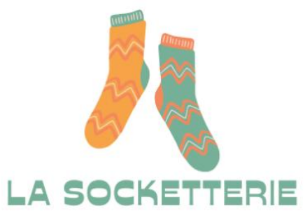
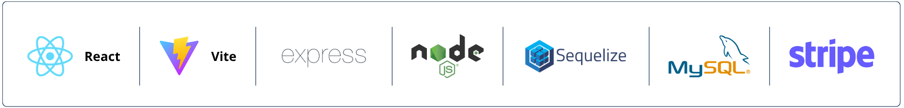
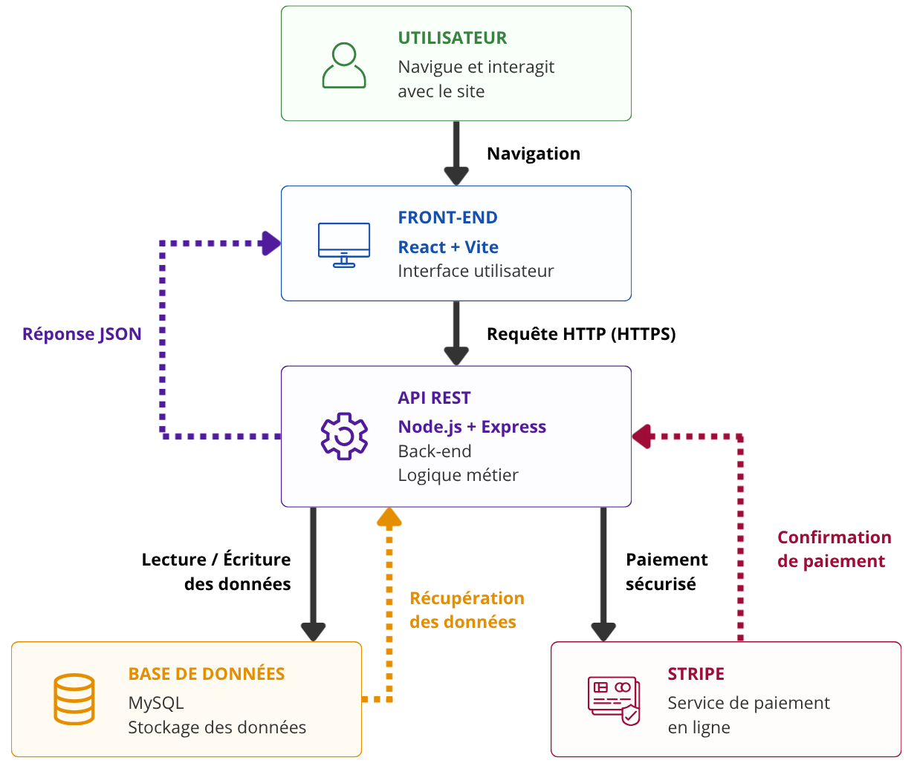
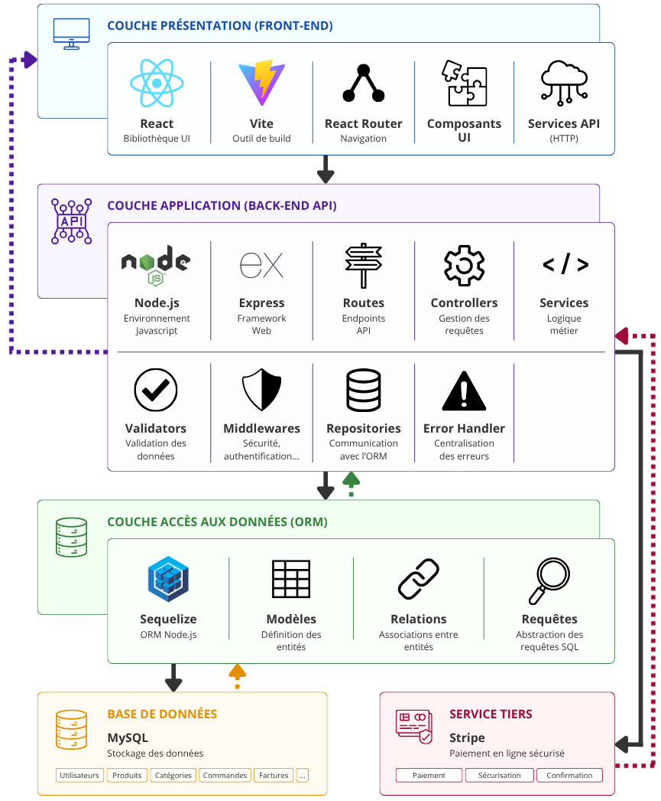
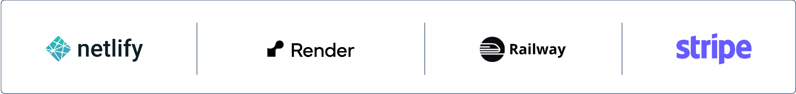

# Projet : Trouve ton artisan

<h2>
  Devoir #9 : 
  Planifier le développement d'un site de vente
</h2>

  
Auteur

  
Cédric Kernec

  
GitHub

  
<a href="https://github.com/pixseed" target="_blank" rel="noopener noreferrer">https://github.com/pixseed</a>

  
Formation

  
Développeur Web & Web Mobile - Centre Européen de Formation

  
Technologies

  

  
Date

  
06/2026

  
Version

  
1.0.0

  
Liens utiles

  

## Sommaire

- [Projet : Trouve ton artisan](#projet--trouve-ton-artisan)
  - [Sommaire](#sommaire)
  - [1. Présentation du projet](#1-présentation-du-projet)
    - [1.1. Contexte du projet](#11-contexte-du-projet)
    - [1.2. Objectif du projet](#12-objectif-du-projet)
    - [1.3. Enjeux du projet](#13-enjeux-du-projet)
    - [1.4. Parties prenantes](#14-parties-prenantes)
    - [1.5. Contraintes du projet](#15-contraintes-du-projet)
    - [1.6. Résultats attendus](#16-résultats-attendus)
  - [2. Analyse des besoins](#2-analyse-des-besoins)
    - [2.1. Identification des acteurs, de leurs rôles et de leurs besoins](#21-identification-des-acteurs-de-leurs-rôles-et-de-leurs-besoins)
    - [2.2. Priorisation des acteurs](#22-priorisation-des-acteurs)
    - [2.3. Identification des besoins fonctionnels](#23-identification-des-besoins-fonctionnels)
      - [2.3.1. Fonctionnalités visiteurs](#231-fonctionnalités-visiteurs)
      - [2.3.2. Fonctionnalités clients](#232-fonctionnalités-clients)
      - [2.3.3. Fonctionnalités commerciales et administratives](#233-fonctionnalités-commerciales-et-administratives)
      - [2.3.4. Fonctionnalités administrateur](#234-fonctionnalités-administrateur)
    - [2.4. Priorisation des fonctionnalités](#24-priorisation-des-fonctionnalités)
  - [3. User Stories](#3-user-stories)
  - [4. Architecture technique](#4-architecture-technique)
    - [4.1. Architecture générale](#41-architecture-générale)
    - [4.2. Technologies retenues](#42-technologies-retenues)
    - [4.3. Structure des données](#43-structure-des-données)
    - [4.4. Flux de données](#44-flux-de-données)
    - [4.5. Schéma d'architecture](#45-schéma-darchitecture)
  - [5. Hébergements et services tiers](#5-hébergements-et-services-tiers)
    - [5.1. Besoins d'hébergement identifiés](#51-besoins-dhébergement-identifiés)
    - [5.2. Comparaison des solutions](#52-comparaison-des-solutions)
    - [5.2. Choix retenus](#52-choix-retenus)
  - [6. Organisation du projet](#6-organisation-du-projet)
    - [6.1. Kanban](#61-kanban)
    - [6.2. Workflow Git](#62-workflow-git)
  - [7 Diagramme de Gantt](#7-diagramme-de-gantt)
  - [8. Estimation des coûts](#8-estimation-des-coûts)
  - [9. Conclusion](#9-conclusion)

---

## 1. Présentation du projet

### 1.1. Contexte du projet

**La Socketterie** est une entreprise française créée en 2019 et **spécialisée dans la vente de chaussettes dépareillées tricotées**.

L'entreprise dispose actuellement d'une boutique physique située à Nice et **souhaite développer sa présence numérique afin d'augmenter sa visibilité et de commercialiser ses produits en ligne**.

Cette demande intervient dans un contexte particulier puisque l'entreprise participera prochainement à un reprotage télévisé. **Le tournage est prévu dans un délai de trois mois et la diffusion un mois plus tard**.

  Le site internet devra donc être suffisament avancé pour être présenté lors du tournage et totalement opérationnel avant la diffusion du reportage afin de tirer profit de cette visibilité médiatique.

L'entreprise **cible principalement une population jeune agée de 20 à 35 ans**. Le futur site devra donc proposer une expérience moderne, intuitive et adaptée aux usages actuels du commerce en ligne.

### 1.2. Objectif du projet

Les objectifs du projet sont les suivants :

<ul class="custom-list">
  <li>Augmenter la visibilité de l'entreprise sur internet.</li>
  <li>Développer les ventes grâce à une boutique en ligne.</li>
  <li>Mettre en avant l'identité graphique de la marque.</li>
  <li>Présenter les produits et les actualités de l'entreprise.</li>
  <li>Permettre aux visiteurs/clients de contacter facilement l'entreprise.</li>
  <li>Offrir aux clients un espace personnel pour suivre leurs commandes.</li>
  <li>Fournir aux équipes internes des outils de gestions adaptés.</li>
</ul>

### 1.3. Enjeux du projet

Le projet présente plusieurs enjeux majeurs :

  

    
Enjeu commercial

    

      Développer une nouvelle source de revenus grâce à la vente en ligne.
    

  

  

    
Enjeu marketing

    

      Renforcer l'identité de la marque auprès de sa cible principale.
    

  

  

    
Enjeu organisationnel

    

      Faciliter le travail des équipes commerciales, administratives et comptables.
    

  

  

    
Enjeu technique

    

      Mettre en place une plateforme fiable, sécurisée, évolutive et maintenable.
    

  

  

    
Enjeu temporel

    

      Respecter les délais imposés par la diffusion du reportage télévisé.
    

  

### 1.4. Parties prenantes

| Acteur | Rôle |
|--------|------|
| La Socketterie | Client |
| Lead Developer | Validation métier et technique |
| UX/UI designers | Maquettes & expérience utilisateur |
| Développeurs | Réalisation / Développement (2 alternants disponible à 80%) |
| Freelances | Renfort ponctuel (2 freelances en contrat de 5 jours max.) |
| Équipe commerciale | Gestion produits & commandes |
| Comptabilité | Facturation & export comptable |
| Administrateur | Administration globales du site |

### 1.5. Contraintes du projet

  

    Délai de 3 mois avant tournage
  

  

    Diffusion 1 mois après
  

  

    Paiement Stripe
  

  

    Français uniquement
  

  

    Euro uniquement
  

  

    Commandes UE
  

  

    SEO
  

  

    Éco-conception
  

  

    Conformité règlementaire
  

### 1.6. Résultats attendus

À l'issue du projet, La Socketterie disposera :

- d'un site vitrine moderne
- d'une boutique e-commerce fonctionnelle
- d'un espace client sécurisé
- d'un espace d'administration
- d'une solution prête à accueillir un volume de visiteurs plus important

---

## 2. Analyse des besoins

### 2.1. Identification des acteurs, de leurs rôles et de leurs besoins

| Acteur | Rôle | Besoins |
|--------|------|---------|
| Visiteurs | Découvrir la marque. | Consulter les produits et les actualités, rechercher un produit, ajouter un articles au panier, contacter l'entreprise. |
| Clients | Acheter des produits. | Commmander des produits, payer en ligne, suivre ses commandes, gérer son compte client. |
| Service commerciale | Gérer les ventes : Suivi et gestion des commandes. | Mettre à jour les articles, éditer des informations de la commande à envoyer au service logistique, consulter les commandes et leur statut. |
| Service comptabilité | Gérer les facturations. | Consulter les commandes, consulter et éditer les factures, exporter les données (format CSV). |
| Administrateur | Gérer le site : Charger du bon fonctionnement du site. | Accéder à toutes les fonctionnalités du site. |

### 2.2. Priorisation des acteurs

<table>
  <thead>
    <tr>
      <th>Acteur</th>
      <th>Priorité</th>
    </tr>
  </thead>

  </tbody>
    <tr>
      <td>Visiteurs</td>
      <td>
        Critique
      </td>
    </tr>
    <tr>
      <td>Clients</td>
      <td>
        Critique
      </td>
    </tr>
    <tr>
      <td>Administrateur</td>
      <td>
        Haute
      </td>
    </tr>
    <tr>
      <td>Commerciaux</td>
      <td>
        Moyenne
      </td>
    </tr>
    <tr>
      <td>Comptables</td>
      <td>
        Moyenne
      </td>
    </tr>
  </tbody>
</table>

### 2.3. Identification des besoins fonctionnels

#### 2.3.1. Fonctionnalités visiteurs

| Fonctionnalité | Description |
|----------------|-------------|
| Catalogue produits | Consulter les produits |
| Recherche | Rechercher un produit |
| Fiche produit | Consulter les détails d'un produit |
| Panier | Préparer une commande |
| Formulaire de contact | Contacter l'entreprise |
| Actualités | Consulter les nouveautés |

#### 2.3.2. Fonctionnalités clients

<ul class="custom-list">
  <li>
    En plus des fonctionnalités visiteurs.
  </li>
</ul>

| Fonctionnalité | Description |
|----------------|-------------|
| Création de compte | S'inscrire |
| Connexion | Accéder à son espace |
| Paiement Stripe | Régler une commande |
| Historique | Consulter les commandes |
| Gestion profil | Modifier ses informations personnelles |

#### 2.3.3. Fonctionnalités commerciales et administratives

| Fonctionnalité | Description |
|----------------|-------------|
| Gestion produits | Ajouter, modifier, supprimer |
| Gestion catégories | Organiser le catalogue |
| Validation commande | Validation et traitement des commandes |
| Paiement sécurisé | Stripe |
| Suivi commandes | État des commandes |
| Facturation | Édition des factures |

#### 2.3.4. Fonctionnalités administrateur

<ul class="custom-list">
  <li>
    En plus des fonctionnalités visiteurs, clients, commerciales et administratives.
  </li>
</ul>

| Fonctionnalité | Description |
|----------------|-------------|
| Gestion utilisateurs | Administrer les comptes |
| Gestion contenus  | Actualités, pages |

### 2.4. Priorisation des fonctionnalités

<table>
  <thead>
    <tr>
      <th>Fonctionnalité</th>
      <th>Priorité</th>
    </tr>
  </thead>

  </tbody>
    <tr>
      <td>Catalogue produits</td>
      <td>
        Critique
      </td>
    </tr>
    <tr>
      <td>Fiche produit</td>
      <td>
        Critique
      </td>
    </tr>
    <tr>
      <td>Recherche produit</td>
      <td>
        Critique
      </td>
    </tr>
    <tr>
      <td>Panier</td>
      <td>
        Critique
      </td>
    </tr>
    <tr>
      <td>Formulaire de contact</td>
      <td>
        Critique
      </td>
    </tr>
    <tr>
      <td>Création de compte</td>
      <td>
        Critique
      </td>
    </tr>
    <tr>
      <td>Connexion</td>
      <td>
        Critique
      </td>
    </tr>
    <tr>
      <td>Paiement Stripe</td>
      <td>
        Critique
      </td>
    </tr>
    <tr>
      <td>Gestion produit</td>
      <td>
        Critique
      </td>
    </tr>
    <tr>
      <td>Gestion catégorie</td>
      <td>
        Critique
      </td>
    </tr>
    <tr>
      <td>Validation commande</td>
      <td>
        Critique
      </td>
    </tr>
    <tr>
      <td>Paiement sécurisé</td>
      <td>
        Critique
      </td>
    </tr>
    <tr>
      <td>Gestion utilisateur</td>
      <td>
        Critique
      </td>
    </tr>
    <tr>
      <td>Suivi commande</td>
      <td>
        Haute
      </td>
    </tr>
    <tr>
      <td>Gestion contenu</td>
      <td>
        Haute
      </td>
    </tr>
    <tr>
      <td>Historique</td>
      <td>
        Moyenne
      </td>
    </tr>
    <tr>
      <td>Gestion profil</td>
      <td>
        Moyenne
      </td>
    </tr>
    <tr>
      <td>Facturation</td>
      <td>
        Moyenne
      </td>
    </tr>
    <tr>
      <td>Actualité</td>
      <td>
        Faible
      </td>
    </tr>
  </tbody>
</table>

---

## 3. User Stories

---

## 4. Architecture technique

### 4.1. Architecture générale

| Couche | Rôle |
|--------|------|
| Front-end | Afficher l'interface utilisateur et permettre les interactions |
| Back-end | Gérér la logique métier, les règles de sécurité et l'API |
| Base de données | Stockage des données : utilisateurs, produits, commandes et factures |
| Services tiers | Gérer les fonctionnalités externes comme le paiement |

### 4.2. Technologies retenues

| Couche | Technologie | Justification |
|--------|-------------|---------------|
| Front-end | React + Vite | Interface dynamique adaptée à un site e-commerce |
| Back-end | Node.js + Express | Création d'une API REST légère et maintenable |
| ORM | Sequelize | Communication strcuturée avec la base MySQL |
| Base de données | MySQL | Données relationnelles adaptées aux produits, clients et commandes |
| Paiement | Stripe | Solution de paiement en ligne sécurisée |

### 4.3. Structure des données

| Entité | Description |
|--------|-------------|
| Utilisateur | Compte client |
| Produit | Article vendu sur la boutique |
| Catégorie | Classement des produits |
| Commande | Achat réalisé par un client |
| DétailCommande | Détail des produits achetés par un client |
| Facture | Document lié à une commande validée |

### 4.4. Flux de données

Le schéma ci-dessous représente le flux de données entre les composants du système e-commerce.

Le front-end envoie des requêtes à l’API REST via HTTP/HTTPS.
L’API traite la logique métier, interagit avec la base de données pour enregistrer ou récupérer les informations et communique avec Stripe pour gérer les paiements. Stripe renvoie ensuite la confirmation de paiement à l’API qui renvoie la réponse au front-end.

### 4.5. Schéma d'architecture

Le schéma ci-dessous représente l'architecture technique générale du système e-commerce.

---

## 5. Hébergements et services tiers

### 5.1. Besoins d'hébergement identifiés

Le brief ne précise pas le volume exact de produits, de visiteurs ou de clients attendus.
Les choix d'hébergement sont donc réalisés sur la base d'un besoin évolutif, adapté à un site e-commerce professionnel de taille intermédiaire, avec possibilité de montée en charge si le trafic augmente après le reportage télévisé.

| Couche | Besoin identifié |
|--------|------------------|
| Front-end | Hébergement rapide, HTTPS, CDN, déploiement automatisé depuis GitHub |
| Back-end | Exécution d'une API Node.js/Express | variables d'environnement, logs, évolutivité |
| Base de données | Stockage relationnel persistant, sauvegardes, sécurité, montée en capacité possible |
| Paiement | Paiement sécurisé, conformité, gestion des confirmations de paiement |
| Maintenance | Supervision, mises à jour, possibilité dévolution selon le trafic réel |

### 5.2. Comparaison des solutions

<table>
  <colgroup>
    <col style="width: 100px">
    <col style="width: auto">
    <col style="width: 100px">
    <col style="width: auto">
    <col style="width: auto">
  </colgroup>
  <thead>
    <tr>
      <th>Solution</th>
      <th>Description</th>
      <th>Couche concernée</th>
      <th>Avantages</th>
      <th>Inconvénient</th>
    <tr>
  </thead>

  <tbody>
    <tr>
      <td>Netlify</td>
      <td>Hébergement d'applications front-end statiques et SPA</td>
      <td>
        Front-end
      </td>
      <td>Déploiement GitHub automatique, CDN mondial, SSL intégré | Peu adapté à l'exécution de services back-end</td>
      <td>Peu adapté à l'exécution de services back-end</td>
    </tr>
    <tr>
      <td>Vercel</td>
      <td>Plateforme cloud optimisée pour les applications web modernes</td>
      <td>
        Front-end
      </td>
      <td>Très bonnes performances, intégration React/Next.js</td>
      <td>Coût pouvant augmenter avec le trafic</td>
    </tr>
    <tr>
      <td>Render</td>
      <td>Hébergement de services Node.js et APIs</td>
      <td>
        Back-end
      </td>
      <td>Déploiement simple, gestion des variables d'environnement</td>
      <td>Mise en veille sur certaines offres</td>
    </tr>
    <tr>
      <td>Railway</td>
      <td>Hébergement d'applications et bases de données managées</td>
      <td>
      

        Backend
        DataBase
      

      </td>
      <td>Mise en place rapide, interface intuitive</td>
      <td>Ressources limitées selon le plan</td>
    </tr>
    <tr>
      <td>Amazon EC2</td>
      <td>Serveur virtuel cloud</td>
      <td>
        Back-end
      </td>
      <td>Contrôle total de l'infrastructure</td>
      <td>Administration plus complexe</td>
    </tr>
    <tr>
      <td>Planet Scale</td>
      <td>Base de données MySQL managée</td>
      <td>
        DataBase
      </td>
      <td>Très haute disponibilité</td>
      <td>Plus complexe pour un projet de taille moyenne |</td>
    </tr>
    <tr>
      <td>Amazon RDS</td>
      <td>Base de données relationnelle managée</td>
      <td>
        DataBase
      </td>
      <td>Sauvegarde et haute disponibilité</td>
      <td>Coût plus élevé</td>
    </tr>
    <tr>
      <td>Stripe</td>
      <td>Solution de paiement en ligne</td>
      <td>
        Tiers
      </td>
      <td>Sécurisé, documentation complète, leader du marché</td>
      <td>Commission sur les transactions</td>
    </tr>
  </tbody>
</table>

### 5.3. Choix retenus

<table>
  <colgroup>
    <col style="width: 150px">
    <col style="width: 80px">
    <col style="width: auto">
  </colgroup>
  <thead>
    <tr>
      <th>Besoin</th>
      <th>Solution</th>
      <th>Justification</th>
    <tr>
  </thead>

  <tbody>
    <tr>
      <td>Front-end</td>
      <td>
        Netlify
      </td>
      <td>Déploiement automatisé, CDN mondial et excellente compatiilité React</td>
    </tr>
    <tr>
      <td>Back-end</td>
      <td>
        Render
      </td>
      <td>Compatible Node.js/Express et administration simplifiée</td>
    </tr>
    <tr>
      <td>Base de données</td>
      <td>
        Railway
      </td>
      <td>Hébergement MySQL managé simple à maintenir</td>
    </tr>
    <tr>
      <td>Paiement en ligne</td>
      <td>
        Stripe
      </td>
      <td>Solution sécurisée et adaptée à un site e-commerce professionnel</td>
    </tr>
  </tbody>
</table>

---

## 6. Organisation du projet

### 6.1. Kanban

### 6.2. Workflow Git

---

## 7 Diagramme de Gantt

---

## 8. Estimation des coûts

---

## 9. Conclusion