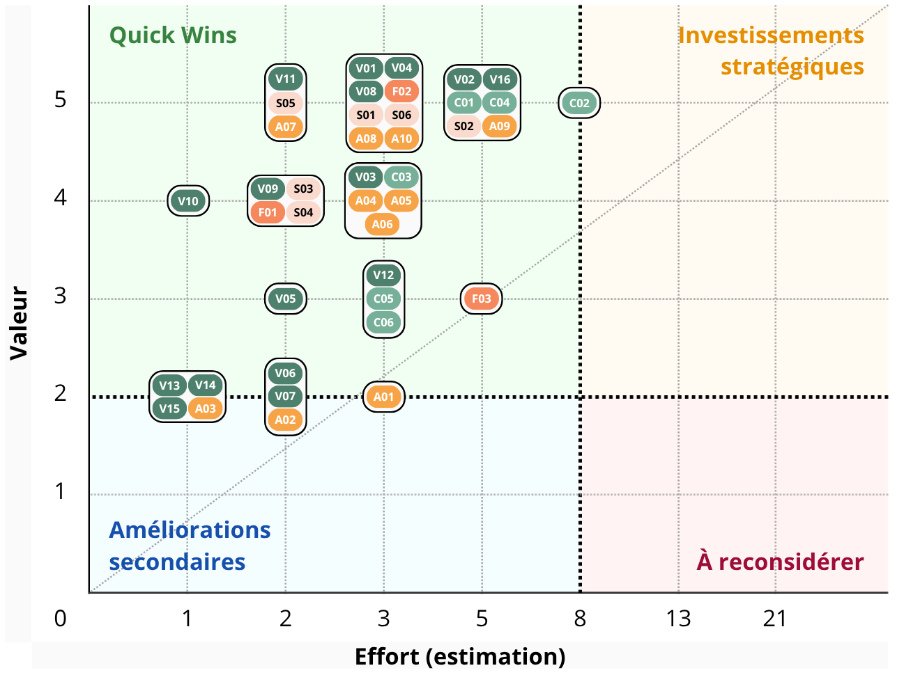
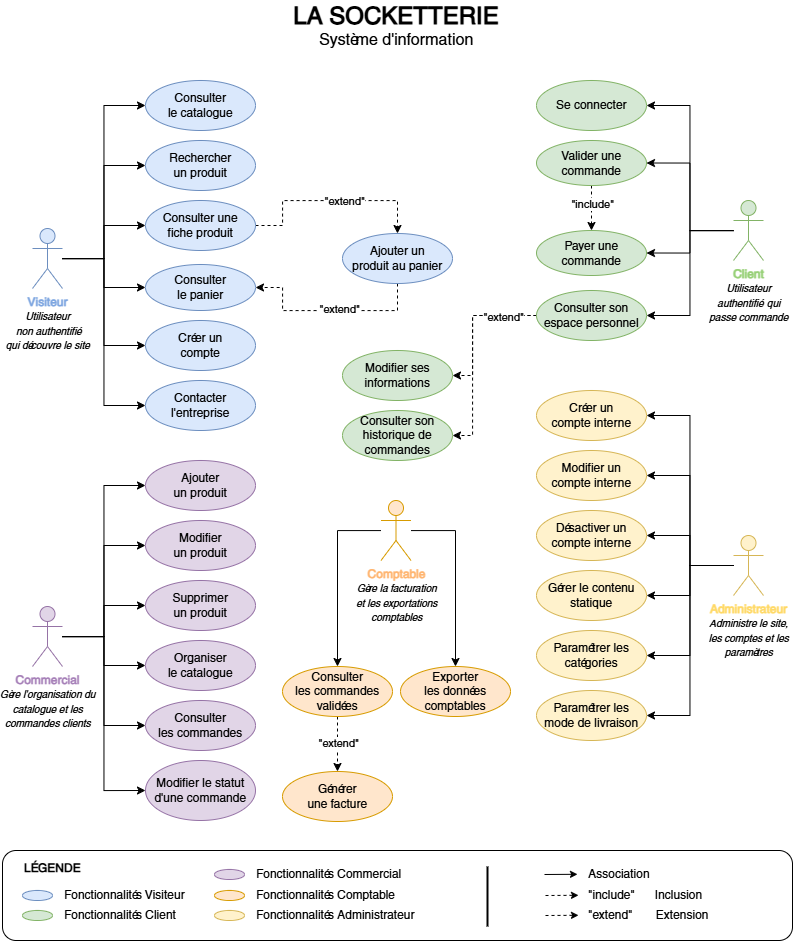
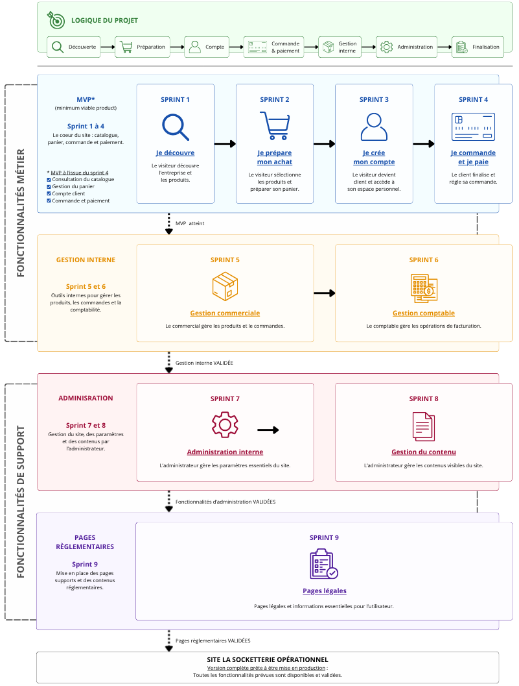
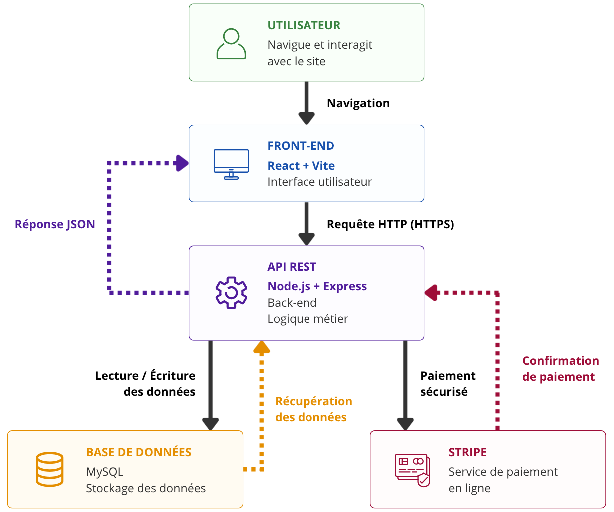
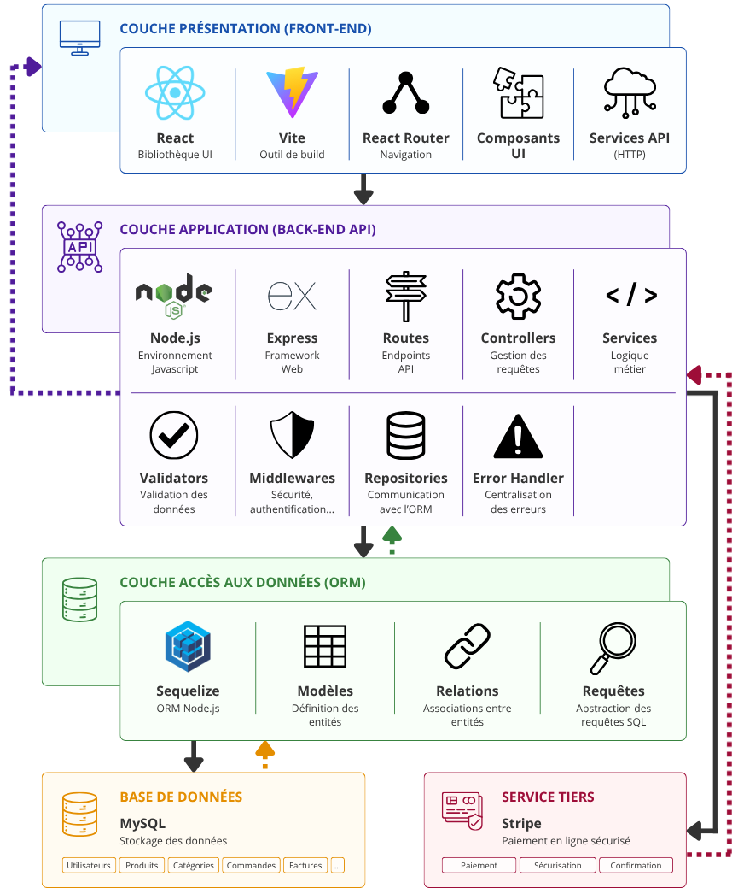
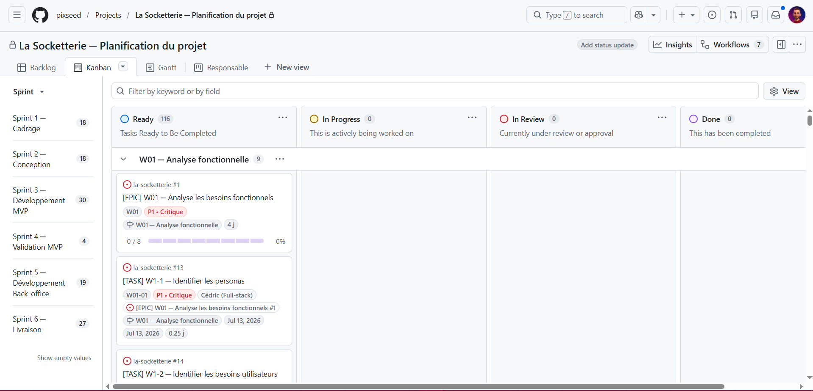
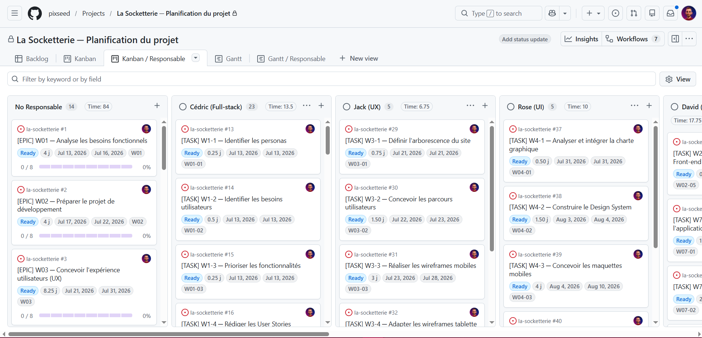
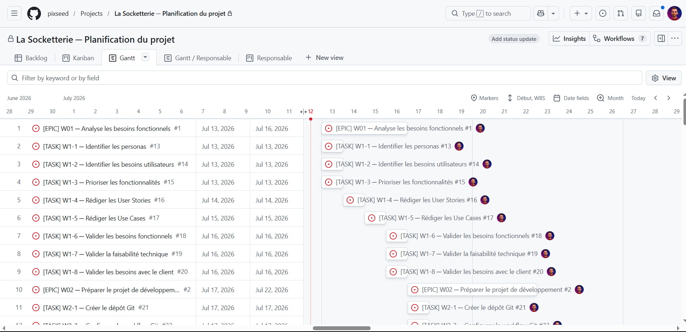
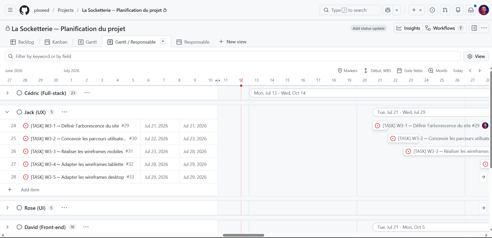

# Projet : Trouve ton artisan

<h2>
  Devoir #9 : 
  Planifier le développement d'un site de vente
</h2>

  
Auteur

  
Cédric Kernec

  
GitHub

  
<a href="https://github.com/pixseed" target="_blank" rel="noopener noreferrer">https://github.com/pixseed</a>

  
Formation

  
Développeur Web & Web Mobile - Centre Européen de Formation

  
Technologies

  
React • Vite • SCSS • Node.js • Express • Sequelize • MySQL

  
Services et outils

  
GitHub • Stripe • Netlify • Render • Railway

  
Date

  
07/2026

  
Version

  
1.0.0

  
Liens utiles

  

      Dépôt GitHub de la documentation du projet : 
      <a href="https://github.com/pixseed/kernec-cedric-devoir-9-planifier-le-developpement-d-un-site-de-vente.git" target="_blank" rel="noopener noreferrer">https://github.com/pixseed/kernec-cedric-devoir-9-planifier-le-developpement-d-un-site-de-vente.git</a> 
      Dépôt GitHub de la planification du projet : 
      <a href="https://github.com/pixseed/la-socketterie" target="_blank" rel="noopener noreferrer">https://github.com/pixseed/la-socketterie</a>
  

## Sommaire

- [Projet : Trouve ton artisan](#projet--trouve-ton-artisan)
  - [Sommaire](#sommaire)
  - [1. Présentation du projet](#1-présentation-du-projet)
    - [1.1. Contexte du projet](#11-contexte-du-projet)
    - [1.2. Objectif du projet](#12-objectif-du-projet)
    - [1.3. Enjeux du projet](#13-enjeux-du-projet)
    - [1.4. Parties prenantes](#14-parties-prenantes)
    - [1.5. Contraintes du projet](#15-contraintes-du-projet)
    - [1.6. Résultats attendus](#16-résultats-attendus)
  - [2. Analyse des besoins](#2-analyse-des-besoins)
    - [2.1. Identification des acteurs, de leurs rôles et de leurs besoins](#21-identification-des-acteurs-de-leurs-rôles-et-de-leurs-besoins)
    - [2.2. Priorisation des acteurs](#22-priorisation-des-acteurs)
    - [2.3. Identification des besoins fonctionnels](#23-identification-des-besoins-fonctionnels)
      - [2.3.1. Fonctionnalités visiteurs](#231-fonctionnalités-visiteurs)
      - [2.3.2. Fonctionnalités clients](#232-fonctionnalités-clients)
      - [2.3.3. Fonctionnalités commerciales et administratives](#233-fonctionnalités-commerciales-et-administratives)
      - [2.3.4. Fonctionnalités administrateur](#234-fonctionnalités-administrateur)
    - [2.4. Priorisation des fonctionnalités](#24-priorisation-des-fonctionnalités)
  - [3. Product Backlog](#3-product-backlog)
    - [3.1. Personas](#31-personas)
      - [3.1.1. Qui est le visiteur ?](#311-qui-est-le-visiteur-)
      - [3.1.2. Qui est le client ?](#312-qui-est-le-client-)
      - [3.1.3. Qui est l'administrateur ?](#313-qui-est-ladministrateur-)
      - [3.1.4. Qui est le commercial ?](#314-qui-est-le-commercial-)
      - [3.1.5. Qui est le comptable ?](#315-qui-est-le-comptable-)
    - [3.4. Backlog fonctionnel (Epics)](#34-backlog-fonctionnel-epics)
    - [3.5. User Stories](#35-user-stories)
      - [3.5.1. Estimation des User Stories selon la suite de Fibonacci](#351-estimation-des-user-stories-selon-la-suite-de-fibonacci)
      - [3.5.2. Matrice Valeur/Effort des User Stories](#352-matrice-valeureffort-des-user-stories)
      - [3.5.3. Détails des User Stories (Critique = niveau 5)](#353-détails-des-user-stories-critique--niveau-5)
    - [3.6. Use Cases](#36-use-cases)
      - [3.6.1. Diagrammes des cas d'utilisation](#361-diagrammes-des-cas-dutilisation)
      - [3.6.2. Description des cas d'utilisation](#362-description-des-cas-dutilisation)
  - [4. Sprint Backlog prévisionnel](#4-sprint-backlog-prévisionnel)
  - [5. Matrice de traçabilité fonctionnelle](#5-matrice-de-traçabilité-fonctionnelle)
  - [6. Architecture technique](#6-architecture-technique)
    - [6.1. Architecture générale](#61-architecture-générale)
    - [6.2. Technologies retenues](#62-technologies-retenues)
    - [6.3. Structure des données](#63-structure-des-données)
    - [6.4. Flux de données](#64-flux-de-données)
    - [6.5. Schéma d'architecture](#65-schéma-darchitecture)
  - [7. Hébergements et services tiers](#7-hébergements-et-services-tiers)
    - [7.1. Besoins d'hébergement identifiés](#71-besoins-dhébergement-identifiés)
    - [7.2. Comparaison des solutions](#72-comparaison-des-solutions)
    - [7.3. Choix retenus](#73-choix-retenus)
  - [8. Organisation du projet](#8-organisation-du-projet)
    - [8.1. Équipe projet et répartition des rôles](#81-équipe-projet-et-répartition-des-rôles)
    - [8.2. Work Breakdown Structure (WBS)](#82-work-breakdown-structure-wbs)
    - [8.3. Kanban](#83-kanban)
  - [9 Diagramme de Gantt](#9-diagramme-de-gantt)
  - [10. Estimation des coûts](#10-estimation-des-coûts)
    - [10.1. Coûts des ressources humaines](#101-coûts-des-ressources-humaines)
    - [10.2. Coûts techniques](#102-coûts-techniques)
    - [10.3. Coûts des services tiers](#103-coûts-des-services-tiers)
    - [10.4. Coûts de maintenance annuelle](#104-coûts-de-maintenance-annuelle)
    - [10.5. Synthèse financière](#105-synthèse-financière)
  - [11. Conclusion](#11-conclusion)

---

## 1. Présentation du projet

### 1.1. Contexte du projet

**La Socketterie** est une entreprise française créée en 2019 et **spécialisée dans la vente de chaussettes dépareillées tricotées**.

L'entreprise dispose actuellement d'une boutique physique située à Nice et **souhaite développer sa présence numérique afin d'augmenter sa visibilité et de commercialiser ses produits en ligne**.

Cette demande intervient dans un contexte particulier puisque l'entreprise participera prochainement à un reprotage télévisé. **Le tournage est prévu dans un délai de trois mois et la diffusion un mois plus tard**.

  Le site internet devra donc être suffisamment avancé pour être présenté lors du tournage et totalement opérationnel avant la diffusion du reportage afin de tirer profit de cette visibilité médiatique.

L'entreprise **cible principalement une population jeune âgée de 20 à 35 ans**. Le futur site devra donc proposer une expérience moderne, intuitive et adaptée aux usages actuels du commerce en ligne.

### 1.2. Objectif du projet

Les objectifs du projet sont les suivants :

<ul class="custom-list">
  <li>Augmenter la visibilité de l'entreprise sur internet.</li>
  <li>Développer les ventes grâce à une boutique en ligne.</li>
  <li>Mettre en avant l'identité graphique de la marque.</li>
  <li>Présenter les produits et les actualités de l'entreprise.</li>
  <li>Permettre aux visiteurs/clients de contacter facilement l'entreprise.</li>
  <li>Offrir aux clients un espace personnel pour suivre leurs commandes.</li>
  <li>Fournir aux équipes internes des outils de gestions adaptés.</li>
</ul>

### 1.3. Enjeux du projet

Le projet présente plusieurs enjeux majeurs :

  

    
Enjeu commercial

    

      Développer une nouvelle source de revenus grâce à la vente en ligne.
    

  

  

    
Enjeu marketing

    

      Renforcer l'identité de la marque auprès de sa cible principale.
    

  

  

    
Enjeu organisationnel

    

      Faciliter le travail des équipes commerciales, administratives et comptables.
    

  

  

    
Enjeu technique

    

      Mettre en place une plateforme fiable, sécurisée, évolutive et maintenable.
    

  

  

    
Enjeu temporel

    

      Respecter les délais imposés par la diffusion du reportage télévisé.
    

  

### 1.4. Parties prenantes

| Acteur | Rôle |
|--------|------|
| La Socketterie | Client |
| Lead Developer | Validation métier et technique |
| UX/UI designers | Maquettes & expérience utilisateur |
| Développeurs | Réalisation / Développement (2 alternants disponible à 80%) |
| Freelances | Renfort ponctuel (2 freelances en contrat de 5 jours max.) |
| Équipe commerciale | Gestion produits & commandes |
| Comptabilité | Facturation & export comptable |
| Administrateur | Administration globales du site |

### 1.5. Contraintes du projet

  

    Délai de 3 mois avant tournage
  

  

    Diffusion 1 mois après
  

  

    Paiement Stripe
  

  

    Français uniquement
  

  

    Euro uniquement
  

  

    Commandes UE
  

  

    SEO
  

  

    Éco-conception
  

  

    Conformité règlementaire
  

### 1.6. Résultats attendus

À l'issue du projet, La Socketterie disposera :

- d'un site vitrine moderne
- d'une boutique e-commerce fonctionnelle
- d'un espace client sécurisé
- d'un espace d'administration
- d'une solution prête à accueillir un volume de visiteurs plus important

---

## 2. Analyse des besoins

### 2.1. Identification des acteurs, de leurs rôles et de leurs besoins

| Acteur | Rôle | Besoins |
|--------|------|---------|
| Visiteurs | Découvrir la marque. | Consulter les produits et les actualités, rechercher un produit, ajouter un articles au panier, contacter l'entreprise. |
| Clients | Acheter des produits. | Commmander des produits, payer en ligne, suivre ses commandes, gérer son compte client. |
| Service commerciale | Gérer les ventes : Suivi et gestion des commandes. | Mettre à jour les articles, éditer des informations de la commande à envoyer au service logistique, consulter les commandes et leur statut. |
| Service comptabilité | Gérer les facturations. | Consulter les commandes, consulter et éditer les factures, exporter les données (format CSV). |
| Administrateur | Gérer le site : Charger du bon fonctionnement du site. | Accéder à toutes les fonctionnalités du site. |

### 2.2. Priorisation des acteurs

<table>
  <thead>
    <tr>
      <th>Acteur</th>
      <th>Priorité</th>
    </tr>
  </thead>

  <tbody>
    <tr>
      <td>Visiteurs</td>
      <td>
        Critique
      </td>
    </tr>
    <tr>
      <td>Clients</td>
      <td>
        Critique
      </td>
    </tr>
    <tr>
      <td>Administrateur</td>
      <td>
        Haute
      </td>
    </tr>
    <tr>
      <td>Commerciaux</td>
      <td>
        Moyenne
      </td>
    </tr>
    <tr>
      <td>Comptables</td>
      <td>
        Moyenne
      </td>
    </tr>
  </tbody>
</table>

### 2.3. Identification des besoins fonctionnels

#### 2.3.1. Fonctionnalités visiteurs

| Fonctionnalité | Description |
|----------------|-------------|
| Catalogue produits | Consulter les produits |
| Recherche | Rechercher un produit |
| Fiche produit | Consulter les détails d'un produit |
| Panier | Préparer une commande |
| Formulaire de contact | Contacter l'entreprise |
| Actualités | Consulter les nouveautés |

#### 2.3.2. Fonctionnalités clients

<ul class="custom-list">
  <li>
    En plus des fonctionnalités visiteurs.
  </li>
</ul>

| Fonctionnalité | Description |
|----------------|-------------|
| Création de compte | S'inscrire |
| Connexion | Accéder à son espace |
| Paiement Stripe | Régler une commande |
| Historique | Consulter les commandes |
| Gestion profil | Modifier ses informations personnelles |

#### 2.3.3. Fonctionnalités commerciales et administratives

| Fonctionnalité | Description |
|----------------|-------------|
| Gestion produits | Ajouter, modifier, supprimer |
| Gestion catégories | Organiser le catalogue |
| Validation commande | Validation et traitement des commandes |
| Paiement sécurisé | Stripe |
| Suivi commandes | État des commandes |
| Facturation | Édition des factures |

#### 2.3.4. Fonctionnalités administrateur

<ul class="custom-list">
  <li>
    En plus des fonctionnalités visiteurs, clients, commerciales et administratives.
  </li>
</ul>

| Fonctionnalité | Description |
|----------------|-------------|
| Gestion utilisateurs | Administrer les comptes |
| Gestion contenus  | Actualités, pages |

### 2.4. Priorisation des fonctionnalités

<table>
  <thead>
    <tr>
      <th>Fonctionnalité</th>
      <th>Priorité</th>
    </tr>
  </thead>

  <tbody>
    <tr>
      <td>Catalogue produits</td>
      <td>
        Critique
      </td>
    </tr>
    <tr>
      <td>Fiche produit</td>
      <td>
        Critique
      </td>
    </tr>
    <tr>
      <td>Recherche produit</td>
      <td>
        Critique
      </td>
    </tr>
    <tr>
      <td>Panier</td>
      <td>
        Critique
      </td>
    </tr>
    <tr>
      <td>Formulaire de contact</td>
      <td>
        Critique
      </td>
    </tr>
    <tr>
      <td>Création de compte</td>
      <td>
        Critique
      </td>
    </tr>
    <tr>
      <td>Connexion</td>
      <td>
        Critique
      </td>
    </tr>
    <tr>
      <td>Paiement Stripe</td>
      <td>
        Critique
      </td>
    </tr>
    <tr>
      <td>Gestion produit</td>
      <td>
        Critique
      </td>
    </tr>
    <tr>
      <td>Gestion catégorie</td>
      <td>
        Critique
      </td>
    </tr>
    <tr>
      <td>Validation commande</td>
      <td>
        Critique
      </td>
    </tr>
    <tr>
      <td>Paiement sécurisé</td>
      <td>
        Critique
      </td>
    </tr>
    <tr>
      <td>Gestion utilisateur</td>
      <td>
        Critique
      </td>
    </tr>
    <tr>
      <td>Suivi commande</td>
      <td>
        Haute
      </td>
    </tr>
    <tr>
      <td>Gestion contenu</td>
      <td>
        Haute
      </td>
    </tr>
    <tr>
      <td>Historique</td>
      <td>
        Moyenne
      </td>
    </tr>
    <tr>
      <td>Gestion profil</td>
      <td>
        Moyenne
      </td>
    </tr>
    <tr>
      <td>Facturation</td>
      <td>
        Moyenne
      </td>
    </tr>
    <tr>
      <td>Actualité</td>
      <td>
        Faible
      </td>
    </tr>
  </tbody>
</table>

---

## 3. Product Backlog

### 3.1. Personas

#### 3.1.1. Qui est le visiteur ?

Un utilisateur :
- non connecté;
- qui découvre la marque;
- qui recherche éventuellement un produit;
- qui n'a jamais acheté.
  
#### 3.1.2. Qui est le client ?

Un utilisateur :
- possédant un compte;
- ayant déjà effectué ou souhaitant effectuer une commande;
- pouvant accéder à son espace personnel;
- pouvant suivre ses commandes.
  
#### 3.1.3. Qui est l'administrateur ?

Un collaborateur interne :
- disposant des droits complets d'administration;
- responsable du bon fonctionnement du site;
- chargé de la gestion du catalogue, du contenu et des utilisateurs.

#### 3.1.4. Qui est le commercial ?

Un collaborateur interne :
- chargé du traitement des ventes;
- responsable du suivi des commandes;
- en relation avec les clients et le service expédition.
  
#### 3.1.5. Qui est le comptable ?

Un collaborateur interne :
- chargé du suivi financier;
- responsable de la facturation;

  

    <h3>3.2. Tableau des points d'effort</h3>
    <table class="custom-table custom-table--effort">
      <colgroup>
        <col class="col-number">
        <col class="col-auto">
        <col class="col-auto">
      </colgroup>
      <thead>
        <tr>
          <th>Effort</th>
          <th>Signification</th>
          <th>Temporisation</th>
        </tr>
      </thead>
      <tbody>
        <tr>
          <td>
           1
          </td>
          <td>Très simple</td>
          <td>Moins de 2 heures</td>
        </tr>
        <tr>
          <td>
           2
          </td>
          <td>Simple</td>
          <td>Une demi-journée</td>
        </tr>
        <tr>
          <td>
           3
          </td>
          <td>Faible complexité</td>
          <td>Jusqu'à 2 jours</td>
        </tr>
        <tr>
          <td>
           5
          </td>
          <td>Complexité moyenne</td>
          <td>Quelques jours</td>
        </tr>
        <tr>
          <td>
           8
          </td>
          <td>Complexe</td>
          <td>Environ une semaine</td>
        </tr>
        <tr>
          <td>
           13
          </td>
          <td>Très complexe</td>
          <td>Plus d'une semaine</td>
        </tr>
      </tbody>
    </table>
  

  

    <h3>3.3. Tableau des valeurs métier</h3>
    <table class="custom-table custom-table--value">
      <colgroup>
        <col class="col-number">
        <col class="col-auto">
      </colgroup>
      <thead>
        <tr>
          <th>Valeur</th>
          <th>Signification</th>
        </tr>
      </thead>
      <tbody>
        <tr>
          <td>
            1
          </td>
          <td>Faible</td>
        </tr>
        <tr>
          <td>
            2
          </td>
          <td>Peu utile</td>
        </tr>
        <tr>
          <td>
            3
          </td>
          <td>Utile</td>
        </tr>
        <tr>
          <td>
            4
          </td>
          <td>Importante</td>
        </tr>
        <tr>
          <td>
            5
          </td>
          <td>Critique</td>
        </tr>
      </tbody>
    </table>
  

### 3.4. Backlog fonctionnel (Epics)

<table class="custom-table custom-table--epics">
  <colgroup>
    <col class="col-id">
    <col class="col-auto">
    <col class="col-role">
    <col class="col-auto">
  </colgroup>
  <thead>
    <tr>
      <th>ID</th>
      <th>EPIC</th>
      <th>Acteurs principal</th>
      <th>Objectif</th>
    </tr>
  </thead>
  <tbody>
    <tr>
      <td>E-01</td>
      <td>Découverte du catalogue</td>
      <td>
        Visiteur
      </td>
      <td>Découvrir les produits vendus par La Socketterie</td>
    </tr>
    <tr>
      <td>E-02</td>
      <td>Recherche & navigation</td>
      <td>
        Visiteur
      </td>
      <td>Trouver rapidement un produit précis</td>
    </tr>
    <tr>
      <td>E-03</td>
      <td>Consultation des produits</td>
      <td>
        Visiteur
      </td>
      <td>Obtenir les informations détaillées d'un produit</td>
    </tr>
    <tr>
      <td>E-04</td>
      <td>Découverte de l'entreprise</td>
      <td>
        Visiteur
      </td>
      <td>Découvrir l'histoire, les valeurs et les engagements de La Socketterie</td>
    </tr>
    <tr>
      <td>E-05</td>
      <td>Gestion du panier</td>
      <td>
        Visiteur
      </td>
      <td>Préparer une commande en ajoutant des produits</td>
    </tr>
    <tr>
      <td>E-06</td>
      <td>Contact & assistance</td>
      <td>
        Visiteur
      </td>
      <td>Entrer en contact avec l'entreprise</td>
    </tr>
    <tr>
      <td>E-07</td>
      <td>Informations légales</td>
      <td>
        Visiteur
      </td>
      <td>Consulter les informations réglementaires du site</td>
    </tr>
    <tr>
      <td>E-08</td>
      <td>Création du compte</td>
      <td>
        Visiteur
      </td>
      <td>Créer un compte client utilisateur</td>
    </tr>
    <tr>
      <td>E-09</td>
      <td>Commande et paiement</td>
      <td>
        Client
      </td>
      <td>Confirmer ou suivre une commande et acheter des produits</td>
    </tr>
    <tr>
      <td>E-10</td>
      <td>Gestion du compte</td>
      <td>
        Client
      </td>
      <td>Gérer son espace personnel</td>
    </tr>
    <tr>
      <td>E-11</td>
      <td>Gestion du catalogue</td>
      <td>
        Commercial
      </td>
      <td>Gérer les produits du catalogue</td>
    </tr>
    <tr>
      <td>E-12</td>
      <td>Gestion des commandes</td>
      <td>
        Commercial
      </td>
      <td>Traiter les commandes client</td>
    </tr>
    <tr>
      <td>E-13</td>
      <td>Facturation</td>
      <td>
        Comptable
      </td>
      <td>Gérer les factures et consulter la liste des commandes</td>
    </tr>
    <tr>
      <td>E-14</td>
      <td>Gestion du contenu</td>
      <td>
        Administrateur
      </td>
      <td>Gérer les pages publiques et les actualités</td>
    </tr>
    <tr>
      <td>E-15</td>
      <td>Gestion des comptes internes</td>
      <td>
        Administrateur
      </td>
      <td>Gérer les comptes d'accès interne : commerciaux, comptables, etc.</td>
    </tr>
    <tr>
      <td>E-16</td>
      <td>Paramétrage du site</td>
      <td>
        Administrateur
      </td>
      <td>Paramétrer les catégories, modes de livraison et paramètres techniques</td>
    </tr>
  </tbody>
</table>

### 3.5. User Stories

<table class="custom-table custom-table--us">
  <colgroup>
    <col class="col-id">
    <col class="col-auto">
    <col class="col-role">
    <col class="col-auto">
    <col class="col-number">
    <col class="col-number">
  </colgroup>
  <thead>
    <tr>
      <th>ID</th>
      <th>EPIC</th>
      <th>Acteur</th>
      <th>User Story</th>
      <th>Effort</th>
      <th>Valeur</th>
    </tr>
  </thead>
  <tbody>
    <tr>
      <td>US-V01</td>
      <td class="epic-column">
        

          E-01
          Découverte du catalogue
        

      </td>
      <td>
        Visiteur
      </td>
      <td class="us-story">En tant que visiteur, je souhaite consulter le catalogue afin de découvrir les produits proposés</td>
      <td>
        3
      </td>
      <td>
        5
      </td>
    </tr>
    <tr>
      <td>US-V02</td>
      <td rowspan="2" class="epic-column">
        

          E-02
          Recherche & navigation
        

      </td>
      <td>
        Visiteur
      </td>
      <td class="us-story">En tant que visiteur, je souhaite rechercher un produit par mot-clé afin de trouver rapidement un article précis</td>
      <td>
        5
      </td>
      <td>
        5
      </td>
    </tr>
    <tr>
      <td>US-V03</td>
      <td>
        Visiteur
      </td>
      <td class="us-story">En tant que visiteur, je souhaite filtrer les produits par catégorie afin d'affiner ma recherche</td>
      <td>
        3
      </td>
      <td>
        4
      </td>
    </tr>
    <tr>
      <td>US-V04</td>
      <td rowspan="2" class="epic-column">
        

          E-03
          Consultation des produits
        

      </td>
      <td>
        Visiteur
      </td>
      <td class="us-story">En tant que visiteur, je souhaite consulter la fiche détaillée d'un produit afin d'obtenir toutes les informations nécessaires avant un éventuel achat</td>
      <td>
        3
      </td>
      <td>
        5
      </td>
    </tr>
    <tr>
      <td>US-V05</td>
      <td>
        Visiteur
      </td>
      <td class="us-story">En tant que visiteur, je souhaite visualiser plusieurs photos d'un produit afin de voir le produit sous différents angles ou différentes couleurs</td>
      <td>
        2
      </td>
      <td>
        3
      </td>
    </tr>
    <tr>
      <td>US-V06</td>
      <td rowspan="2" class="epic-column">
        

          E-04
          Découverte de l'entreprise
        

      </td>
      <td>
        Visiteur
      </td>
      <td class="us-story">En tant que visiteur, je souhaite consulter la présentation de l'entreprise afin de découvrir son histoire et ses valeurs</td>
      <td>
        2
      </td>
      <td>
        2
      </td>
    </tr>
    <tr>
      <td>US-V07</td>
      <td>
        Visiteur
      </td>
      <td class="us-story">En tant que visiteur, je souhaite consulter les actualités de l'entreprise afin de suivre son activité</td>
      <td>
        2
      </td>
      <td>
        2
      </td>
    </tr>
    <tr>
      <td>US-V08</td>
      <td rowspan="4" class="epic-column">
        

          E-05
          Gestion du panier
        

      </td>
      <td>
        Visiteur
      </td>
      <td class="us-story">En tant que visiteur, je souhaite ajouter un produit au panier afin de préparer une commande</td>
      <td>
        3
      </td>
      <td>
        5
      </td>
    </tr>
    <tr>
      <td>US-V09</td>
      <td>
        Visiteur
      </td>
      <td class="us-story">En tant que visiteur, je souhaite modifier la quantité d'un produit afin d'ajuster ma future commande</td>
      <td>
        2
      </td>
      <td>
        4
      </td>
    </tr>
    <tr>
      <td>US-V10</td>
      <td>
        Visiteur
      </td>
      <td class="us-story">En tant que visiteur, je souhaite supprimer un produit du panier afin de mettre à jour ma sélection</td>
      <td>
        1
      </td>
      <td>
        4
      </td>
    </tr>
    <tr>
      <td>US-V11</td>
      <td>
        Visiteur
      </td>
      <td class="us-story">En tant que visiteur, je souhaite consulter le contenu de mon panier afin de vérifier les produits sélectionnés avant de poursuivre ma commande</td>
      <td>
        2
      </td>
      <td>
        5
      </td>
    </tr>
    <tr>
      <td>US-V12</td>
      <td class="epic-column">
        

          E-06
          Contact & assistance
        

      </td>
      <td>
        Visiteur
      </td>
      <td class="us-story">En tant que visiteur, je souhaite envoyer un message via le formulaire de contact afin d'obtenir une réponse à ma demande</td>
      <td>
        3
      </td>
      <td>
        3
      </td>
    </tr>
    <tr>
      <td>US-V13</td>
      <td rowspan="2" class="epic-column">
        

          E-07
          Informations légales
        

      </td>
      <td>
        Visiteur
      </td>
      <td class="us-story">En tant que visiteur, je souhaite consulter les mentions légales afin de connaître les informations réglementaires du site</td>
      <td>
        1
      </td>
      <td>
        2
      </td>
    </tr>
    <tr>
      <td>US-V14</td>
      <td>
        Visiteur
      </td>
      <td class="us-story">En tant que visiteur, je souhaite consulter les CGV afin de connaître les régles applicables aux achats</td>
      <td>
        1
      </td>
      <td>
        2
      </td>
    </tr>
    <tr>
      <td>US-V15</td>
      <td class="epic-column">
        

          E-07
          Informations légales
        

      </td>
      <td>
        Visiteur
      </td>
      <td class="us-story">En tant que visiteur, je souhaite consulter la politique de confidentialité afin de connaître l'utilisation de mes données personnelles</td>
      <td>
        1
      </td>
      <td>
        2
      </td>
    </tr>
    <tr>
      <td>US-V16</td>
      <td class="epic-column">
        

          E-08
          Création du compte
        

      </td>
      <td>
        Visiteur
      </td>
      <td class="us-story">En tant que visiteur, je souhaite créer un compte afin de pouvoir passer commande et suivre mes achats</td>
      <td>
        5
      </td>
      <td>
        5
      </td>
    </tr>
    <tr>
      <td>US-C01</td>
      <td rowspan="3" class="epic-column">
        

          E-09
          Commande et paiement
        

      </td>
      <td>
        Client
      </td>
      <td class="us-story">En tant que client, je souhaite valider une commande afin de finaliser mon achat</td>
      <td>
        5
      </td>
      <td>
        5
      </td>
    </tr>
    <tr>
      <td>US-C02</td>
      <td>
        Client
      </td>
      <td class="us-story">En tant que client, je souhaite payer ma commande en ligne afin de confirmer mon achat</td>
      <td>
        8
      </td>
      <td>
        5
      </td>
    </tr>
    <tr>
      <td>US-C03</td>
      <td>
        Client
      </td>
      <td class="us-story">En tant que client, je souhaite recevoir une confirmation de commande afin d'être informé de la prise en compte de mon achat</td>
      <td>
        3
      </td>
      <td>
        4
      </td>
    </tr>
    <tr>
      <td>US-C04</td>
      <td rowspan="3" class="epic-column">
        

          E-10
          Gestion du compte
        

      </td>
      <td>
        Client
      </td>
      <td class="us-story">En tant client, je souhaite me connecter à mon compte afin d'accéder à mon espace personnel et à mes commandes</td>
      <td>
        5
      </td>
      <td>
        5
      </td>
    </tr>
    <tr>
      <td>US-C05</td>
      <td>
        Client
      </td>
      <td class="us-story">En tant que client, je souhaite modifier mes informations personnelles afin de maintenir mon profil à jour</td>
      <td>
        3
      </td>
      <td>
        3
      </td>
    </tr>
    <tr>
      <td>US-C06</td>
      <td>
        Client
      </td>
      <td class="us-story">En tant que client, je souhaite consulter l'historique de mes commandes afin de suivre mes achats passés</td>
      <td>
        3
      </td>
      <td>
        3
      </td>
    </tr>
    <tr>
      <td>US-S01</td>
      <td rowspan="4" class="epic-column">
        

          E-11
          Gestion du catalogue
        

      </td>
      <td>
        Commercial
      </td>
      <td class="us-story">En tant que commercial, je souhaite ajouter un nouveau produit au catalogue afin de proposer de nouveaux articles à la vente</td>
      <td>
        3
      </td>
      <td>
        5
      </td>
    </tr>
    <tr>
      <td>US-S02</td>
      <td>
        Commercial
      </td>
      <td class="us-story">En tant que commercial, je souhaite accéder au formulaire d'édition de produit afin de pouvoir modifier un article</td>
      <td>
        5
      </td>
      <td>
        5
      </td>
    </tr>
    <tr>
      <td>US-S03</td>
      <td>
        Commercial
      </td>
      <td class="us-story">En tant que commercial, je souhaite supprimer un produit afin de retirer un article du catalogue</td>
      <td>
        2
      </td>
      <td>
        4
      </td>
    </tr>
    <tr>
      <td>US-S04</td>
      <td>
        Commercial
      </td>
      <td class="us-story">En tant que commercial, je souhaite organiser le catalogue par catégorie afin de faciliter la navigation des visiteurs</td>
      <td>
        2
      </td>
      <td>
        4
      </td>
    </tr>
    <tr>
      <td>US-S05</td>
      <td rowspan="2" class="epic-column">
        

          E-12
          Gestion des commandes
        

      </td>
      <td>
        Commercial
      </td>
      <td class="us-story">En tant que commercial, je souhaite consulter les commandes afin d'assurer leur suivi</td>
      <td>
        2
      </td>
      <td>
        5
      </td>
    </tr>
    <tr>
      <td>US-S06</td>
      <td>
        Commercial
      </td>
      <td class="us-story">En tant que commercial, je souhaite modifier le statut d'une commande afin de suivre son traitement et la mettre à jour</td>
      <td>
        3
      </td>
      <td>
        5
      </td>
    </tr>
    <tr>
      <td>US-F01</td>
      <td class="epic-column">
        

          E-13
          Facturation
        

      </td>
      <td>
        Comptable
      </td>
      <td class="us-story">En tant que comptable, je souhaite consulter les commandes validées afin de préparer les opérations de facturation</td>
      <td>
        2
      </td>
      <td>
        4
      </td>
    </tr>
    <tr>
      <td>US-F02</td>
      <td rowspan="2" class="epic-column">
        

          E-13
          Facturation
        

      </td>
      <td>
        Comptable
      </td>
      <td class="us-story">En tant que comptable, je souhaite générer une facture afin de disposer d'un document comptable associé à une commande validée</td>
      <td>
        3
      </td>
      <td>
        5
      </td>
    </tr>
    <tr>
      <td>US-F03</td>
      <td>
        Comptable
      </td>
      <td class="us-story">En tant que comptable, je souhaite exporter les données comptables afin de les intégrer au système comptable de l'entreprise</td>
      <td>
        5
      </td>
      <td>
        3
      </td>
    </tr>
    <tr>
      <td>US-A01</td>
      <td rowspan="4" class="epic-column">
        

          E-14
          Gestion du contenu
        

      </td>
      <td>
        Administrateur
      </td>
      <td class="us-story">En tant qu'administrateur, je souhaite créer une actualité afin d'informer les visiteurs du site</td>
      <td>
        3
      </td>
      <td>
        2
      </td>
    </tr>
    <tr>
      <td>US-A02</td>
      <td>
        Administrateur
      </td>
      <td class="us-story">En tant qu'administrateur, je souhaite modifier une actualité afin de mettre à jour les informations publiées</td>
      <td>
        2
      </td>
      <td>
        2
      </td>
    </tr>
    <tr>
      <td>US-A03</td>
      <td>
        Administrateur
      </td>
      <td class="us-story">En tant qu'administrateur, je souhaite supprimer une actualité afin de retirer une information obsolète</td>
      <td>
        1
      </td>
      <td>
        2
      </td>
    </tr>
    <tr>
      <td>US-A04</td>
      <td>
        Administrateur
      </td>
      <td class="us-story">En tant qu'administrateur, je souhaite gérer les contenus statiques du site afin de maintenir les pages publiques à jour</td>
      <td>
        3
      </td>
      <td>
        4
      </td>
    </tr>
    <tr>
      <td>US-A05</td>
      <td rowspan="3" class="epic-column">
        

          E-15
          Gestion des comptes internes
        

      </td>
      <td>
        Administrateur
      </td>
      <td class="us-story">En tant qu'administrateur, je souhaite créer un compte interne afin de permettre l'accès aux collaborateurs autorisés</td>
      <td>
        3
      </td>
      <td>
        4
      </td>
    </tr>
    <tr>
      <td>US-A06</td>
      <td>
        Administrateur
      </td>
      <td class="us-story">En tant qu'administrateur, je souhaite modifier un compte interne afin de maintenir les informations et les accès des utilisateurs interne à jour</td>
      <td>
        3
      </td>
      <td>
        4
      </td>
    </tr>
    <tr>
      <td>US-A07</td>
      <td>
        Administrateur
      </td>
      <td class="us-story">En tant qu'administrateur, je souhaite désactiver un compte interne afin de supprimer les accès d'un utilisateur</td>
      <td>
        2
      </td>
      <td>
        4
      </td>
    </tr>
    <tr>
      <td>US-A08</td>
      <td rowspan="4" class="epic-column">
        

          E-16
          Paramétrage du site
        

      </td>
      <td>
        Administrateur
      </td>
      <td class="us-story">En tant qu'administrateur, je souhaite paramétrer les catégories de produits afin d'organiser efficacement le catalogue</td>
      <td>
        3
      </td>
      <td>
        5
      </td>
    </tr>
    <tr>
      <td>US-A09</td>
      <td>
        Administrateur
      </td>
      <td class="us-story">En tant qu'administrateur, je souhaite paramétrer les modes de livraison disponibles afin de proposer différentes solutions d'expédition aux clients</td>
      <td>
        5
      </td>
      <td>
        5
      </td>
    </tr>
    <tr>
      <td>US-A10</td>
      <td>
        Administrateur
      </td>
      <td class="us-story">En tant qu'administrateur, je souhaite accéder aux paramètres techniques du site afin d'assurer son bon fonctionnement</td>
      <td>
        3
      </td>
      <td>
        5
      </td>
    </tr>
  </tbody>
</table>

#### 3.5.1. Estimation des User Stories selon la suite de Fibonacci

Les User Stories sont estimées selon la suite de Fibonacci (1, 2, 3, 5, 8, 13, 21...) afin de prendre en compte la complexité et l'incertitude croissance.

<table class="custom-table custom-table--fibo">
  <colgroup>
    <col style="width: 14%">
    <col style="width: 54%">
    <col style="width: 32%">
  </colgroup>
  <thead>
    <tr>
      <th>Story Point</th>
      <th>User Stories</th>
      <th>Description</th>
    </tr>
  </thead>
  <tbody>
    <tr>
      <td>
        

          1 point
          Très simple
        

      </td>
      <td>
        

          US-V10
          US-V13
          US-V14
          US-V15
          US-A03
        

      </td>
      <td>US simple avec une complexité minimale.</td>
    </tr>
    <tr>
      <td>
        

          2 points
          Simple
        

      </td>
      <td>
        

          US-V05
          US-V06
          US-V07
          US-V09
          US-V11
          US-S03
          US-S04
          US-S05
          US-F01
          US-A02
          US-A07
        

      </td>
      <td>Un peu plus complexe. Fonctionnalité simple avec peu de dépendances.</td>
    </tr>
    <tr>
      <td>
        

          3 points
          Faible complexité
        

      </td>
      <td>
        

          US-V01
          US-V03
          US-V04
          US-V08
          US-V12
          US-C03
          US-C05
          US-C06
          US-S01
          US-S06
          US-F02
          US-A01
          US-A04
          US-A05
          US-A06
          US-A08
          US-A10
        

      </td>
      <td>Complexité modérée avec quelques dépendances nécessitant quelques règles et interactions.</td>
    </tr>
    <tr>
      <td>
        

          5 points
          Complexité moyenne
        

      </td>
      <td>
        

          US-V02
          US-V16
          US-C01
          US-C04
          US-S02
          US-F03
          US-A09
        

      </td>
      <td>US complexe impliquant de multiples dépendances. Fonctionnalité complexe avec plusieurs règles métier.</td>
    </tr>
    <tr>
      <td>
        

          8 points
          Complexe
        

      </td>
      <td>
        

          US-C02
        

      </td>
      <td>US très complexe ou à forte incertitude. Envisagez de la décomposer.</td>
    </tr>
    <tr>
      <td>
        

          13 points
          Très complexe
        

      </td>
      <td class="empty-cell">Aucune User Story estimée à ce niveau</td>
      <td>Trop important ou trop risqué pour être estimé avec précision. Il faut le diviser en US plus petites.</td>
    </tr>
  </tbody>
</table>

  Légende :
  Visiteur
  Client
  Commercial
  Comptable
  Administrateur

#### 3.5.2. Matrice Valeur/Effort des User Stories

La matrice Valeur / Effort permet de visualiser les User Stories selon deux critèes : leur **valeur métier** (axe vertical) et leur **effort de développement estimé** (axe horizontal, selon la suite Fibonacci). Cette représentation facilite la priorisation des fonctionnalités en mettant en évidence les tâches offrant le meilleur rapport entre valeur apportée et coût de réalisation.

  Légende :
  Visiteur
  Client
  Commercial
  Comptable
  Administrateur

Lecture de la la matrice

- Les User Stories situées en **haut à gauche** présentent une **forte valeur pour un faible effort**. Elles constituent les fonctionnalités à développer en priorité (Quick Wins).
- Les User Stories **en haut à droite** aportent **une forte valeur** mais nécessitent **un effort important**. Elles représentent des investissements stratégiques à planifier.
- Les User Stories **en bas à gauche** demandent **peu d'effort** mais apportent **une valeur limitée**. Elles peuvent être intégrées en fonction des ressources disponibles.
- Les User Stories **en bas à droite** combinent **un effort élevé et une faible valeur**. Elles sont généralement reportées ou réévaluées.

#### 3.5.3. Détails des User Stories (Critique = niveau 5)

  

    US-V01 - Consulter le catalogue des produits
  

  

    

      
Acteur

      Visiteur
    

    

      
Effort

      3
    

    

      
Valeur

      5
    

  

  

    

      <h3 class="us-section__title">Description</h3>
      

        En tant que visiteur, 
        je souhaite consulter le catalogue 
        afin de découvrir les produits proposés.
      

    

    

      <h3 class="us-section__title">Règles métier</h3>
      <ul class="custom-list">
        <li>Le catalogue doit être accessible sans authentification.</li>
        <li>Les produits doivent être affichés sous forme de liste ou de grille.</li>
        <li>Chaque produit doit afficher au minimum son nom, sa catégorie, son prix et son image principale.</li>
        <li>Les produits indisponibles doivent être identifiables visuellement.</li>
        <li>Les produits doivent être classés par catégorie.</li>
      </ul>
    

    

      <h3 class="us-section__title">Critères d'acceptation</h3>
      

        

          
Scénario principal

          

            Étant donné que je suis sur le site de La Socketterie, 
            lorsque j'accède au catalogue, 
            alors la liste des produits est affichée.
          

        

        

          
Scénario secondaire

          

            Étant donné qu'un produit est indisponible, 
            lorsque je consulte le catalogue, 
            alors le produit apparaît comme indisponible mais sa fiche détaillée reste consultable sans pouvoir ajouter le produit au panier.
          

        

      

    

    

      <h3 class="us-section__title">Justification</h3>
      <ul class="custom-list">
        <li>Fonction centrale du site.</li>
        <li>Première fonctionnalité utilisée par la majorité des visiteurs.</li>
        <li>Sans catalogue : pas de découverte produit, pas d'achat et pas de chiffre d'affaires.</li>
        <li>Complexité faible à moyenne : page catalogue, récupération des produits et affichage des cartes produits.</li>
      </ul>
    

  

  

    US-V02 - Rechercher un produit par mot-clé
  

  

    

      
Acteur

      Visiteur
    

    

      
Effort

      5
    

    

      
Valeur

      5
    

  

  

    

      <h3 class="us-section__title">Description</h3>
      

        En tant que visiteur, 
        je souhaite rechercher un produit via un mot-clé 
        afin de trouver rapidement un article précis.
      

    

    

      <h3 class="us-section__title">Règles métier</h3>
      <ul class="custom-list">
        <li>Le moteur de recherche est accessible depuis le catalogue.</li>
        <li>La recherche porte sur le nom ou le type du produit.</li>
        <li>Les résultats sont mis à jour après validation de la recherche.</li>
      </ul>
    

    

      <h3 class="us-section__title">Critères d'acceptation</h3>
      

        

          
Scénario principal

          

            Étant donné que je consulte le catalogue, 
            lorsque je saisis un mot-clé existant, 
            alors les produits correspondant sont affichés.
          

        

        

          
Scénario secondaire

          

            Étant donné qu'aucun produit ne correspond à la recherche, 
            lorsque j'effectue une recherche, 
            alors un message indique qu'aucun résultat n'a été trouvé.
          

        

      

    

    

      <h3 class="us-section__title">Justification</h3>
      <ul class="custom-list">
        <li>Fonction essentielle pour améliorer l'expérience utilisateur.</li>
        <li>Permet de trouver rapidement un produit sans parcourir tout le catalogue.</li>
        <li>Fonction très utilisée sur les sites e-commerce comportant de nombreux articles.</li>
        <li>Complexité moyenne : mise en place d'un champ de recherche, filtrage des produits, gestion des résultats et des cas sans correspondance.</li>
      </ul>
    

  

  

    US-V04 - Consulter la fiche détaillée d'un produit
  

  

    

      
Acteur

      Visiteur
    

    

      
Effort

      3
    

    

      
Valeur

      5
    

  

  

    

      <h3 class="us-section__title">Description</h3>
      

        En tant que visiteur, 
        je souhaite consulter la fiche détaillée d'un produit 
        afin d'obtenir toutes les informations nécessaires avant un éventuel achat.
      

    

    

      <h3 class="us-section__title">Règles métier</h3>
      <ul class="custom-list">
        <li>Chaque produit possède une page détaillée.</li>
        <li>La fiche produit affiche au minimum : le nom du produit, sa catégorie, sa description, ses images et son état de disponibilité.</li>
        <li>Un produit indisponible doit être clairement identifié.</li>
      </ul>
    

    

      <h3 class="us-section__title">Critères d'acceptation</h3>
      

        

          
Scénario principal

          

            Étant donné que je consulte le catalogue, 
            lorsque je sélectionne un produit, 
            alors sa fiche détaillée est affichée.
          

        

        

          
Scénario secondaire

          

            Étant donné qu'un produit est indisponible, 
            lorsque je consulte sa fiche produit, 
            alors son indisponibilité est indiquée.
          

        

      

    

    

      <h3 class="us-section__title">Justification</h3>
      <ul class="custom-list">
        <li>Fonction indispensable avant achat.</li>
        <li>Permet au visiteur d'obtenir toutes les informations utiles sur un produit.</li>
        <li>Favorise la conversion en commande.</li>
        <li>Complexité faible à moyenne : création d'une page produit, affichage des informations détaillées et gestion de la disponibilité.</li>
      </ul>
    

  

  

    US-V08 - Ajouter un produit au panier
  

  

    

      
Acteur

      Visiteur
    

    

      
Effort

      3
    

    

      
Valeur

      5
    

  

  

    

      <h3 class="us-section__title">Description</h3>
      

        En tant que visiteur, 
        je souhaite ajouter un produit au panier 
        afin de préparer une commande.
      

    

    

      <h3 class="us-section__title">Règles métier</h3>
      <ul class="custom-list">
        <li>Un produit disponible peut être ajouté au panier.</li>
        <li>Le panier conserve les produits sélectionnés même après déconnexion.</li>
        <li>La quantité initiale est égale à 1.</li>
        <li>La couleur initiale est celle paramétrée par défaut.</li>
      </ul>
    

    

      <h3 class="us-section__title">Critères d'acceptation</h3>
      

        

          
Scénario principal

          

            Étant donné que je consulte une fiche produit, 
            lorsque je clique sur "Ajouter au panier", 
            alors le produit est ajouté au panier.
          

        

        

          
Scénario secondaire

          

            Étant donné que je consulte une fiche produit, 
            lorsque le produit est indisponible, 
            alors les sélecteurs de choix ainsi que le bouton "Ajouter au panier" sont désactivés.
          

        

      

    

    

      <h3 class="us-section__title">Justification</h3>
      <ul class="custom-list">
        <li>Première étape du processus d'achat.</li>
        <li>Sans panier, aucune commande ne peut être préparée.</li>
        <li>Fonction centrale d'un site e-commerce.</li>
        <li>Complexité moyenne : gestion du panier, ajout d'article et conservation des données utilisateur.</li>
      </ul>
    

  

  

    US-V11 - Consulter le contenu de son panier
  

  

    

      
Acteur

      Visiteur
    

    

      
Effort

      2
    

    

      
Valeur

      5
    

  

  

    

      <h3 class="us-section__title">Description</h3>
      

        En tant que visiteur, 
        je souhaite consulter le contenu de mon panier 
        afin de vérifier les produits sélectionnés avant de poursuivre ma commande.
      

    

    

      <h3 class="us-section__title">Règles métier</h3>
      <ul class="custom-list">
        <li>Le panier affiche l'ensemble des produits ajoutés.</li>
        <li>Le prix unitaire, les choix de couleurs, de taille et la quantité sont visibles.</li>
        <li>Le montant total est calculé automatiquement.</li>
        <li>Le panier reste accessible à tout moment depuis le site.</li>
        <li>Le panier s'affiche dans un panel.</li>
      </ul>
    

    

      <h3 class="us-section__title">Critères d'acceptation</h3>
      

        

          
Scénario principal

          

            Étant donné que j'ai ajouté un ou plusieurs produits au panier, 
            lorsque j'accède au panier, 
            alors la liste des produits sélectionnés est affichée et le montant total de la commande est calculé.
          

        

        

          
Scénario secondaire

          

            Étant donné que mon panier est vide, 
            lorsque j'accède au panier, 
            alors un message indique que le panier est vide.
          

        

      

    

    

      <h3 class="us-section__title">Justification</h3>
      <ul class="custom-list">
        <li>Permet au visiteur de vérifier sa future commande.</li>
        <li>Fonction essentielle avant la validation d'un achat.</li>
        <li>Complexité faible : affichage des produits, calcul du montant total et gestion du panier vide.</li>
      </ul>
    

  

  

    US-V16 - Créer un compte client
  

  

    

      
Acteur

      Visiteur
    

    

      
Effort

      5
    

    

      
Valeur

      5
    

  

  

    

      <h3 class="us-section__title">Description</h3>
      

        En tant que visiteur, 
        je souhaite créer un compte 
        afin de pouvoir passer commande et suivre mes achats.
      

    

    

      <h3 class="us-section__title">Règles métier</h3>
      <ul class="custom-list">
        <li>Une adresse email unique est obligatoire.</li>
        <li>Un mot de passe est requis.</li>
        <li>Les informations obligatoires doivent être renseignées.</li>
      </ul>
    

    

      <h3 class="us-section__title">Critères d'acceptation</h3>
      

        

          
Scénario principal

          

            Étant donné que je suis sur le formulaire d'inscription, 
            lorsque je renseigne des informations valides, 
            alors mon compte est créé.
          

        

        

          
Scénario secondaire

          

            Étant donné qu'une erreur survient, 
            lorsque les informations sont invalides, 
            alors la création de compte n'est pas exécutée et le formulaire de contact retourne un message explicite sur l'erreur.
          

        

      

    

    

      <h3 class="us-section__title">Justification</h3>
      <ul class="custom-list">
        <li>Prérequis à la validation d'une commande.</li>
        <li>Permet le suivi des achats et la personnalisation de l'expérience utilisateur.</li>
        <li>Complexité moyenne : gestion des comptes, validation des données et contrôle des doublons.</li>
      </ul>
    

  

  

    US-C01 - Valider une commande
  

  

    

      
Acteur

      Client
    

    

      
Effort

      5
    

    

      
Valeur

      5
    

  

  

    

      <h3 class="us-section__title">Description</h3>
      

        En tant que client, 
        je souhaite valider une commande 
        afin de finaliser mon achat.
      

    

    

      <h3 class="us-section__title">Règles métier</h3>
      <ul class="custom-list">
        <li>L'utilisateur doit être authentifié.</li>
        <li>Le panier doit contenir au moins un produit.</li>
        <li>Le montant total doit être calculé avant validation (TVA, frais de port, etc.).</li>
      </ul>
    

    

      <h3 class="us-section__title">Critères d'acceptation</h3>
      

        

          
Scénario principal

          

            Étant donné que je suis connecté et que mon panier contient des produits, 
            lorsque je valide ma commande, 
            alors une commande est créée.
          

        

        

          
Scénario secondaire

          

            Étant donné que je ne suis pas connecté, 
            lorsque je tente de valider ma commande, 
            alors je suis redirigé vers la connexion.
          

        

      

    

    

      <h3 class="us-section__title">Justification</h3>
      <ul class="custom-list">
        <li>Fonction critique du processus d'achat.</li>
        <li>Transforme un panier en commande réelle.</li>
        <li>Impact direct sur le chiffre d'affaires.</li>
        <li>Complexité moyenne : vérification métier, création de commande et gestion des états.</li>
      </ul>
    

  

  

    US-C02 - Régler une commande via Stripe
  

  

    

      
Acteur

      Client
    

    

      
Effort

      8
    

    

      
Valeur

      5
    

  

  

    

      <h3 class="us-section__title">Description</h3>
      

        En tant que client, 
        je souhaite payer ma commande en ligne 
        afin de confirmer mon achat.
      

    

    

      <h3 class="us-section__title">Règles métier</h3>
      <ul class="custom-list">
        <li>Le paiement est réalisé via Stripe.</li>
        <li>Le montant transmis correspond au total de la commande.</li>
        <li>La commande n'est validée qu'après confirmation du paiement.</li>
      </ul>
    

    

      <h3 class="us-section__title">Critères d'acceptation</h3>
      

        

          
Scénario principal

          

            Étant donné que ma commande est prête, 
            lorsque j'effectue un paiement valide, 
            alors le paiement est accepté et la commande est confirmée.
          

        

        

          
Scénario secondaire

          

            Étant donné qu'une erreur survient, 
            lorsque le paiement échoue, 
            alors la commande n'est pas validée.
          

        

      

    

    

      <h3 class="us-section__title">Justification</h3>
      <ul class="custom-list">
        <li>Fonction indispensable à la vente en ligne.</li>
        <li>Permet l'encaissement des paiements.</li>
        <li>Impact direct sur la rentabilité du projet.</li>
        <li>Complexité élevée : intégration Stripe, sécurisation des échanges et gestion des erreurs de paiement.</li>
      </ul>
    

  

  

    US-C04 - Se connecter à son compte
  

  

    

      
Acteur

      Client
    

    

      
Effort

      5
    

    

      
Valeur

      5
    

  

  

    

      <h3 class="us-section__title">Description</h3>
      

        En tant que client, 
        je souhaite me connecter à mon compte 
        afin d'accéder à mon espace personnel et à mes commandes.
      

    

    

      <h3 class="us-section__title">Règles métier</h3>
      <ul class="custom-list">
        <li>L'authentification nécessite une adresse email et un mot de passe.</li>
        <li>Les identifiants doivent être valides.</li>
        <li>Un utilisateur connecté accède à son espace client.</li>
      </ul>
    

    

      <h3 class="us-section__title">Critères d'acceptation</h3>
      

        

          
Scénario principal

          

            Étant donné que je possède un compte, 
            lorsque je saisis des identifiants valides, 
            alors je suis connecté à mon espace client.
          

        

        

          
Scénario secondaire

          

            Étant donné que je saisis des identifiants incorrects, 
            lorsque je tente de me connecter, 
            alors un message d'erreur explicite est affiché.
          

        

      

    

    

      <h3 class="us-section__title">Justification</h3>
      <ul class="custom-list">
        <li>Permet l'accès aux fonctionnalités réservées aux clients.</li>
        <li>Fonction indispensable à la gestion du compte et des commandes.</li>
        <li>Fonction indispensable au processus d'achat afin de valider une commande.</li>
        <li>Complexité faible à moyenne : authentification, gestion des sessions et contrôle des accès.</li>
      </ul>
    

  

  

    US-S01 - Ajouter un produit
  

  

    

      
Acteur

      Commercial
    

    

      
Effort

      3
    

    

      
Valeur

      5
    

  

  

    

      <h3 class="us-section__title">Description</h3>
      

        En tant que commercial, 
        je souhaite ajouter un nouveau produit au catalogue 
        afin de proposer de nouveaux articles à la vente.
      

    

    

      <h3 class="us-section__title">Règles métier</h3>
      <ul class="custom-list">
        <li>La création de produits est réservée aux commerciaux et aux administrateurs.</li>
        <li>Un produit possède au minimum un nom, une description, un prix, une catégorie et une image principale.</li>
        <li>Le produit est visible dans le catalogue après enregistrement.</li>
      </ul>
    

    

      <h3 class="us-section__title">Critères d'acceptation</h3>
      

        

          
Scénario principal

          

            Étant donné que je suis connecté en tant que commercial, 
            lorsque je crée un produit avec des données valides, 
            alors le produit est enregistré et apparaît dans le catalogue.
          

        

        

          
Scénario secondaire

          

            Étant donné que les champs obligatoires ne sont pas respectés, 
            lorsque je valide la création du produit, 
            alors un message d'erreur explicite est affiché.
          

        

      

    

    

      <h3 class="us-section__title">Justification</h3>
      <ul class="custom-list">
        <li>Fonction essentielle à l'alimentation du catalogue.</li>
        <li>Permet de mettre de nouveaux produits à disposition des clients.</li>
        <li>Impact direct sur l'offre commerciale.</li>
        <li>Complexité moyenne : formulaire d'administration, validation des données et gestion des images.</li>
      </ul>
    

  

  

    US-S02 - Modifier un produit
  

  

    

      
Acteur

      Commercial
    

    

      
Effort

      5
    

    

      
Valeur

      5
    

  

  

    

      <h3 class="us-section__title">Description</h3>
      

        En tant que commercial, 
        je souhaite modifier un produit existant 
        afin de maintenir le catalogue à jour.
      

    

    

      <h3 class="us-section__title">Règles métier</h3>
      <ul class="custom-list">
        <li>L'édition des produits est réservée aux commerciaux et aux administrateurs.</li>
        <li>Un produit possède au minimum un nom, une description, un prix, une catégorie et une image principale.</li>
        <li>Le produit modifié est visible dans le catalogue après enregistrement.</li>
      </ul>
    

    

      <h3 class="us-section__title">Critères d'acceptation</h3>
      

        

          
Scénario principal

          

            Étant donné que je suis connecté en tant que commercial, 
            lorsque je modifie un produit avec des données valides, 
            alors le produit est enregistré et mis à jour dans le catalogue.
          

        

        

          
Scénario secondaire

          

            Étant donné que les champs obligatoires ne sont pas respectés, 
            lorsque j'enregistre les modifications, 
            alors un message d'erreur explicite est affiché.
          

        

      

    

    

      <h3 class="us-section__title">Justification</h3>
      <ul class="custom-list">
        <li>Permet de maintenir les informations produits à jour.</li>
        <li>Garantit la cohérence du catalogue.</li>
        <li>Évite la diffusion d'informations obsolètes.</li>
        <li>Complexité moyenne : chargement des données existantes, validation des modifications et mise à jour des informations.</li>
      </ul>
    

  

  

    US-S06 - Modifier le statut d'une commande
  

  

    

      
Acteur

      Commercial
    

    

      
Effort

      3
    

    

      
Valeur

      5
    

  

  

    

      <h3 class="us-section__title">Description</h3>
      

        En tant que commercial, 
        je souhaite modifier le statut d'une commande 
        afin de suivre son traitement et informer le client.
      

    

    

      <h3 class="us-section__title">Règles métier</h3>
      <ul class="custom-list">
        <li>L'édition des commandes est réservée aux commerciaux et aux administrateurs.</li>
        <li>Une commande possède obligatoirement un statut.</li>
        <li>Seuls les utilisateurs autorisés peuvent modifier le statut d'une commande.</li>
        <li>Les statuts disponibles sont définis par l'entreprise.</li>
        <li>Chaque modification est enregistrée.</li>
      </ul>
    

    

      <h3 class="us-section__title">Critères d'acceptation</h3>
      

        

          
Scénario principal

          

            Étant donné qu'une commande existe, 
            lorsque je modifie son statut, 
            alors le nouveau statut est enregistré.
          

        

        

          
Scénario secondaire

          

            Étant donné qu'un client consulte son compte, 
            lorsque le statut a été modifié, 
            alors il visualise la nouvelle information.
          

        

      

    

    

      <h3 class="us-section__title">Justification</h3>
      <ul class="custom-list">
        <li>Fonction essentielle au suivi logistique.</li>
        <li>Permet d'informer les clients de l'avancement de leur commande.</li>
        <li>Améliore la traçabilité des commandes.</li>
        <li>Complexité moyenne : gestion des états, historisation et mise à jour des informations client.</li>
      </ul>
    

  

  

    US-F02 - Générer une facture
  

  

    

      
Acteur

      Comptable
    

    

      
Effort

      3
    

    

      
Valeur

      5
    

  

  

    

      <h3 class="us-section__title">Description</h3>
      

        En tant que comptable, 
        je souhaite générer une facture 
        afin de disposer d'un document comptable associé à une commande validée.
      

    

    

      <h3 class="us-section__title">Règles métier</h3>
      <ul class="custom-list">
        <li>L'édition de factures est réservée aux comptables et aux administrateurs.</li>
        <li>Une facture est liée à une commande.</li>
        <li>Chaque facture possède une référence unique.</li>
        <li>Les informations de facturation sont conservées.</li>
        <li>Les mentions légales obligatoires sont présentes sur chaque facture.</li>
      </ul>
    

    

      <h3 class="us-section__title">Critères d'acceptation</h3>
      

        

          
Scénario principal

          

            Étant donné qu'une commande a été validée, 
            lorsque je génère une facture, 
            alors une facture est créée et enregistrée.
          

        

        

          
Scénario secondaire

          

            Étant donné qu'une erreur survient, 
            lorsque la création de la facture est effectuée, 
            alors un message d'erreur explicite est affiché.
          

        

      

    

    

      <h3 class="us-section__title">Justification</h3>
      <ul class="custom-list">
        <li>Fonction indispensable à la gestion comptable.</li>
        <li>Permet de produire un document officiel associé à une commande validée.</li>
        <li>Facilite le suivi administratif et la traçabilité des ventes.</li>
        <li>Complexité moyenne : génération du document, association avec une commande et gestion des références uniques.</li>
      </ul>
    

  

  

    US-A08 - Paramétrer les catégories de produits
  

  

    

      
Acteur

      Administrateur
    

    

      
Effort

      3
    

    

      
Valeur

      5
    

  

  

    

      <h3 class="us-section__title">Description</h3>
      

        En tant qu'administrateur, 
        je souhaite paramétrer les catégories de produits 
        afin d'organiser efficacement le catalogue.
      

    

    

      <h3 class="us-section__title">Règles métier</h3>
      <ul class="custom-list">
        <li>La gestion des catégories est réservée aux administrateurs.</li>
        <li>Une catégorie possède un nom unique.</li>
        <li>Une catégorie peut contenir plusieurs produits.</li>
        <li>Une catégorie peut être créée, modifiée ou désactivée.</li>
        <li>Les produits peuvent être associés aux catégories lors de leur création.</li>
      </ul>
    

    

      <h3 class="us-section__title">Critères d'acceptation</h3>
      

        

          
Scénario principal

          

            Étant donné que je suis connecté en tant qu'administrateur, 
            lorsque je crée ou modifie une catégorie, 
            alors celle-ci est enregistrée et disponible dans le catalogue.
          

        

        

          
Scénario secondaire

          

            Étant donné qu'une catégorie possède déjà le même nom, 
            lorsque je tente de la créer, 
            alors un message d'erreur explicite est affiché.
          

        

      

    

    

      <h3 class="us-section__title">Justification</h3>
      <ul class="custom-list">
        <li>Fonction essentielle pour organiser le catalogue.</li>
        <li>Facilite la navigation des visiteurs.</li>
        <li>Permet aux équipes internes de structurer l'offre commerciale.</li>
        <li>Complexité moyenne : gestion CRUD des catégories, association avec les produits et contrôle des doublons.</li>
      </ul>
    

  

  

    US-A09 - Paramétrer les modes de livraison
  

  

    

      
Acteur

      Administrateur
    

    

      
Effort

      5
    

    

      
Valeur

      5
    

  

  

    

      <h3 class="us-section__title">Description</h3>
      

        En tant qu'administrateur, 
        je souhaite paramétrer les modes de livraison 
        afin de proposer différentes solutions d'expédition.
      

    

    

      <h3 class="us-section__title">Règles métier</h3>
      <ul class="custom-list">
        <li>La gestion des modes de livraison est réservée aux administrateurs.</li>
        <li>Chaque mode possède un nom et un coût.</li>
        <li>Un mode peut être créé, modifié ou désactivé.</li>
        <li>Les modes actifs sont proposés lors de la validation d'une commande.</li>
      </ul>
    

    

      <h3 class="us-section__title">Critères d'acceptation</h3>
      

        

          
Scénario principal

          

            Étant donné que je suis connecté en tant qu'administrateur, 
            lorsque je crée ou modifie un mode de livraison, 
            alors celui-ci devient disponible pour les futures commandes.
          

        

        

          
Scénario secondaire

          

            Étant donné qu'une donnée est invalide, 
            lorsque j'enregistre le mode de livraison, 
            alors un message d'erreur explicite est affiché.
          

        

      

    

    

      <h3 class="us-section__title">Justification</h3>
      <ul class="custom-list">
        <li>Fonction indispensable au processus de commande.</li>
        <li>Permet de proposer plusieurs solutions d'expédition.</li>
        <li>Impact direct sur le traitement des commandes.</li>
        <li>Complexité moyenne à élevée : gestion des coûts, activation des modes et intégration au tunnel de commande.</li>
      </ul>
    

  

  

    US-A10 - Accéder aux paramètres techniques du site
  

  

    

      
Acteur

      Administrateur
    

    

      
Effort

      3
    

    

      
Valeur

      5
    

  

  

    

      <h3 class="us-section__title">Description</h3>
      

        En tant qu'administrateur, 
        je souhaite accéder aux paramètres techniques du site 
        afin d'assurer son bon fonctionnement.
      

    

    

      <h3 class="us-section__title">Règles métier</h3>
      <ul class="custom-list">
        <li>Les paramètres techniques sont réservés aux administrateurs.</li>
        <li>Seuls les administrateurs peuvent accéder à cette fonctionnalité.</li>
        <li>Les paramètres sont centralisés dans un espace dédié.</li>
        <li>Toute modification est enregistrée.</li>
        <li>Les modifications sont traçables.</li>
      </ul>
    

    

      <h3 class="us-section__title">Critères d'acceptation</h3>
      

        

          
Scénario principal

          

            Étant donné que je suis connecté en tant qu'administrateur, 
            lorsque j'accède aux paramètres techniques, 
            alors je peux consulter et modifier les paramètres autorisés.
          

        

        

          
Scénario secondaire

          

            Étant donné qu'un utilisateur non autorisé tente d'accéder à cette fonctionnalité, 
            lorsque il consulte l'URL correspondante, 
            alors l'accès lui est refusé.
          

        

      

    

    

      <h3 class="us-section__title">Justification</h3>
      <ul class="custom-list">
        <li>Fonction importante pour l'administration avancée du site.</li>
        <li>Permet de centraliser les paramètres nécessaires au bon fonctionnement de la plateforme.</li>
        <li>Réservée aux administrateurs afin de sécuriser les réglages sensibles.</li>
        <li>Complexité moyenne : gestion des droits d'accès, centralisation des paramètres et traçabilité des modifications.</li>
      </ul>
    

  

### 3.6. Use Cases

Les cas d'utilisation (Use Cases) décrivent les intéractions entre les différents acteurs et le système d'information de La Socketterie.

Ils permettent de représenter les principales fonctionnalités offertes par l'application en précisant les actions réalisées par chaque utilisateur ainsi que les réponses attendues du système.

Complémentaires aux User Stories, les Use Cases apportent une vision plus fonctionnelle du comportement de l'application et constituent un support de référence pour la conception, le développement et les phases de tests.

#### 3.6.1. Diagrammes des cas d'utilisation

#### 3.6.2. Description des cas d'utilisation

  

    

      
UC-01

      
Consulter le catalogue

    

    

      

        
User Story

        
US-V01

      

      

        
Acteur

        Visiteur
      

      

        
Précondition

        
Le site est accessible.

      

      

        
Scénario nominal

        <ol class="use-case__steps">
          <li>Le visiteur accède au catalogue.</li>
          <li>Le système récupère les produits du catalogue.</li>
          <li>Le catalogue est affiché.</li>
        </ol>
      

      

        
Résultat

        
Le visiteur peut consulter les produits du catalogue.

      

    

  

  

    

      
UC-02

      
Rechercher un produit

    

    

      

        
User Story

        
US-V02

      

      

        
Acteur

        Visiteur
      

      

        
Précondition

        
Le catalogue est disponible.

      

      

        
Scénario nominal

        <ol class="use-case__steps">
          <li>Le visiteur accède au catalogue.</li>
          <li>Le visiteur saisit un mot-clé dans le champ de recherche.</li>
          <li>Le système affiche les résultats trouvés.</li>
        </ol>
      

      

        
Résultat

        
Le visiteur visualise les produits correspondant à sa recherche.

      

    

  

  

    

      
UC-03

      
Consulter une fiche produit

    

    

      

        
User Story

        
US-V04

      

      

        
Acteur

        Visiteur
      

      

        
Précondition

        
Le catalogue est accessible.

      

      

        
Scénario nominal

        <ol class="use-case__steps">
          <li>Le visiteur consulet le catalogue.</li>
          <li>Le visiteur sélectionne un produit.</li>
          <li>Le système affiche la liste détaillée du produit.</li>
        </ol>
      

      

        
Résultat

        
Le visiteur consulte les informations détaillées du produit.

      

    

  

  

    

      
UC-04

      
Ajouter un produit au panier

    

    

      

        
User Story

        
US-V08

      

      

        
Acteur

        Visiteur
      

      

        
Précondition

        
La fiche du produit est affichée et le produit est disponible.

      

      

        
Scénario nominal

        <ol class="use-case__steps">
          <li>Le visiteur sélectionne les options du produit.</li>
          <li>Le visiteur clique sur "Ajouter au panier".</li>
          <li>Le système ajoute le produit au panier.</li>
          <li>Le panier est mis à jour.</li>
        </ol>
      

      

        
Résultat

        
Le produit est présent dans le panier.

      

    

  

  

    

      
UC-05

      
Consulter le panier

    

    

      

        
User Story

        
US-V11

      

      

        
Acteur

        Visiteur
      

      

        
Précondition

        
Au moins un produit a été ajouté au panier.

      

      

        
Scénario nominal

        <ol class="use-case__steps">
          <li>Le visiteur ouvre le panier.</li>
          <li>Le système affiche les produits sélectionnés.</li>
          <li>Le système calcule le montant total.</li>
        </ol>
      

      

        
Résultat

        
Le visiteur visualise le contenu de son panier.

      

    

  

  

    

      
UC-06

      
Contacter l'entreprise

    

    

      

        
User Story

        
US-V12

      

      

        
Acteur

        Visiteur
      

      

        
Précondition

        
Le formulaire de contact est accessible.

      

      

        
Scénario nominal

        <ol class="use-case__steps">
          <li>Le visiteur ouvre la page de contact.</li>
          <li>Le visiteur renseigne les champs du formulaire.</li>
          <li>Le visiteur envoie son message.</li>
          <li>Le système confirme l'envoi du message.</li>
        </ol>
      

      

        
Résultat

        
L'entreprise reçoit la demande du visiteur.

      

    

  

  

    

      
UC-07

      
Créer un compte

    

    

      

        
User Story

        
US-V16

      

      

        
Acteur

        Visiteur
      

      

        
Précondition

        
Le visiteur ne possède pas de compte (id unique via email).

      

      

        
Scénario nominal

        <ol class="use-case__steps">
          <li>Le visiteur accède au formulaire d'inscription.</li>
          <li>Il renseigne les informations demandées.</li>
          <li>Le système vérifie les données.</li>
          <li>Le compte est créé.</li>
        </ol>
      

      

        
Résultat

        
Le visiteur possède un compte client.

      

    

  

  

    

      
UC-08

      
Valider une commande

    

    

      

        
User Story

        
US-C01

      

      

        
Acteur

        Client
      

      

        
Précondition

        
Le client est connecté et son panier contient au moins un produit.

      

      

        
Scénario nominal

        <ol class="use-case__steps">
          <li>Le client ouvre son panier.</li>
          <li>Le client vérifie le récapitulatif.</li>
          <li>Le client confirme la commande.</li>
          <li>Le système crée la commande.</li>
        </ol>
      

      

        
Résultat

        
La commande est enregistrée et prête à être payée.

      

    

  

  

    

      
UC-09

      
Payer une commande

    

    

      

        
User Story

        
US-C02

      

      

        
Acteur

        Client
      

      

        
Précondition

        
Le client est connecté et une commande est en attente de paiement.

      

      

        
Scénario nominal

        <ol class="use-case__steps">
          <li>Le client choisit le paiement par Stripe.</li>
          <li>Le client saisit ses informations de paiement.</li>
          <li>Stripe valide le paiement.</li>
          <li>Le système confirme la commande.</li>
        </ol>
      

      

        
Résultat

        
La commande est payée et confirmée.

      

    

  

  

    

      
UC-10

      
Se connecter

    

    

      

        
User Story

        
US-C04

      

      

        
Acteur

        Client
      

      

        
Précondition

        
Le client possède un compte.

      

      

        
Scénario nominal

        <ol class="use-case__steps">
          <li>Le client ouvre la page de connexion.</li>
          <li>Le client saisit son adresse e-mail et son mot de passe.</li>
          <li>Le système vérifie les identifiants.</li>
          <li>Le client est authentifié.</li>
        </ol>
      

      

        
Résultat

        
Le client est redirigé sur la dernière page ouverte avant connexion et les informations utilisateur sont affichées dans la barre de navigation.

      

    

  

  

    

      
UC-11

      
Consulter son espace personnel

    

    

      

        
User Story

        
US-C05 / US-C06

      

      

        
Acteur

        Client
      

      

        
Précondition

        
Le client est connecté.

      

      

        
Scénario nominal

        <ol class="use-case__steps">
          <li>Le client accède à son espace personnel via la barre de navigation.</li>
          <li>Le système affiche les informations du compte.</li>
          <li>Le client consulte ses informations et son historique.</li>
        </ol>
      

      

        
Résultat

        
Le client accède à l'ensemble des informations de son compte.

      

    

  

  

    

      
UC-12

      
Modifier ses informations

    

    

      

        
User Story

        
US-C05

      

      

        
Acteur

        Client
      

      

        
Précondition

        
Le client est connecté.

      

      

        
Scénario nominal

        <ol class="use-case__steps">
          <li>Le client accède à son espace personnel via la barre de navigation.</li>
          <li>Le système affiche les informations du compte.</li>
          <li>Le client modifie ses informations et les enregistre.</li>
          <li>Le système met à jour les informations du compte.</li>
        </ol>
      

      

        
Résultat

        
Les informations personnelles du client sont mises à jour.

      

    

  

  

    

      
UC-13

      
Consulter son historique de commande

    

    

      

        
User Story

        
US-C06

      

      

        
Acteur

        Client
      

      

        
Précondition

        
Le client est connecté.

      

      

        
Scénario nominal

        <ol class="use-case__steps">
          <li>Le client accède à son espace personnel via la barre de navigation.</li>
          <li>Le client ouvre son historique de commandes.</li>
          <li>Le système affiche les commandes et leur statut.</li>
          <li>Le système met à jour les informations du compte.</li>
        </ol>
      

      

        
Résultat

        
Le client consulte l'intégralité de ses commandes.

      

    

  

  

    

      
UC-14

      
Ajouter un produit

    

    

      

        
User Story

        
US-S01

      

      

        
Acteur

        Commercial
      

      

        
Précondition

        
Le commercial est authentifié et dispose des droits de gestion du catalogue.

      

      

        
Scénario nominal

        <ol class="use-case__steps">
          <li>Le commercial ouvre le formulaire de création d'un produit.</li>
          <li>Le commercial renseigne les information du produit et valide le formulaire.</li>
          <li>Le système enregistre le nouveau produit.</li>
        </ol>
      

      

        
Résultat

        
Le produit est ajouté au catalogue.

      

    

  

  

    

      
UC-15

      
Modifier un produit

    

    

      

        
User Story

        
US-S02

      

      

        
Acteur

        Commercial
      

      

        
Précondition

        
Le commercial est authentifié et le produit existe.

      

      

        
Scénario nominal

        <ol class="use-case__steps">
          <li>Le commercial sélectionne un produit.</li>
          <li>Le commercial modifie les informations souhaitées.</li>
          <li>Le commercial enregistre les modifications.</li>
          <li>Le système met à jour le produit.</li>
        </ol>
      

      

        
Résultat

        
Les informations du produit sont mises à jour.

      

    

  

  

    

      
UC-16

      
Supprimer un produit

    

    

      

        
User Story

        
US-S03

      

      

        
Acteur

        Commercial
      

      

        
Précondition

        
Le commercial est authentifié et le produit existe.

      

      

        
Scénario nominal

        <ol class="use-case__steps">
          <li>Le commercial sélectionne un produit.</li>
          <li>Le commercial lance la suppression.</li>
          <li>Le système demande une confirmation.</li>
          <li>Le système supprime le produit du catalogue.</li>
        </ol>
      

      

        
Résultat

        
Le produit n'est plus disponible dans le catalogue.

      

    

  

  

    

      
UC-17

      
Organiser le catalogue

    

    

      

        
User Story

        
US-S04

      

      

        
Acteur

        Commercial
      

      

        
Précondition

        
Le commercial est authentifié.

      

      

        
Scénario nominal

        <ol class="use-case__steps">
          <li>Le commercial accède à la gestion du catalogue.</li>
          <li>Le commercial organise les produits par catégorie.</li>
          <li>Le commercial enregistre les modifications.</li>
          <li>Le système met à jour l'organisation du catalogue.</li>
        </ol>
      

      

        
Résultat

        
Le catalogue est structuré par catégories.

      

    

  

  

    

      
UC-18

      
Consulter les commandes

    

    

      

        
User Story

        
US-S05

      

      

        
Acteur

        Commercial
      

      

        
Précondition

        
Le commercial est authentifié.

      

      

        
Scénario nominal

        <ol class="use-case__steps">
          <li>Le commercial accède à la liste des commandes.</li>
          <li>Le système affiche les commandes enregistrées.</li>
          <li>Le commercial consulte les informations d'une commande.</li>
        </ol>
      

      

        
Résultat

        
Le commercial visualise les commandes clients.

      

    

  

  

    

      
UC-19

      
Modifier le statut d'une commande

    

    

      

        
User Story

        
US-S06

      

      

        
Acteur

        Commercial
      

      

        
Précondition

        
Le commercial est authentifié et la commande existe.

      

      

        
Scénario nominal

        <ol class="use-case__steps">
          <li>Le commercial sélectionne une commande.</li>
          <li>Le commercial choisit un nouveau statut.</li>
          <li>Le commercial valide la modification.</li>
          <li>Le système met à jour le statut de la commande.</li>
        </ol>
      

      

        
Résultat

        
Le nouveau statut est enregistré et est visible par le client.

      

    

  

  

    

      
UC-20

      
Consulter les commandes validées

    

    

      

        
User Story

        
US-F01

      

      

        
Acteur

        Comptable
      

      

        
Précondition

        
Le comptable est authentifié.

      

      

        
Scénario nominal

        <ol class="use-case__steps">
          <li>Le comptable accède aux commandes validées.</li>
          <li>Le système affiche la liste des commandes concernées.</li>
          <li>Le comptable consulte une commande.</li>
        </ol>
      

      

        
Résultat

        
Les commandes prêtes à être facturées sont consultables.

      

    

  

  

    

      
UC-21

      
Générer une facture

    

    

      

        
User Story

        
US-F02

      

      

        
Acteur

        Comptable
      

      

        
Précondition

        
Le comptable est authentifié et une commande valide existe.

      

      

        
Scénario nominal

        <ol class="use-case__steps">
          <li>Le comptable sélectionne une commande validée.</li>
          <li>Le comptable lance la génération de la facture.</li>
          <li>Le système crée la facture.</li>
          <li>Le facture est enregistrée et affiliée à la commande de référence.</li>
        </ol>
      

      

        
Résultat

        
Une facture est générée pour la commande.

      

    

  

  

    

      
UC-22

      
Exporter les données comptables

    

    

      

        
User Story

        
US-F03

      

      

        
Acteur

        Comptable
      

      

        
Précondition

        
Le comptable est authentifié.

      

      

        
Scénario nominal

        <ol class="use-case__steps">
          <li>Le comptable accède aux données comptables.</li>
          <li>Le comptable sélectionne les données à exporter.</li>
          <li>Le comptable lance l'export.</li>
          <li>Le système génère le fichier d'export et le télécharge automatiquement.</li>
        </ol>
      

      

        
Résultat

        
Les données comptables sont exportées.

      

    

  

  

    

      
UC-23

      
Gérer le contenu statique

    

    

      

        
User Story

        
US-A04

      

      

        
Acteur

        Administrateur
      

      

        
Précondition

        
L'administrateur est authentifié.

      

      

        
Scénario nominal

        <ol class="use-case__steps">
          <li>L'administrateur accède à la gestion du contenu.</li>
          <li>L'administrateur crée ou sélectionne une page statique.</li>
          <li>L'administrateur crée ou modifie le contenu puis enregistre.</li>
          <li>Le système enregistre les modifications.</li>
        </ol>
      

      

        
Résultat

        
Le contenu statique du site est crée ou mis à jour.

      

    

  

  

    

      
UC-24

      
Créer un compte interne

    

    

      

        
User Story

        
US-A05

      

      

        
Acteur

        Administrateur
      

      

        
Précondition

        
L'administrateur est authentifié.

      

      

        
Scénario nominal

        <ol class="use-case__steps">
          <li>L'administrateur ouvre le formulaire de création.</li>
          <li>L'administrateur renseigne les informations du collaborateur et valide le formulaire.</li>
          <li>Le système crée le compte.</li>
        </ol>
      

      

        
Résultat

        
Le nouveau compte interne est disponible.

      

    

  

  

    

      
UC-25

      
Modifier un compte interne

    

    

      

        
User Story

        
US-A06

      

      

        
Acteur

        Administrateur
      

      

        
Précondition

        
L'administrateur est authentifié et le compte interne existe.

      

      

        
Scénario nominal

        <ol class="use-case__steps">
          <li>L'administrateur sélectionne un compte.</li>
          <li>L'administrateur modifie les informations souhaitées et les enregistre.</li>
          <li>Le système met à jour le compte.</li>
        </ol>
      

      

        
Résultat

        
Les informations du compte sont mises à jour.

      

    

  

  

    

      
UC-26

      
Désactiver un compte interne

    

    

      

        
User Story

        
US-A07

      

      

        
Acteur

        Administrateur
      

      

        
Précondition

        
L'administrateur est authentifié et le compte interne existe.

      

      

        
Scénario nominal

        <ol class="use-case__steps">
          <li>L'administrateur sélectionne un compte.</li>
          <li>L'administrateur lance la désactivation.</li>
          <li>Le système désactive le compte.</li>
        </ol>
      

      

        
Résultat

        
Le compte ne peut plus accéder au système.

      

    

  

  

    

      
UC-27

      
Paramétrer les catégories de produits

    

    

      

        
User Story

        
US-A08

      

      

        
Acteur

        Administrateur
      

      

        
Précondition

        
L'administrateur est authentifié.

      

      

        
Scénario nominal

        <ol class="use-case__steps">
          <li>L'administrateur accède à la gestion des catégories.</li>
          <li>L'administrateur crée, modifie ou désactive une catégorie et enregistre les modifications.</li>
          <li>Le système met à jour le catalogue.</li>
        </ol>
      

      

        
Résultat

        
Les catégories de produits sont mises à jour.

      

    

  

  

    

      
UC-28

      
Paramétrer les modes de livraison

    

    

      

        
User Story

        
US-A09

      

      

        
Acteur

        Administrateur
      

      

        
Précondition

        
L'administrateur est authentifié.

      

      

        
Scénario nominal

        <ol class="use-case__steps">
          <li>L'administrateur accède à la gestion des modes de livraison.</li>
          <li>L'administrateur crée, modifie ou désactive un mode de livraison et enregistre les modifications.</li>
          <li>Le système met à jour les modes de livraison.</li>
        </ol>
      

      

        
Résultat

        
Les modes de livraison sont disponibles pour les futures commandes.

      

    

  

  

    

      
UC-29

      
Accéder aux paramètres techniques

    

    

      

        
User Story

        
US-A10

      

      

        
Acteur

        Administrateur
      

      

        
Précondition

        
L'administrateur est authentifié et dispose des droits nécessaires.

      

      

        
Scénario nominal

        <ol class="use-case__steps">
          <li>L'administrateur ouvre l'espace des paramètres techniques.</li>
          <li>L'administrateur consulte ou modifie les paramètres autorisés et enregistre les modifications.</li>
          <li>Le système applique les nouveaux paramètres.</li>
        </ol>
      

      

        
Résultat

        
Les paramètres techniques et la plateforme sont mis à jour.

      

    

  

---

## 4. Sprint Backlog prévisionnel

Les User Stories ont été regroupées dans des sprints en suivant une démarche Agile Scrum.

L'ordre de réalisation respecte la logique d'un Produit Minimum Viable (MVP) :
Les fonctionnalités indispensables à la consultation du catalogue, à la préparation d'une commande et au paiement sont développées en priorité, tandis que les fonctionnalités d'administration et les contenus complémentaires sont planifiés dans les derniers sprint.

  

    
Sprint 1 - Découverte du catalogue et du site

    

      

        
Objectif

        
Permettre au visiteur de découvrir l'entreprise et les produits.

      

      

        
User Stories

        <ul class="sprint-card__list">
          <li>US-V01 — Consulter le catalogue</li>
          <li>US-V02 — Rechercher un produit</li>
          <li>US-V03 — Filtrer les produits</li>
          <li>US-V04 — Consulter une fiche produit</li>
          <li>US-V05 — Visualiser plusieurs photos</li>
          <li>US-V06 — Consulter la présentation de l'entreprise</li>
          <li>US-V07 — Consulter les actualités</li>
        </ul>
      

    

    
7 US • 23 points d'effort

  

  

    
Sprint 2 - Préparer une commande

    

      

        
Objectif

        
Permettre au visiteur de sélectionner les produits et de préparer une commande.

      

      

        
User Stories

        <ul class="sprint-card__list">
          <li>US-V08 — Ajouter un produit au panier</li>
          <li>US-V09 — Modifier la quantité</li>
          <li>US-V10 — Supprimer un produit du panier</li>
          <li>US-V11 — Consulter le panier</li>
        </ul>
      

    

    
4 US • 8 points d'effort

  

  

    
Sprint 3 - Compte client

    

      

        
Objectif

        
Permettre au visiteur de devenir client.

      

      

        
User Stories

        <ul class="sprint-card__list">
          <li>US-V16 — Créer un compte</li>
          <li>US-C04 — Se connecter</li>
          <li>US-C05 — Modifier ses informations</li>
          <li>US-C06 — Consulter l'historique des commandes</li>
        </ul>
      

    

    
4 US • 16 points d'effort

  

  

    
Sprint 4 - Commande et paiement

    

      

        
Objectif

        
Permettre au client de finaliser son achat.

      

      

        
User Stories

        <ul class="sprint-card__list">
          <li>US-C01 — Valider une commande</li>
          <li>US-C02 — Régler une commande</li>
          <li>US-C03 — Recevoir une confirmation</li>
        </ul>
      

    

    
3 US • 16 points d'effort

  

  

    
Sprint 5 - Gestion commerciale

    

      

        
Objectif

        
Permettre au commercial de gérer le catalogue et les commandes.

      

      

        
User Stories

        <ul class="sprint-card__list">
          <li>US-S01 — Ajouter un produit</li>
          <li>US-S02 — Modifier un produit</li>
          <li>US-S03 — Supprimer un produit</li>
          <li>US-S04 — Organiser le catalogue</li>
          <li>US-S05 — Consulter les commandes</li>
          <li>US-S06 — Modifier le statut d'une commande</li>
        </ul>
      

    

    
6 US • 15 points d'effort

  

  

    
Sprint 6 - Gestion comptable

    

      

        
Objectif

        
Permettre au comptable de gérer les opérations de facturation.

      

      

        
User Stories

        <ul class="sprint-card__list">
          <li>US-F01 — Consulter les commandes validées</li>
          <li>US-F02 — Générer une facture</li>
          <li>US-F03 — Exporter les données comptables</li>
        </ul>
      

    

    
3 US • 10 points d'effort

  

  

    
Sprint 7 - Administration interne

    

      

        
Objectif

        
Permettre à l'administrateur de gérer les paramètres essentiels à la gestion du site.

      

      

        
User Stories

        <ul class="sprint-card__list">
          <li>US-A05 — Créer un compte interne</li>
          <li>US-A06 — Modifier un compte interne</li>
          <li>US-A07 — Désactiver un compte interne</li>
          <li>US-A08 — Paramétrer les catégories</li>
          <li>US-A09 — Paramétrer les modes de livraison</li>
          <li>US-A10 — Accéder aux paramètres techniques</li>
        </ul>
      

    

    
6 US • 19 points d'effort

  

  
  

    
Sprint 8 - Gestion du contenu

    

      

        
Objectif

        
Permettre à l'administrateur de gérer le contenu.

      

      

        
User Stories

        <ul class="sprint-card__list">
          <li>US-A01 — Créer une actualité</li>
          <li>US-A02 — Modifier une actualité</li>
          <li>US-A03 — Supprimer une actualité</li>
          <li>US-A04 — Gérer le contenu statique</li>
        </ul>
      

    

    
4 US • 9 points d'effort

  

  

    
Sprint 9 - Finalisation

    

      

        
Objectif

        
Finaliser la plateforme.

      

      

        
User Stories

        <ul class="sprint-card__list">
          <li>US-V12 — Contacter l'entreprise</li>
          <li>US-V13 — Consulter les mentions légales</li>
          <li>US-V14 — Consulter les Conditions Générales de Ventes</li>
          <li>US-V15 — Consulter la politique de confidentialité</li>
        </ul>
      

    

    
4 US • 6 points d'effort

  

---

## 5. Matrice de traçabilité fonctionnelle

Cette matrice permet de faire le lien entre les Epics, les User Stories, les Use Cases
et les sprints prévisionnels. Elle assure la cohérence entre les besoins fonctionnels
identifiés et l'organisation du développement.

<table class="custom-table custom-table--traceability">
  <colgroup>
    <col style="width: 10%">
    <col style="width: 25%">
    <col style="width: 15%">
    <col style="width: 40%">
    <col style="width: 10%">
  </colgroup>
  <thead>
    <tr>
      <th>Epic</th>
      <th>Fonctionnalité</th>
      <th>User Stories</th>
      <th>Use Cases associés</th>
      <th>Sprint</th>
    </tr>
  </thead>
  <tbody>
    <tr>
      <td>E-01</td>
      <td>Découverte du catalogue</td>
      <td>
        US-V01
      </td>
      <td>UC-01 ─ Consulter le catalogue</td>
      <td>Sprint 1</td>
    </tr>
    <tr>
      <td>E-02</td>
      <td>Recherche & navigation</td>
      <td>
        

          US-V02
          US-V03
        

      </td>
      <td>UC-02 ─ Rechercher un produit</td>
      <td>Sprint 1</td>
    </tr>
    <tr>
      <td>E-03</td>
      <td>Consultation des produits</td>
      <td>
        

          US-V04
          US-V05
        

      </td>
      <td>UC-03 ─ Consulter une fiche produit</td>
      <td>Sprint 1</td>
    </tr>
    <tr>
      <td>E-04</td>
      <td>Découverte de l'entreprise</td>
      <td>
        

          US-V06
          US-V07
        

      </td>
      <td>—</td>
      <td>Sprint 1</td>
    </tr>
    <tr>
      <td>E-05</td>
      <td>Gestion du panier</td>
      <td>
        

          US-V08
          US-V09
          US-V10
          US-V11
        

      </td>
      <td>
        UC-04 ─ Ajouter un produit au panier 
        UC-05 ─ Consulter le panier
      </td>
      <td>Sprint 2</td>
    </tr>
    <tr>
      <td>E-06</td>
      <td>Contact & assistance</td>
      <td>
        US-V12
      </td>
      <td>
        UC-06 ─ Contacter l'entreprise
      </td>
      <td>Sprint 9</td>
    </tr>
    <tr>
      <td>E-07</td>
      <td>Informations légales</td>
      <td>
        

          US-V13
          US-V14
          US-V15
        

      </td>
      <td>
        ─
      </td>
      <td>Sprint 9</td>
    </tr>
    <tr>
      <td>E-08</td>
      <td>Création du compte</td>
      <td>
        US-V16
      </td>
      <td>UC-07 ─ Créer un compte</td>
      <td>Sprint 3</td>
    </tr>
    <tr>
      <td>E-09</td>
      <td>Commande & paiement</td>
      <td>
        

          US-C01
          US-C02
          US-C03
        

      </td>
      <td>
        UC-08 ─ Valider une commmande 
        UC-09 ─ Payer une commande
      </td>
      <td>Sprint 4</td>
    </tr>
    <tr>
      <td>E-10</td>
      <td>Gestion du compte</td>
      <td>
        

          US-C04
          US-C05
          US-C06
        

      </td>
      <td>
        UC-10 ─ Se connecter 
        UC-11 ─ Consulter son espace personnel 
        UC-12 ─ Modifier ses informations 
        UC-13 ─ Consulter son historique de commande
      </td>
      <td>Sprint 3</td>
    </tr>
    <tr>
      <td>E-11</td>
      <td>Gestion du catalogue</td>
      <td>
        

          US-S01
          US-S02
          US-S03
          US-S04
        

      </td>
      <td>
        UC-14 ─ Ajouter un produit 
        UC-15 ─ Modifier un produit 
        UC-16 ─ Supprimer un produit 
        UC-17 ─ Organiser le catalogue
      </td>
      <td>Sprint 5</td>
    </tr>
    <tr>
      <td>E-12</td>
      <td>Gestion des commandes</td>
      <td>
        

          US-S05
          US-S06
        

      </td>
      <td>
        UC-18 ─ Consulter les commandes 
        UC-19 ─ Modifier le statut d'une commande
      </td>
      <td>Sprint 5</td>
    </tr>
    <tr>
      <td>E-13</td>
      <td>Facturation</td>
      <td>
        

          US-F01
          US-F02
          US-F03
        

      </td>
      <td>
        UC-20 ─ Consulter les commandes validées 
        UC-21 ─ Générer une facture 
        UC-22 ─ Exporter les données comptables
      </td>
      <td>Sprint 6</td>
    </tr>
    <tr>
      <td>E-14</td>
      <td>Gestion du contenu</td>
      <td>
        

          US-A01
          US-A02
          US-A03
          US-A04
        

      </td>
      <td>UC-23 ─ Gérer le contenu statique</td>
      <td>Sprint 8</td>
    </tr>
    <tr>
      <td>E-15</td>
      <td>Gestion des comptes internes</td>
      <td>
        

          US-A05
          US-A06
          US-A07
        

      </td>
      <td>
        UC-24 ─ Créer un compte interne 
        UC-25 ─ Modifier un compte interne 
        UC-26 ─ Désactiver un compte interne
      </td>
      <td>Sprint 7</td>
    </tr>
    <tr>
      <td>E-16</td>
      <td>Paramétrage du site</td>
      <td>
        

          US-A08
          US-A09
          US-A10
        

      </td>
      <td>
        UC-27 ─ Paramétrer les catégories de produits 
        UC-28 ─ Paramétrer les modes de livraison 
        UC-29 ─ Accéder aux paramètres techniques
      </td>
      <td>Sprint 7</td>
    </tr>
  </tbody>
</table>

---

## 6. Architecture technique

### 6.1. Architecture générale

| Couche | Rôle |
|--------|------|
| Front-end | Afficher l'interface utilisateur et permettre les interactions |
| Back-end | Gérér la logique métier, les règles de sécurité et l'API |
| Base de données | Stockage des données : utilisateurs, produits, commandes et factures |
| Services tiers | Gérer les fonctionnalités externes comme le paiement |

### 6.2. Technologies retenues

| Couche | Technologie | Justification |
|--------|-------------|---------------|
| Front-end | React + Vite | Interface dynamique adaptée à un site e-commerce |
| Back-end | Node.js + Express | Création d'une API REST légère et maintenable |
| ORM | Sequelize | Communication strcuturée avec la base MySQL |
| Base de données | MySQL | Données relationnelles adaptées aux produits, clients et commandes |
| Paiement | Stripe | Solution de paiement en ligne sécurisée |

### 6.3. Structure des données

| Entité | Description |
|--------|-------------|
| Utilisateur | Compte client |
| Produit | Article vendu sur la boutique |
| Catégorie | Classement des produits |
| Commande | Achat réalisé par un client |
| DétailCommande | Détail des produits achetés par un client |
| Facture | Document lié à une commande validée |

### 6.4. Flux de données

Le schéma ci-dessous représente le flux de données entre les composants du système e-commerce.

Le front-end envoie des requêtes à l’API REST via HTTP/HTTPS.
L’API traite la logique métier, interagit avec la base de données pour enregistrer ou récupérer les informations et communique avec Stripe pour gérer les paiements. Stripe renvoie ensuite la confirmation de paiement à l’API qui renvoie la réponse au front-end.

### 6.5. Schéma d'architecture

Le schéma ci-dessous représente l'architecture technique générale du système e-commerce.

---

## 7. Hébergements et services tiers

### 7.1. Besoins d'hébergement identifiés

Le brief ne précise pas le volume exact de produits, de visiteurs ou de clients attendus.
Les choix d'hébergement sont donc réalisés sur la base d'un besoin évolutif, adapté à un site e-commerce professionnel de taille intermédiaire, avec possibilité de montée en charge si le trafic augmente après le reportage télévisé.

| Couche | Besoin identifié |
|--------|------------------|
| Front-end | Hébergement rapide, HTTPS, CDN, déploiement automatisé depuis GitHub |
| Back-end | Exécution d'une API Node.js/Express | variables d'environnement, logs, évolutivité |
| Base de données | Stockage relationnel persistant, sauvegardes, sécurité, montée en capacité possible |
| Paiement | Paiement sécurisé, conformité, gestion des confirmations de paiement |
| Maintenance | Supervision, mises à jour, possibilité dévolution selon le trafic réel |

### 7.2. Comparaison des solutions

<table>
  <colgroup>
    <col style="width: 100px">
    <col style="width: auto">
    <col style="width: 100px">
    <col style="width: auto">
    <col style="width: auto">
  </colgroup>
  <thead>
    <tr>
      <th>Solution</th>
      <th>Description</th>
      <th>Couche concernée</th>
      <th>Avantages</th>
      <th>Inconvénient</th>
    <tr>
  </thead>

  <tbody>
    <tr>
      <td>Netlify</td>
      <td>Hébergement d'applications front-end statiques et SPA</td>
      <td>
        Front-end
      </td>
      <td>Déploiement GitHub automatique, CDN mondial, SSL intégré | Peu adapté à l'exécution de services back-end</td>
      <td>Peu adapté à l'exécution de services back-end</td>
    </tr>
    <tr>
      <td>Vercel</td>
      <td>Plateforme cloud optimisée pour les applications web modernes</td>
      <td>
        Front-end
      </td>
      <td>Très bonnes performances, intégration React/Next.js</td>
      <td>Coût pouvant augmenter avec le trafic</td>
    </tr>
    <tr>
      <td>Render</td>
      <td>Hébergement de services Node.js et APIs</td>
      <td>
        Back-end
      </td>
      <td>Déploiement simple, gestion des variables d'environnement</td>
      <td>Mise en veille sur certaines offres</td>
    </tr>
    <tr>
      <td>Railway</td>
      <td>Hébergement d'applications et bases de données managées</td>
      <td>
        

          Backend
          DataBase
        

      </td>
      <td>Mise en place rapide, interface intuitive</td>
      <td>Ressources limitées selon le plan</td>
    </tr>
    <tr>
      <td>Amazon EC2</td>
      <td>Serveur virtuel cloud</td>
      <td>
        Back-end
      </td>
      <td>Contrôle total de l'infrastructure</td>
      <td>Administration plus complexe</td>
    </tr>
    <tr>
      <td>Planet Scale</td>
      <td>Base de données MySQL managée</td>
      <td>
        DataBase
      </td>
      <td>Très haute disponibilité</td>
      <td>Plus complexe pour un projet de taille moyenne |</td>
    </tr>
    <tr>
      <td>Amazon RDS</td>
      <td>Base de données relationnelle managée</td>
      <td>
        DataBase
      </td>
      <td>Sauvegarde et haute disponibilité</td>
      <td>Coût plus élevé</td>
    </tr>
    <tr>
      <td>Stripe</td>
      <td>Solution de paiement en ligne</td>
      <td>
        Tiers
      </td>
      <td>Sécurisé, documentation complète, leader du marché</td>
      <td>Commission sur les transactions</td>
    </tr>
  </tbody>
</table>

### 7.3. Choix retenus

<table>
  <colgroup>
    <col style="width: 150px">
    <col style="width: 80px">
    <col style="width: auto">
  </colgroup>
  <thead>
    <tr>
      <th>Besoin</th>
      <th>Solution</th>
      <th>Justification</th>
    <tr>
  </thead>

  <tbody>
    <tr>
      <td>Front-end</td>
      <td>
        Netlify
      </td>
      <td>Déploiement automatisé, CDN mondial et excellente compatiilité React</td>
    </tr>
    <tr>
      <td>Back-end</td>
      <td>
        Render
      </td>
      <td>Compatible Node.js/Express et administration simplifiée</td>
    </tr>
    <tr>
      <td>Base de données</td>
      <td>
        Railway
      </td>
      <td>Hébergement MySQL managé simple à maintenir</td>
    </tr>
    <tr>
      <td>Paiement en ligne</td>
      <td>
        Stripe
      </td>
      <td>Solution sécurisée et adaptée à un site e-commerce professionnel</td>
    </tr>
  </tbody>
</table>

---

## 8. Organisation du projet

### 8.1. Équipe projet et répartition des rôles

| Collaborateur | Rôle | Missions principales | Disponibilité |
|---------------|------|----------------------|---------------|
| Cédric | Chef de projet / Développeur Full Stack | Coordination du projet, développement des fonctionnalités, intégration, tests | 100% |
| David | Développeur Front-end | Interfaces utilisateur (UI), intégration HTML/CSS/JS, responsive | 80% |
| Jonathan | Développeur Back-end | API, database, logique métier, sécurité, déploiement | 80% |
| Jack | UX Designer | Analyse des besoins utilisateurs, conception de parcours utilisateurs, réalisation des wireframes, validation de l'UX | Intervention ponctuelle |
| Rose | UI Designer | Création des maquettes graphiques, Définition de l'identité visuelle, Design Système, création des composants graphiques | Intervention ponctuelle |
| Omar | Développeur freelance Full Stack | Intégration du paiement Stripe Front-end et Back-end, pages réglementaires | 5 jours maximum |
| Fred | Développeur freelance Full Stack | Conformité Web, RGPD, obligations légales, SEO, accessibilité, performances et responsive design | 5 jours maximum |
| Lead developer | Validation technique & relation client | Validation des livrables, arbitrage technique et relation client | Selon les besoins |

### 8.2. Work Breakdown Structure (WBS)

<table class="custom-table custom-table--wbs">
  <colgroup>
      <col class="col-id">
      <col class="col-task">
      <col class="col-description">
      <col class="col-assigned">
      <col class="col-dependency">
      <col class="col-duration">
  </colgroup>
  <thead>
    <tr>
      <th>ID</th>
      <th>Tâche</th>
      <th>Description</th>
      <th>Assigné à</th>
      <th>Dépend de</th>
      <th>Durée</th>
    </tr>
  </thead>
  <tbody>
    <tr class="table-section">
      <td colspan="4" class="table-section--label">
        W1 ─ Analyser les besoins fonctionnels
      </td>
      <td colspan="2" class="table-section--phase">
        

          Phase : Analyse
        

      </td>
    </tr>
    <tr>
      <td>W1-1</td>
      <td>Identifier les personas</td>
      <td>Définir les différents profils utilisateurs du site.</td>
      <td>
        

          Cédric
        

      </td>
      <td>─</td>
      <td>0,25 j</td>
    </tr>
    <tr>
      <td>W1-2</td>
      <td>Identifier les besoins utilisateurs</td>
      <td>Recenser les besoins de chaque persona.</td>
      <td>
        

          Cédric
        

      </td>
      <td>W1-1</td>
      <td>0,50 j</td>
    </tr>
    <tr>
      <td>W1-3</td>
      <td>Prioriser les fonctionnalités</td>
      <td>Classer les fonctionnalités selon leur importance métier.</td>
      <td>
        

          Cédric
        

      </td>
      <td>W1-2</td>
      <td>0,25 j</td>
    </tr>
    <tr>
      <td>W1-4</td>
      <td>Rédiger les User Stories</td>
      <td>Décrire les besoins fonctionnels sous forme de User Stories.</td>
      <td>
        

          Cédric
        

      </td>
      <td>W1-3</td>
      <td>1 j</td>
    </tr>
    <tr>
      <td>W1-5</td>
      <td>Rédiger les Use Cases</td>
      <td>Décrire les principaux cas d'utilisation du système.</td>
      <td>
        

          Cédric
        

      </td>
      <td>W1-4</td>
      <td>1 j</td>
    </tr>
    <tr>
      <td>W1-6</td>
      <td>Valider les besoins fonctionnels</td>
      <td>Vérifier que les besoins couvrent les attentes du client et les contraintes du projet.</td>
      <td>
        

          Cédric
        

      </td>
      <td>W1-5</td>
      <td>0,25 j</td>
    </tr>
    <tr>
      <td>W1-7</td>
      <td>Valider la faisabilité technique</td>
      <td>Vérifier la cohérence fonctionnelle avant le lancement de la conception UX.</td>
      <td>
        

          Lead dev.
        

      </td>
      <td>W1-6</td>
      <td>0,25 j</td>
    </tr>
    <tr>
      <td>W1-8</td>
      <td>Valider les besoins avec le client</td>
      <td>Présenter l'analyse des besoins et obtenir la validation du client.</td>
      <td>
        

          Lead dev.
        

      </td>
      <td>W1-7</td>
      <td>0,50 j</td>
    </tr>
    <tr>
      <td colspan="4" class="cell-left cell-highlight--primary">
        Livrables :
      </td>
      <td colspan="2" class="bold underline duration-cell cell-highlight--primary">
        Charge de travail
      </td>
    </tr>
    <tr>
      <td colspan="4" class="cell-left cell-list cell-highlight">
        <ul>
          <li>Personas</li>
          <li>Backlog fonctionnel</li>
          <li>User stories</li>
          <li>Use cases</li>
          <li>Besoins fonctionnels validés</li>
        </ul>
      </td>
      <td colspan="2" class="bold duration-cell cell-highlight">4 j</td>
    </tr>
  </tbody>
</table>

<table class="custom-table custom-table--wbs">
  <colgroup>
      <col class="col-id">
      <col class="col-task">
      <col class="col-description">
      <col class="col-assigned">
      <col class="col-dependency">
      <col class="col-duration">
  </colgroup>
  <thead>
    <tr>
      <th>ID</th>
      <th>Tâche</th>
      <th>Description</th>
      <th>Assigné à</th>
      <th>Dépend de</th>
      <th>Durée</th>
    </tr>
  </thead>
  <tbody>
    <tr class="table-section">
      <td colspan="4" class="table-section--label">
        W2 ─ Préparer le projet de développement
      </td>
      <td colspan="2" class="table-section--phase">
        

          Phase : Préparation
        

      </td>
    </tr>
    <tr>
      <td>W2-1</td>
      <td>Créer le dépôt Git</td>
      <td>Initialiser le dépôt GitHub et définir les stratégie de branches.</td>
      <td>
        

          Cédric
        

      </td>
      <td>W1-8</td>
      <td>0,25 j</td>
    </tr>
    <tr>
      <td>W2-2</td>
      <td>Configurer le workflow Git</td>
      <td>Définir la stratégie Git (Gitflow, branches, conventions de commits, Pull Requests).</td>
      <td>
        

          Cédric
        

      </td>
      <td>W2-1</td>
      <td>0,50 j</td>
    </tr>
    <tr>
      <td>W2-3</td>
      <td>Configurer le dépôt GitGub</td>
      <td>Créer les labels, milestones, templates d'issues, templates de Pull Requests, GitHub Project et les protections de branches.</td>
      <td>
        

          Cédric
        

      </td>
      <td>W2-2</td>
      <td>0,50 j</td>
    </tr>
    <tr>
      <td>W2-4</td>
      <td>Créer le backlog GitHub</td>
      <td>Créer les issues à partir du WBS, les affecter aux milestones, ajouter les labels, les priorités et les assignations.</td>
      <td>
        

          Cédric
        

      </td>
      <td>W2-3</td>
      <td>1 j</td>
    </tr>
    <tr>
      <td>W2-5</td>
      <td>Initialiser et structurer le projet Front-end</td>
      <td>Créer le projet React/Vite, installer les dépendances, configurer l'environnement et mettre en place l'arborescence du projet.</td>
      <td>
        

          David
        

      </td>
      <td>W2-4</td>
      <td>0,50 j</td>
    </tr>
    <tr>
      <td>W2-6</td>
      <td>Initialiser et structurer le projet Back-end</td>
      <td>Créer le projet Node.js/Express, installer les dépendances, configurer l'environnement et mettre en place l'arborescence du projet.</td>
      <td>
        

          Jonathan
        

      </td>
      <td>W2-4</td>
      <td>0,50 j</td>
    </tr>
    <tr>
      <td>W2-7</td>
      <td>Configurer les outils de développement du projet</td>
      <td>Configurer les outils qualité et l'environnement de développement (ESLint, Prettier, EditorConfig, scripts NPM....)</td>
      <td>
        

          Cédric
        

      </td>
      <td>W2-5, W2-6</td>
      <td>0,50 j</td>
    </tr>
    <tr>
      <td>W2-8</td>
      <td>Valider l'envionnement technique</td>
      <td>Vérifier que tout l'environnement est opérationnel avant le développement.</td>
      <td>
        

          Lead dev.
        

      </td>
      <td>W2-5, W2-6, W2-7</td>
      <td>0,25 j</td>
    </tr>
    <tr>
      <td colspan="4" class="cell-left cell-highlight--primary">
        Livrables :
      </td>
      <td colspan="2" class="bold underline duration-cell cell-highlight--primary">
        Charge de travail
      </td>
    </tr>
    <tr>
      <td colspan="4" class="cell-left cell-list cell-highlight">
        <ul>
          <li>Dépôt GitHub configuré</li>
          <li>Backlog GitHub opérationnel</li>
          <li>Projet Front-end opérationnel</li>
          <li>Projet Back-end opérationnel</li>
          <li>Outils de développement configurés</li>
          <li>Environnements Front et Back configurés</li>
          <li>Workflow Git défini</li>
          <li>Environnement de développement validé</li>
        </ul>
      </td>
      <td colspan="2" class="bold duration-cell cell-highlight">4 j</td>
    </tr>
  </tbody>
</table>

<table class="custom-table custom-table--wbs">
  <colgroup>
      <col class="col-id">
      <col class="col-task">
      <col class="col-description">
      <col class="col-assigned">
      <col class="col-dependency">
      <col class="col-duration">
  </colgroup>
  <thead>
    <tr>
      <th>ID</th>
      <th>Tâche</th>
      <th>Description</th>
      <th>Assigné à</th>
      <th>Dépend de</th>
      <th>Durée</th>
    </tr>
  </thead>
  <tbody>
    <tr class="table-section">
      <td colspan="4" class="table-section--label">
        W3 ─ Concevoir l'expérience utilisateur (UX)
      </td>
      <td colspan="2" class="table-section--phase">
        

          Phase : UX
        

      </td>
    </tr>
    <tr>
      <td>W3-1</td>
      <td>Définir l'arborescence du site</td>
      <td>Organiser les différentes pages et les niveaux de navigation.</td>
      <td>
        

          Jack
        

      </td>
      <td>W2-4</td>
      <td>0,75 j</td>
    </tr>
    <tr>
      <td>W3-2</td>
      <td>Concevoir les parcours utilisateurs</td>
      <td>Définir les principaux parcours (achat, inscription, connexion, gestion du compte, administration...)</td>
      <td>
        

          Jack
        

      </td>
      <td>W3-1</td>
      <td>1,5 j</td>
    </tr>
    <tr>
      <td>W3-3</td>
      <td>Réaliser les wireframes mobiles</td>
      <td>Réaliser les wireframes basse fidélité des écrans en approche Mobile First.</td>
      <td>
        

          Jack
        

      </td>
      <td>W3-2</td>
      <td>3 j</td>
    </tr>
    <tr>
      <td>W3-4</td>
      <td>Adapter les wireframes tablette</td>
      <td>Adapter les wireframes aux contraintes ergonomique des écrans tablette.</td>
      <td>
        

          Jack
        

      </td>
      <td>W3-3</td>
      <td>0,75 j</td>
    </tr>
    <tr>
      <td>W3-5</td>
      <td>Adapter les wireframes desktop</td>
      <td>Adapter les wireframes aux écran desktop en conservant la cohérence des parcours utilisateurs.</td>
      <td>
        

          Jack
        

      </td>
      <td>W3-4</td>
      <td>0,75 j</td>
    </tr>
    <tr>
      <td>W3-6</td>
      <td>Vérifier la cohérence UX</td>
      <td>Vérifier la cohérence des parcours, la hierarchie des informations et l'ergonomie générale.</td>
      <td>
        

          Cédric
        

      </td>
      <td>W3-5</td>
      <td>0,25 j</td>
    </tr>
    <tr>
      <td>W3-7</td>
      <td>Valider la faisabilité technique des wireframes</td>
      <td>Vérifier que les wireframes sont exploitables pour les équipes de développement.</td>
      <td>
        

          lead dev.
        

      </td>
      <td>W3-6</td>
      <td>0,25 j</td>
    </tr>
    <tr>
      <td>W3-8</td>
      <td>Présenter et valider les wireframes avec le client</td>
      <td>Présenter les wireframes et recueillir les retours du client afin d'obtenir leur validation.</td>
      <td>
        

          lead dev.
        

      </td>
      <td>W3-7</td>
      <td>1 j</td>
    </tr>
    <tr>
      <td colspan="4" class="cell-left cell-highlight--primary">
        Livrables :
      </td>
      <td colspan="2" class="bold underline duration-cell cell-highlight--primary">
        Charge de travail
      </td>
    </tr>
    <tr>
      <td colspan="4" class="cell-left cell-list cell-highlight">
        <ul>
          <li>Arborescence du site</li>
          <li>Parcours utilisateurs</li>
          <li>Wireframes mobile</li>
          <li>Wireframes tablette</li>
          <li>Wireframes desktop</li>
          <li>Wireframes validés</li>
        </ul>
      </td>
      <td colspan="2" class="bold duration-cell cell-highlight">8,25 j</td>
    </tr>
  </tbody>
</table>

<table class="custom-table custom-table--wbs">
  <colgroup>
      <col class="col-id">
      <col class="col-task">
      <col class="col-description">
      <col class="col-assigned">
      <col class="col-dependency">
      <col class="col-duration">
  </colgroup>
  <thead>
    <tr>
      <th>ID</th>
      <th>Tâche</th>
      <th>Description</th>
      <th>Assigné à</th>
      <th>Dépend de</th>
      <th>Durée</th>
    </tr>
  </thead>
  <tbody>
    <tr class="table-section">
      <td colspan="4" class="table-section--label">
        W4 ─ Concevoir l'interface utilisateur (UI)
      </td>
      <td colspan="2" class="table-section--phase">
        

          Phase : UI
        

      </td>
    </tr>
    <tr>
      <td>W4-1</td>
      <td>Analyser et intégrer la charte graphique</td>
      <td>Analyser les éléments graphiques fournis par le client (logo, couleurs, typographies, identité visuelle) et les intégrer au projet afin de préparer la mise en place du Design System.</td>
      <td>
        

          Rose
        

      </td>
      <td>W3-8</td>
      <td>0,50 j</td>
    </tr>
    <tr>
      <td>W4-2</td>
      <td>Construire le Design System</td>
      <td>Structurer le Design System à partir de la charte graphique en créant les design tokens (couleurs, typographies, espacements, tailles, rayons, ombres...), les styles globaux et l'ossature de la bibliothèque de composants qui sera enrichie au fur et à mesure de la conception des interfaces.</td>
      <td>
        

          Rose
        

      </td>
      <td>W4-1</td>
      <td>1,50 j</td>
    </tr>
    <tr>
      <td>W4-3</td>
      <td>Concevoir les maquettes mobiles</td>
      <td>Réaliser les maquettes haute fidélité des écrans en appliquant le Design System.</td>
      <td>
        

          Rose
        

      </td>
      <td>W4-2</td>
      <td>4 j</td>
    </tr>
    <tr>
      <td>W4-4</td>
      <td>Adapter les maquettes tablettes</td>
      <td>Adapter les maquettes aux contraintes ergonomiques des écrans tablette.</td>
      <td>
        

          Rose
        

      </td>
      <td>W4-3</td>
      <td>2 j</td>
    </tr>
    <tr>
      <td>W4-5</td>
      <td>Adapter les maquettes desktop</td>
      <td>Adapter les maquettes aux écrans desktop tout en conservant la cohérence graphique.</td>
      <td>
        

          Rose
        

      </td>
      <td>W4-4</td>
      <td>2 j</td>
    </tr>
    <tr>
      <td>W4-6</td>
      <td>Vérifier la cohérence graphique</td>
      <td>Vérifier la cohérence visuelle, le respect du Design System, de la charte graphique et des règles d'accessibilité afin de garantir une interface homogène.</td>
      <td>
        

          Cédric
        

      </td>
      <td>W4-5</td>
      <td>0,50 j</td>
    </tr>
    <tr>
      <td>W4-7</td>
      <td>Valider la faisabilité technique des maquettes</td>
      <td>Vérifier que les maquettes sont exploitables par les développeurs.</td>
      <td>
        

          Lead dev.
        

      </td>
      <td>W4-6</td>
      <td>0,25 j</td>
    </tr>
    <tr>
      <td>W4-8</td>
      <td>Présenter et valider les maquettes avec le client</td>
      <td>Présenter les maquettes finales au client, recueillir ses retours et obtenir sa validation.</td>
      <td>
        

          Lead dev.
        

      </td>
      <td>W4-7</td>
      <td>1 j</td>
    </tr>
    <tr>
      <td colspan="4" class="cell-left cell-highlight--primary">
        Livrables :
      </td>
      <td colspan="2" class="bold underline duration-cell cell-highlight--primary">
        Charge de travail
      </td>
    </tr>
    <tr>
      <td colspan="4" class="cell-left cell-list cell-highlight">
        <ul>
          <li>Design System enrichi (tokens, composants, variaantes, styles, règles d'utilisation...)</li>
          <li>Maquettes mobiles</li>
          <li>Maquettes tablettes</li>
          <li>Maquettes desktop</li>
          <li>Maquettes validées</li>
        </ul>
      </td>
      <td colspan="2" class="bold duration-cell cell-highlight">11,75 j</td>
    </tr>
  </tbody>
</table>

<table class="custom-table custom-table--wbs">
  <colgroup>
      <col class="col-id">
      <col class="col-task">
      <col class="col-description">
      <col class="col-assigned">
      <col class="col-dependency">
      <col class="col-duration">
  </colgroup>
  <thead>
    <tr>
      <th>ID</th>
      <th>Tâche</th>
      <th>Description</th>
      <th>Assigné à</th>
      <th>Dépend de</th>
      <th>Durée</th>
    </tr>
  </thead>
  <tbody>
    <tr class="table-section">
      <td colspan="4" class="table-section--label">
        W5 ─ Concevoir et mettre en place la base de données
      </td>
      <td colspan="2" class="table-section--phase">
        

          Phase : Database
        

      </td>
    </tr>
    <tr>
      <td>W5-1</td>
      <td>Identifier les entités</td>
      <td>Identifier les objets métier (Utilisateur, Produit, Catégorie, Commande, Facture...).</td>
      <td>
        

          Jonathan
        

      </td>
      <td>W4-8</td>
      <td>0,25 j</td>
    </tr>
    <tr>
      <td>W5-2</td>
      <td>Définir les relations</td>
      <td>Définir les associations entre les différentes entités.</td>
      <td>
        

          Jonathan
        

      </td>
      <td>W5-1</td>
      <td>0,25 j</td>
    </tr>
    <tr>
      <td>W5-3</td>
      <td>Concevoir le MCD</td>
      <td>Réaliser le Modèle Conceptuel de Données.</td>
      <td>
        

          Jonathan
        

      </td>
      <td>W5-2</td>
      <td>0,50 j</td>
    </tr>
    <tr>
      <td>W5-4</td>
      <td>Concevoir le MLD</td>
      <td>Transfomer le MCD en Modèle Logique de Données.</td>
      <td>
        

          Jonathan
        

      </td>
      <td>W5-3</td>
      <td>0,50 j</td>
    </tr>
    <tr>
      <td>W5-5</td>
      <td>Créer le schéma de la base de données</td>
      <td>Créer la base et les tables dans MySQL Workbench.</td>
      <td>
        

          Jonathan
        

      </td>
      <td>W5-4</td>
      <td>0,75 j</td>
    </tr>
    <tr>
      <td>W5-6</td>
      <td>Tester la base de données</td>
      <td>Vérifier l'intégrité référentielle, les contraintes, les relations, et le bon fonctionnement des scripts SQL.</td>
      <td>
        

          Jonathan
        

      </td>
      <td>W5-5</td>
      <td>0,75 j</td>
    </tr>
    <tr>
      <td>W5-7</td>
      <td>Valider techniquement la conception de la base de données</td>
      <td>Valider la cohérence de la base de données avant le développement de l'API.</td>
      <td>
        

          Lead dev.
        

      </td>
      <td>W5-6</td>
      <td>0,25 j</td>
    </tr>
    <tr>
      <td colspan="4" class="cell-left cell-highlight--primary">
        Livrables :
      </td>
      <td colspan="2" class="bold underline duration-cell cell-highlight--primary">
        Charge de travail
      </td>
    </tr>
    <tr>
      <td colspan="4" class="cell-left cell-list cell-highlight">
        <ul>
          <li>MCD</li>
          <li>MLD</li>
          <li>Base de données MySQL</li>
          <li>Scripts SQL</li>
          <li>Schéma relationnel</li>
          <li>Base de données validée</li>
        </ul>
      </td>
      <td colspan="2" class="bold duration-cell cell-highlight">3,25 j</td>
    </tr>
  </tbody>
</table>

<table class="custom-table custom-table--wbs">
  <colgroup>
      <col class="col-id">
      <col class="col-task">
      <col class="col-description">
      <col class="col-assigned">
      <col class="col-dependency">
      <col class="col-duration">
  </colgroup>
  <thead>
    <tr>
      <th>ID</th>
      <th>Tâche</th>
      <th>Description</th>
      <th>Assigné à</th>
      <th>Dépend de</th>
      <th>Durée</th>
    </tr>
  </thead>
  <tbody>
    <tr class="table-section">
      <td colspan="4" class="table-section--label">
        W6 ─ Développer le Back-end MVP
      </td>
      <td colspan="2" class="table-section--phase">
        

          Phase : Back-end
        

      </td>
    </tr>
    <tr>
      <td>W6-1</td>
      <td>Créer les modèles Sequelize</td>
      <td>Implémenter les modèles ORM et leurs relations à partir de la base de données.</td>
      <td>
        

          Jonathan
        

      </td>
      <td>W5-7</td>
      <td>0,75 j</td>
    </tr>
    <tr>
      <td>W6-2</td>
      <td>Développer l'API d'authentification</td>
      <td>Mettre en place l'inscription, la connexion, JWT, bcrypt, la gestion des rôles et des accès.</td>
      <td>
        

          Jonathan
        

      </td>
      <td>W6-1</td>
      <td>1,50 j</td>
    </tr>
    <tr>
      <td>W6-3</td>
      <td>Développer l'API Catalogue</td>
      <td>Développer les endpoints permettant de consulter les produits, les catégories et d'effectuer des recherches.</td>
      <td>
        

          Jonathan
        

      </td>
      <td>W6-1</td>
      <td>1,25 j</td>
    </tr>
    <tr>
      <td>W6-4</td>
      <td>Développer l'API Panier</td>
      <td>Développer les fonctionnalités d'ajout, de modification et de suppression des produits du panier.</td>
      <td>
        

          Jonathan
        

      </td>
      <td>W6-1</td>
      <td>1 j</td>
    </tr>
    <tr>
      <td>W6-5</td>
      <td>Développer l'API Commandes</td>
      <td>Développer la création des commandes, leur validation et leur consultation par le client.</td>
      <td>
        

          Jonathan
        

      </td>
      <td>W6-2, W6-3, W6-4</td>
      <td>1,50 j</td>
    </tr>
    <tr>
      <td>W6-6</td>
      <td>Intégrer le paiement Stripe</td>
      <td>Mettre en place le paiement sécurisé et la confirmation de commande.</td>
      <td>
        

          Omar
        

      </td>
      <td>W6-5</td>
      <td>1,25 j</td>
    </tr>
    <tr>
      <td>W6-7</td>
      <td>Développer l'API Contact</td>
      <td>Développer l'endpoint de contact permettant l'envoi sécurisé des messages utilisateurs avec validation des données et traitement des demandes.</td>
      <td>
        

          Jonathan
        

      </td>
      <td>W6-1</td>
      <td>0,75 j</td>
    </tr>
    <tr>
      <td>W6-8</td>
      <td>Ajouter les validations et la gestion des erreurs</td>
      <td>Implémenter les validations métier et centraliser la gestion des erreur.</td>
      <td>
        

          Jonathan
        

      </td>
      <td>W6-7</td>
      <td>0,75 j</td>
    </tr>
    <tr>
      <td>W6-9</td>
      <td>Documenter et tester l'API</td>
      <td>Documenter les endpoints (OpenAPI/Swagger) et réaliser les tests avec Postman.</td>
      <td>
        

          Jonathan
        

      </td>
      <td>W6-8</td>
      <td>0,75 j</td>
    </tr>
    <tr>
      <td>W6-10</td>
      <td>Valider le Back-end MVP</td>
      <td>Vérifier que le Back-end MVP est conforme aux exigences fonctionnelles et techniques avant son intégration avec le Front-end.</td>
      <td>
        

          Lead dev.
        

      </td>
      <td>W6-9</td>
      <td>0,25 j</td>
    </tr>
    <tr>
      <td colspan="4" class="cell-left cell-highlight--primary">
        Livrables :
      </td>
      <td colspan="2" class="bold underline duration-cell cell-highlight--primary">
        Charge de travail
      </td>
    </tr>
    <tr>
      <td colspan="4" class="cell-left cell-list cell-highlight">
        <ul>
          <li>Modèles Sequelize</li>
          <li>API d'authentification</li>
          <li>API Catalogue</li>
          <li>API Panier</li>
          <li>API Commandes</li>
          <li>API Contact</li>
          <li>Intégration Stripe</li>
          <li>Documentation OpenAPI</li>
          <li>Collection Postman</li>
          <li>Back-end MVP validé</li>
        </ul>
      </td>
      <td colspan="2" class="bold duration-cell cell-highlight">9,75 j</td>
    </tr>
  </tbody>
</table>

<table class="custom-table custom-table--wbs">
  <colgroup>
      <col class="col-id">
      <col class="col-task">
      <col class="col-description">
      <col class="col-assigned">
      <col class="col-dependency">
      <col class="col-duration">
  </colgroup>
  <thead>
    <tr>
      <th>ID</th>
      <th>Tâche</th>
      <th>Description</th>
      <th>Assigné à</th>
      <th>Dépend de</th>
      <th>Durée</th>
    </tr>
  </thead>
  <tbody>
    <tr class="table-section">
      <td colspan="4" class="table-section--label">
        W7 ─ Développer le Front-end du MVP
      </td>
      <td colspan="2" class="table-section--phase">
        

          Phase : Front-end
        

      </td>
    </tr>
    <tr>
      <td>W7-1</td>
      <td>Développer la structure de l'application</td>
      <td>Mettre en place le routage, les layouts, la navigation et les composants communs de l'application.</td>
      <td>
        

          David
        

      </td>
      <td>W4-8</td>
      <td>1 j</td>
    </tr>
    <tr>
      <td>W7-2</td>
      <td>Développer le catalogue</td>
      <td>Développer la page catalogue (accueil) avec fonctionnalité de recherche et la page fiche produit.</td>
      <td>
        

          David
        

      </td>
      <td>W7-1</td>
      <td>2 j</td>
    </tr>
    <tr>
      <td>W7-3</td>
      <td>Développer le panier</td>
      <td>Développer les interfaces de gestion du panier et leur interaction avec l'API.</td>
      <td>
        

          David
        

      </td>
      <td>W7-1</td>
      <td>1,25 j</td>
    </tr>
    <tr>
      <td>W7-4</td>
      <td>Développer l'espace client</td>
      <td>Développer les pages d'inscription, de connexion, de profil et d'historique des commandes.</td>
      <td>
        

          David
        

      </td>
      <td>W7-1</td>
      <td>2 j</td>
    </tr>
    <tr>
      <td>W7-5</td>
      <td>Développer le tunnel de commande</td>
      <td>Développer les écrans de validation de commande et l'intégration du paiement Stripe côté Front-end</td>
      <td>
        

          Omar
        

      </td>
      <td>W6-6, W7-3, W7-4</td>
      <td>1,50 j</td>
    </tr>
    <tr>
      <td>W7-6</td>
      <td>Développer la page de contact</td>
      <td>Développer l'écran de contact et intégrer le formulaire permettant aux utilisateurs d'envoyer une demande via l'API Contact.</td>
      <td>
        

          David
        

      </td>
      <td>W7-1</td>
      <td>0,75 j</td>
    </tr>
    <tr>
      <td>W7-7</td>
      <td>Intégrer le Front-end au Back-end</td>
      <td>Connecter le Front-end aux différents endpoints du Back-end (authentification, catalogue, panier, commandes...).</td>
      <td>
        

          David
        

      </td>
      <td>W6-9, W7-2, W7-5, W7-6</td>
      <td>1,50 j</td>
    </tr>
    <tr>
      <td>W7-8</td>
      <td>Optimiser l'expérience utilisateur</td>
      <td>Finaliser le responsive, les états de chargement, les messages d'erreur et les interactions utilisateur.</td>
      <td>
        

          David
        

      </td>
      <td>W7-7</td>
      <td>1,25 j</td>
    </tr>
    <tr>
      <td>W7-9</td>
      <td>Tester le Front-end</td>
      <td>Vérifier le fonctionnement des interfaces et des parcours utilisateurs ainsi que le responsive design.</td>
      <td>
        

          Cédric
        

      </td>
      <td>W7-8</td>
      <td>0,75 j</td>
    </tr>
    <tr>
      <td>W7-10</td>
      <td>Valider le Front-end MVP</td>
      <td>Vérifier que le Front-end MVP est conforme aux exigences fonctionnelles et techniques avant l'intégration finale.</td>
      <td>
        

          Lead dev.
        

      </td>
      <td>W7-9</td>
      <td>0,50 j</td>
    </tr>
    <tr>
      <td colspan="4" class="cell-left cell-highlight--primary">
        Livrables :
      </td>
      <td colspan="2" class="bold underline duration-cell cell-highlight--primary">
        Charge de travail
      </td>
    </tr>
    <tr>
      <td colspan="4" class="cell-left cell-list cell-highlight">
        <ul>
          <li>Structure du Front-end</li>
          <li>Catalogue fonctionnel</li>
          <li>Panier fonctionnel</li>
          <li>Espace client</li>
          <li>Tunnel de commande</li>
          <li>Intégration API</li>
          <li>Interface responsive</li>
          <li>Front-end MVP validé</li>
        </ul>
      </td>
      <td colspan="2" class="bold duration-cell cell-highlight">12,50 J</td>
    </tr>
  </tbody>
</table>

<table class="custom-table custom-table--wbs">
  <colgroup>
      <col class="col-id">
      <col class="col-task">
      <col class="col-description">
      <col class="col-assigned">
      <col class="col-dependency">
      <col class="col-duration">
  </colgroup>
  <thead>
    <tr>
      <th>ID</th>
      <th>Tâche</th>
      <th>Description</th>
      <th>Assigné à</th>
      <th>Dépend de</th>
      <th>Durée</th>
    </tr>
  </thead>
  <tbody>
    <tr class="table-section">
      <td colspan="4" class="table-section--label">
        W8 ─ Préparer le MVP pour le tournage
      </td>
      <td colspan="2" class="table-section--phase">
        

          Phase : Validation MVP
        

      </td>
    </tr>
    <tr>
      <td>W8-1</td>
      <td>Déployer le MVP sur un environnement de préproduction</td>
      <td>Mettre le MVP à disposition sur un serveur accessible au client pour les phases de validation.</td>
      <td>
        

          Jonathan
        

      </td>
      <td>W6-9, W7-9</td>
      <td>0,50 j</td>
    </tr>
    <tr>
      <td>W8-2</td>
      <td>Réaliser les tests fonctionnels</td>
      <td>Vérifier l'ensemble des parcours utilisateurs du MVP, corriger toutes les anomalies identifiées sur le périmètre MVP et préparer la recette client.</td>
      <td>
        

          Cédric
        

      </td>
      <td>W8-1</td>
      <td>1 j</td>
    </tr>
    <tr>
      <td>W8-3</td>
      <td>Réaliser la recette client du MVP</td>
      <td>Présenter le MVP au client, recueillir ses retours et obtenir sa validation pour la version utilisée lors du tournage.</td>
      <td>
        

          Lead dev.
        

      </td>
      <td>W8-2</td>
      <td>1 j</td>
    </tr>
    <tr>
      <td colspan="4" class="cell-left cell-highlight--primary">
        Livrables :
      </td>
      <td colspan="2" class="bold underline duration-cell cell-highlight--primary">
        Charge de travail
      </td>
    </tr>
    <tr>
      <td colspan="4" class="cell-left cell-list cell-highlight">
        <ul>
          <li>MVP déployé</li>
          <li>Rapport de tests</li>
          <li>Correctifs appliqués</li>
          <li>Recette client validée</li>
          <li>MVP validé pour le tournage</li>
        </ul>
      </td>
      <td colspan="2" class="bold duration-cell cell-highlight">2,50 j</td>
    </tr>
  </tbody>
</table>

<table class="custom-table custom-table--wbs">
  <colgroup>
      <col class="col-id">
      <col class="col-task">
      <col class="col-description">
      <col class="col-assigned">
      <col class="col-dependency">
      <col class="col-duration">
  </colgroup>
  <thead>
    <tr>
      <th>ID</th>
      <th>Tâche</th>
      <th>Description</th>
      <th>Assigné à</th>
      <th>Dépend de</th>
      <th>Durée</th>
    </tr>
  </thead>
  <tbody>
    <tr class="table-section">
      <td colspan="4" class="table-section--label">
        W9 ─ Développer le Back-end du Back-office
      </td>
      <td colspan="2" class="table-section--phase">
        

          Phase : Back-end
        

      </td>
    </tr>
    <tr>
      <td>W9-1</td>
      <td>Développer les API de gestion des produits</td>
      <td>Développer les endpoints permettant la création, la modification et la suppression des produits.</td>
      <td>
        

          Jonathan
        

      </td>
      <td>W8-3</td>
      <td>1,50 j</td>
    </tr>
    <tr>
      <td>W9-2</td>
      <td>Développer les API de gestion des catégories</td>
      <td>Développer les endpoints de gestion des catégories de produits.</td>
      <td>
        

          Jonathan
        

      </td>
      <td>W8-3</td>
      <td>0,75 j</td>
    </tr>
    <tr>
      <td>W9-3</td>
      <td>Développer les API de gestion des commandes</td>
      <td>Développer les fonctionnalités de consultation, de suivi et de traitement des commandes.</td>
      <td>
        

          Jonathan
        

      </td>
      <td>W8-3</td>
      <td>1,25 j</td>
    </tr>
    <tr>
      <td>W9-4</td>
      <td>Développer les API de facturation</td>
      <td>Développer la génération des factures et les fonctionnalités d'export comptable.</td>
      <td>
        

          Jonathan
        

      </td>
      <td>W8-3</td>
      <td>1,25 j</td>
    </tr>
    <tr>
      <td>W9-5</td>
      <td>Développer les API d'administration interne</td>
      <td>Développer la gestion des utilisateurs, des rôles, des paramètres et des contenus administratifs.</td>
      <td>
        

          Jonathan
        

      </td>
      <td>W8-3</td>
      <td>1 j</td>
    </tr>
    <tr>
      <td>W9-6</td>
      <td>Ajouter les validations et la gestion des erreurs</td>
      <td>Étendre les validations métier et la gestion des erreurs aux nouvelles fonctionnalités.</td>
      <td>
        

          Jonathan
        

      </td>
      <td>W9-1 à W9-5</td>
      <td>0,75 j</td>
    </tr>
    <tr>
      <td>W9-7</td>
      <td>Mettre à jour la documentation et tester l'API</td>
      <td>Mettre à jour la documentation OpenAPI, mettre à jour la collection Postman et tester les nouvelles fonctionnalités.</td>
      <td>
        

          Jonathan
        

      </td>
      <td>W9-6</td>
      <td>0,50 j</td>
    </tr>
    <tr>
      <td>W9-8</td>
      <td>Valider le Back-end du Back-office</td>
      <td>Valider le Back-end du Back-office avant le développement du Front-end associé.</td>
      <td>
        

          Lead dev.
        

      </td>
      <td>W9-7</td>
      <td>0,25 j</td>
    </tr>
    <tr>
      <td colspan="4" class="cell-left cell-highlight--primary">
        Livrables :
      </td>
      <td colspan="2" class="bold underline duration-cell cell-highlight--primary">
        Charge de travail
      </td>
    </tr>
    <tr>
      <td colspan="4" class="cell-left cell-list cell-highlight">
        <ul>
          <li>API de gestion des produits</li>
          <li>API de gestion des catégories</li>
          <li>API de gestion des commandes</li>
          <li>API de facturation</li>
          <li>API d'administration</li>
          <li>Documentation OpenAPI mise à jour</li>
          <li>Collection Postman mise à jour</li>
          <li>Back-end Back-office validé</li>
        </ul>
      </td>
      <td colspan="2" class="bold duration-cell cell-highlight">7,25 j</td>
    </tr>
  </tbody>
</table>

<table class="custom-table custom-table--wbs">
  <colgroup>
      <col class="col-id">
      <col class="col-task">
      <col class="col-description">
      <col class="col-assigned">
      <col class="col-dependency">
      <col class="col-duration">
  </colgroup>
  <thead>
    <tr>
      <th>ID</th>
      <th>Tâche</th>
      <th>Description</th>
      <th>Assigné à</th>
      <th>Dépend de</th>
      <th>Durée</th>
    </tr>
  </thead>
  <tbody>
    <tr class="table-section">
      <td colspan="4" class="table-section--label">
        W10 ─ Développer le Front-end du Back-office
      </td>
      <td colspan="2" class="table-section--phase">
        

          Phase : Front-end
        

      </td>
    </tr>
    <tr>
      <td>W10-1</td>
      <td>Développer l'interface du tableau de bord d'administration</td>
      <td>Concevoir l'interface principale permettant d'accéder aux fonctionnalités du Back-office.</td>
      <td>
        

          David
        

      </td>
      <td>W8-3</td>
      <td>1 j</td>
    </tr>
    <tr>
      <td>W10-2</td>
      <td>Développer l'interface de gestion des produits</td>
      <td>Concevoir l'interface d'édition des produits (création, modification, suppression).</td>
      <td>
        

          David
        

      </td>
      <td>W10-1</td>
      <td>1 j</td>
    </tr>
    <tr>
      <td>W10-3</td>
      <td>Développer l'interface de gestion des catégories</td>
      <td>Concevoir l'interface de gestion des catégories.</td>
      <td>
        

          David
        

      </td>
      <td>W10-1</td>
      <td>0,75 j</td>
    </tr>
    <tr>
      <td>W10-4</td>
      <td>Développer l'interface de gestion des commandes</td>
      <td>Concevoir l'interface de suivi et de traitement des commandes.</td>
      <td>
        

          David
        

      </td>
      <td>W10-1</td>
      <td>1,25 j</td>
    </tr>
    <tr>
      <td>W10-5</td>
      <td>Développer l'interface de gestion de la facturation</td>
      <td>Concevoir l'interface permettat de consulter les commandes validées, consulter et éditer les factures puis exporter les données comptables au format CSV.</td>
      <td>
        

          David
        

      </td>
      <td>W10-1</td>
      <td>1,25 j</td>
    </tr>
    <tr>
      <td>W10-6</td>
      <td>Développer l'interface d'administration interne</td>
      <td>Concevoir l'interface de gestion des utilisateurs, des rôles, des paramètres du site et des contenus statiques.</td>
      <td>
        

          David
        

      </td>
      <td>W10-1</td>
      <td>1,25 j</td>
    </tr>
    <tr>
      <td>W10-7</td>
      <td>Intégrer les nouvelles API Back-office</td>
      <td>Connecter les interfaces du Back-office aux nouvelles API développées côté Back-end.</td>
      <td>
        

          David
        

      </td>
      <td>W9-8, W10-1 à W10-6</td>
      <td>1 j</td>
    </tr>
    <tr>
      <td>W10-8</td>
      <td>Tester le Back-office</td>
      <td>Vérifier le bon fonctionnement des interfaces et des parcours d'administration ainsi que le responsive design.</td>
      <td>
        

          Cédric
        

      </td>
      <td>W10-7</td>
      <td>0,75 j</td>
    </tr>
    <tr>
      <td>W10-9</td>
      <td>Valider le Front-end du Back-office</td>
      <td>Valider le Front-end du Back-office avant la préparation de la mise en production.</td>
      <td>
        

          Lead dev.
        

      </td>
      <td>W10-8</td>
      <td>0,25 j</td>
    </tr>
    <tr>
      <td colspan="4" class="cell-left cell-highlight--primary">
        Livrables :
      </td>
      <td colspan="2" class="bold underline duration-cell cell-highlight--primary">
        Charge de travail
      </td>
    </tr>
    <tr>
      <td colspan="4" class="cell-left cell-list cell-highlight">
        <ul>
          <li>Tableau de bord d'administration</li>
          <li>Gestion des produits</li>
          <li>Gestion des catégories</li>
          <li>Gestion des commandes</li>
          <li>Gestion de la facturation</li>
          <li>Administration interne</li>
          <li>Intégration des API Back-office</li>
          <li>Back-office validé</li>
        </ul>
      </td>
      <td colspan="2" class="bold duration-cell cell-highlight">8,50 j</td>
    </tr>
  </tbody>
</table>

<table class="custom-table custom-table--wbs">
  <colgroup>
      <col class="col-id">
      <col class="col-task">
      <col class="col-description">
      <col class="col-assigned">
      <col class="col-dependency">
      <col class="col-duration">
  </colgroup>
  <thead>
    <tr>
      <th>ID</th>
      <th>Tâche</th>
      <th>Description</th>
      <th>Assigné à</th>
      <th>Dépend de</th>
      <th>Durée</th>
    </tr>
  </thead>
  <tbody>
    <tr class="table-section">
      <td colspan="4" class="table-section--label">
        W11 ─ Développer les pages règlementaires
      </td>
      <td colspan="2" class="table-section--phase">
        

          Phase : Front-end
        

      </td>
    </tr>
    <tr>
      <td>W11-1</td>
      <td>Créer la page Mentions légales</td>
      <td>Développer la page Mentions légales et intégrer le contenu juridique fourni par le client.</td>
      <td>
        

          Omar
        

      </td>
      <td>W8-3</td>
      <td>0,25 j</td>
    </tr>
    <tr>
      <td>W11-2</td>
      <td>Créer la page Conditions Générales de Vente (CGV)</td>
      <td>Développer la page CGV et intégrer le contenu juridique fourni par le client.</td>
      <td>
        

          Omar
        

      </td>
      <td>W8-3</td>
      <td>0,25 j</td>
    </tr>
    <tr>
      <td>W11-3</td>
      <td>Créer la page Politique de confidentialité</td>
      <td>Développer la page Politique de confidentialité et intégrer le contenu juridique fourni par le client.</td>
      <td>
        

          Omar
        

      </td>
      <td>W8-3</td>
      <td>0,25 j</td>
    </tr>
    <tr>
      <td>W11-4</td>
      <td>Présenter et valider les pages réglementaires avec le client</td>
      <td>Présenter les pages réglementaires au client, recueillir ses retours et obtenir sa validation avant la mise en production.</td>
      <td>
        

          Lead dev.
        

      </td>
      <td>W11-1 à W11-3</td>
      <td>0,50 j</td>
    </tr>
    <tr>
      <td colspan="4" class="cell-left cell-highlight--primary">
        Livrables :
      </td>
      <td colspan="2" class="bold underline duration-cell cell-highlight--primary">
        Charge de travail
      </td>
    </tr>
    <tr>
      <td colspan="4" class="cell-left cell-list cell-highlight">
        <ul>
          <li>Page Mentions légales</li>
          <li>Page Conditions Générales de vente</li>
          <li>Page Politique de confidentialité</li>
          <li>Validation client</li>
        </ul>
      </td>
      <td colspan="2" class="bold duration-cell cell-highlight">1,25 j</td>
    </tr>
  </tbody>
</table>

<table class="custom-table custom-table--wbs">
  <colgroup>
      <col class="col-id">
      <col class="col-task">
      <col class="col-description">
      <col class="col-assigned">
      <col class="col-dependency">
      <col class="col-duration">
  </colgroup>
  <thead>
    <tr>
      <th>ID</th>
      <th>Tâche</th>
      <th>Description</th>
      <th>Assigné à</th>
      <th>Dépend de</th>
      <th>Durée</th>
    </tr>
  </thead>
  <tbody>
    <tr class="table-section">
      <td colspan="4" class="table-section--label">
        W12 ─ Valider la qualité et la conformité Web
      </td>
      <td colspan="2" class="table-section--phase">
        

          Phase : Qualité
        

      </td>
    </tr>
    <tr>
      <td>W12-1</td>
      <td>Vérifier la conformité RGPD</td>
      <td>Vérifier que le traitement des données personnelles, les formulaires et les consentements respectent les exigences du RGPD.</td>
      <td>
        

          Fred
        

      </td>
      <td>W11-4</td>
      <td>0,50 j</td>
    </tr>
    <tr>
      <td>W12-2</td>
      <td>Vérifier les obligations légales du site</td>
      <td>Contrôler la présence et la conformité des mentions légales, des CGV, de la politique de confidentialité et des informations obligatoires.</td>
      <td>
        

          Fred
        

      </td>
      <td>W11-4</td>
      <td>0,25 j</td>
    </tr>
    <tr>
      <td>W12-3</td>
      <td>Vérifier les informations de paiement et de livraison</td>
      <td>Vérifier la cohérence des informations relatives aux moyens de paiement, aux délais, aux frais et aux modalités de livraison.</td>
      <td>
        

          Fred
        

      </td>
      <td>W11-4</td>
      <td>0,25 j</td>
    </tr>
    <tr>
      <td>W12-4</td>
      <td>Vérifier les emails transactionnels</td>
      <td>Contrôler le contenu et le bon fonctionnement des emails automatiques envoyés aux utilisateurs (confirmation de commande, création de compte, contact...).</td>
      <td>
        

          Fred
        

      </td>
      <td>W11-4</td>
      <td>0,25 j</td>
    </tr>
    <tr>
      <td>W12-5</td>
      <td>Optimiser le référencement naturel (SEO)</td>
      <td>Optimiser le référencement naturel en améliorant les balises HTML, les métadonnées, la structure des pages et les performances favorisant l'indexation.</td>
      <td>
        

          Fred
        

      </td>
      <td>W11-4</td>
      <td>1 j</td>
    </tr>
    <tr>
      <td>W12-6</td>
      <td>Optimiser les performances, l'accessibilité et les bonnes pratiques</td>
      <td>Corriger les points d'amélioration identifiés par Lighthouse afin d'optimiser les performances, l'accessibilité, le SEO et les bonnes pratiques.</td>
      <td>
        

          Fred
        

      </td>
      <td>W11-4</td>
      <td>0,75 j</td>
    </tr>
    <tr>
      <td>W12-7</td>
      <td>Valider la conformité W3C</td>
      <td>Vérifier la conformité du code HTML et CSS à l'aide des validateurs W3C et corriger les éventuelles erreurs détectées.</td>
      <td>
        

          Fred
        

      </td>
      <td>W12-1 à W12-6</td>
      <td>0,50 j</td>
    </tr>
    <tr>
      <td>W12-8</td>
      <td>Tester le responsive design</td>
      <td>Vérifier le bon fonctionnement et l'affichage du site sur les principaux format d'écran (mobile, tablette et desktop).</td>
      <td>
        

          Fred
        

      </td>
      <td>W12-7</td>
      <td>0,50 j</td>
    </tr>
    <tr>
      <td>W12-9</td>
      <td>Valider la qualité Web</td>
      <td>Valider les résultats des contrôles qualité.</td>
      <td>
        

          Lead dev.
        

      </td>
      <td>W12-8</td>
      <td>0,25 j</td>
    </tr>
    <tr>
      <td colspan="4" class="cell-left cell-highlight--primary">
        Livrables :
      </td>
      <td colspan="2" class="bold underline duration-cell cell-highlight--primary">
        Charge de travail
      </td>
    </tr>
    <tr>
      <td colspan="4" class="cell-left cell-list cell-highlight">
        <ul>
          <li>Validation RGPD</li>
          <li>Validation des obligations légales</li>
          <li>Rapport d'optimisation SEO</li>
          <li>Rapport Lighthouse</li>
          <li>Validation W3C</li>
          <li>Validation de l'accessibilité</li>
          <li>Validation Responsive</li>
          <li>Validation finale qualité</li>
        </ul>
      </td>
      <td colspan="2" class="bold duration-cell cell-highlight">4,25 j</td>
    </tr>
  </tbody>
</table>

<table class="custom-table custom-table--wbs">
  <colgroup>
      <col class="col-id">
      <col class="col-task">
      <col class="col-description">
      <col class="col-assigned">
      <col class="col-dependency">
      <col class="col-duration">
  </colgroup>
  <thead>
    <tr>
      <th>ID</th>
      <th>Tâche</th>
      <th>Description</th>
      <th>Assigné à</th>
      <th>Dépend de</th>
      <th>Durée</th>
    </tr>
  </thead>
  <tbody>
    <tr class="table-section">
      <td colspan="4" class="table-section--label">
        W13 ─ Préparer la mise en production
      </td>
      <td colspan="2" class="table-section--phase">
        

          Phase : Déploiement
        

      </td>
    </tr>
    <tr>
      <td>W13-1</td>
      <td>Configurer l'environnement de production</td>
      <td>Configurer les variables d'environnement, le nom de domaine, les certificats SSL, les services externes et vérifier la sécurité de la configuration de production.</td>
      <td>
        

          Jonathan
        

      </td>
      <td>W10-9, W9-8, W11-4, W12-9</td>
      <td>0,50 j</td>
    </tr>
    <tr>
      <td>W13-2</td>
      <td>Déployer l'application en production</td>
      <td>Déployer le Front-end, le Back-end et la base de données sur les environnements de production définitifs.</td>
      <td>
        

          Jonathan
        

      </td>
      <td>W13-1</td>
      <td>1 j</td>
    </tr>
    <tr>
      <td>W13-3</td>
      <td>Réaliser la recette fonctionnelle</td>
      <td>Vérifier l'ensemble des fonctionnalités sur l'environnement de production et corriger toutes les anomalies détectées avant la recette client.</td>
      <td>
        

          Cédric
        

      </td>
      <td>W13-2</td>
      <td>1 j</td>
    </tr>
    <tr>
      <td>W13-4</td>
      <td>Réaliser la recette client</td>
      <td>Présenter la version finale, recueillir ses retours et obtenir sa validation avant la mise en service officielle.</td>
      <td>
        

          Lead dev.
        

      </td>
      <td>W13-3</td>
      <td>1 j</td>
    </tr>
    <tr>
      <td>W13-5</td>
      <td>Mise en service de l'application</td>
      <td>Baculer la version validée en exploitation, vérifier les derniers points de contrôle et ouvrir officiellement l'application aux utilisateurs.</td>
      <td>
        

          Cédric
        

      </td>
      <td>W13-4</td>
      <td>0,25 j</td>
    </tr>
    <tr>
      <td colspan="4" class="cell-left cell-highlight--primary">
        Livrables :
      </td>
      <td colspan="2" class="bold underline duration-cell cell-highlight--primary">
        Charge de travail
      </td>
    </tr>
    <tr>
      <td colspan="4" class="cell-left cell-list cell-highlight">
        <ul>
          <li>Application déployée</li>
          <li>Environnement de production configuré</li>
          <li>Rapport de recette</li>
          <li>Correctifs appliqués</li>
          <li>Validation client</li>
          <li>Site mis en production</li>
        </ul>
      </td>
      <td colspan="2" class="bold duration-cell cell-highlight">3,75 j</td>
    </tr>
  </tbody>
</table>

<table class="custom-table custom-table--wbs">
  <colgroup>
      <col class="col-id">
      <col class="col-task">
      <col class="col-description">
      <col class="col-assigned">
      <col class="col-dependency">
      <col class="col-duration">
  </colgroup>
  <thead>
    <tr>
      <th>ID</th>
      <th>Tâche</th>
      <th>Description</th>
      <th>Assigné à</th>
      <th>Dépend de</th>
      <th>Durée</th>
    </tr>
  </thead>
  <tbody>
    <tr class="table-section">
      <td colspan="4" class="table-section--label">
        W14 ─ Clôturer le projet
      </td>
      <td colspan="2" class="table-section--phase">
        

          Phase : Clôture
        

      </td>
    </tr>
    <tr>
      <td>W14-1</td>
      <td>Rédiger le README du projet</td>
      <td>Rédiger le README (installation, configuration, lancement, structure du projet et technologies utilisées).</td>
      <td>
        

          Cédric
        

      </td>
      <td>W13-5</td>
      <td>0,50 j</td>
    </tr>
    <tr>
      <td>W14-2</td>
      <td>Finaliser la documentation technique</td>
      <td>Rédiger et mettre à jour la documentation technique destinée aux développeurs (architecture, API, base de données, déploiement, sécurité, maintenance...).</td>
      <td>
        

          Cédric
        

      </td>
      <td>W14-1</td>
      <td>1 j</td>
    </tr>
    <tr>
      <td>W14-3</td>
      <td>Rédiger la documentation utilisateur</td>
      <td>Rédiger les guides d'utilisation destinés aux administrateurs, commerciaux et comptables.</td>
      <td>
        

          Cédric
        

      </td>
      <td>W14-2</td>
      <td>0,75 j</td>
    </tr>
    <tr>
      <td>W14-4</td>
      <td>Former les utilisateurs</td>
      <td>Présenter le fonctionnement du Back-office, accompagner les utilisateurs dans sa prise en main et répondre à leurs questions.</td>
      <td>
        

          Cédric
        

      </td>
      <td>W14-3</td>
      <td>0,50 j</td>
    </tr>
    <tr>
      <td>W14-5</td>
      <td>Clôturer le projet</td>
      <td>Réaliser le bilan du projet, archiver les livrables, clôturer officiellement le projet et préparer le passage en maintenance.</td>
      <td>
        

          Cédric
        

      </td>
      <td>W14-4</td>
      <td>0,25 j</td>
    </tr>
    <tr>
      <td colspan="4" class="cell-left cell-highlight--primary">
        Livrables :
      </td>
      <td colspan="2" class="bold underline duration-cell cell-highlight--primary">
        Charge de travail
      </td>
    </tr>
    <tr>
      <td colspan="4" class="cell-left cell-list cell-highlight">
        <ul>
          <li>README du projet</li>
          <li>Documentation technique</li>
          <li>Documentation utilisateur</li>
          <li>Formation réalisée</li>
          <li>Bilan du projet</li>
          <li>Projet clôturé</li>
        </ul>
      </td>
      <td colspan="2" class="bold duration-cell cell-highlight">3 j</td>
    </tr>
  </tbody>
</table>

### 8.3. Kanban

Le suivi opérationnel du projet est réalisé à l'aide de deux vues Kanban complémentaires configurées dans GitHub Project.

La vue Kanban principale organise les tâches selon leur statut d'avancement : Ready, In Progress, In Review et Done. Les éléments sont regroupés en swimlanes par milestone et triés selon leur identifiant WBS croissant afin de conserver une lecture cohérente avec la décomposition du projet. Chaque colonne indique le nombre d'éléments correspondant au statut concerné. Un filtre par sprint permet également d'isoler les tâches d'une période de travail donnée et de suivre l'avancement des différentes phases du projet.

Une seconde vue Kanban regroupe les tâches par responsable. Au sein de chaque colonne, les éléments sont triés par date de début croissante puis selon leur identifiant WBS. Le nombre de tâches et la charge de travail prévisionnelle (exprimée en jours) sont totalisés pour chaque responsable. Cette vue facilite ainsi la lecture de la répartition de la charge entre les collaborateurs. Les Epics, qui ne sont pas attribués individuellement, sont regroupés dans la colonne No Responsable.

[Lien du Kanban : https://github.com/users/pixseed/projects/3/views/2](https://github.com/users/pixseed/projects/3/views/2)  
[Lien du Kanban (par responsable) : https://github.com/users/pixseed/projects/3/views/7](https://github.com/users/pixseed/projects/3/views/7)

L'utilisation conjointe de ces deux vues permet ainsi de suivre l'état d'avancement du projet tout en conservant une visibilité sur la répartition prévisionnelle de la charge de travail au sein de l'équipe.

---

## 9 Diagramme de Gantt

Le diagramme de Gantt a été réalisé à partir des tâches définies dans le WBS et planifiées dans GitHub Project. Les dates présentées constituent une planification prévisionnelle du projet et tiennent compte des dépendances entre les tâches, de leur durée estimée et de la disponibilité des différents collaborateurs.

GitHub Project utilisant des dates calendaires sans permettre de représenter précisément des fractions de journée ou d'exclure certains jours intermédiaires d'une période, plusieurs conventions de lecture ont été retenues.

Conventions de lecture du diagramme

  

    
Week-ends

    
Les week-ends peuvent apparaître dans la période d'une tâche lorsque celle-ci débute avant un week-end et se poursuit la semaine suivante. Ces journées ne correspondent pas à du temps de travail planifié et ne sont pas comptabilisées dans la charge prévisionnelle de la tâche.

  

  

    
Fractions de journée

    
Les durées du WBS sont exprimées en fractions de journée (0,25 j, 0,50 j, 0,75 j ou 1 j). Plusieurs tâches peuvent donc être planifiées sur une même date lorsqu'elles sont réalisées successivement au cours d'une journée.

  

  

    
Chevauchement visuel

    
GitHub Project ne permettant pas de représenter les horaires de début et de fin, certaines tâches peuvent apparaître comme se chevauchant alors qu'elles correspondent à une répartition successive de la charge au sein d'une même journée.

  

  

    
Disponibilité à 80 %

    
Les développeurs Front-end et Back-end sont considérés comme indisponibles le vendredi. Cédric, chef de projet et développeur Full Stack, peut intervenir en relais sur les travaux Front-end ou Back-end afin d'assurer la continuité du projet.

  

Capacité de renfort

Les développeurs freelances disposent d'une capacité maximale d'intervention de 5 jours chacun. Une partie de cette capacité est mobilisée dès la lanification prévisionnelle sur des travaux ciblés correspondant aux besoins du projet. La capacité résiduelle constitue une marge de renfort mobilisable en cas de dérive du planning ou de surcharge ponctuelle.

  

    
Omar — Développement Full Stack

    

      Mobilisation prévisionnelle : 3,5 j / 5 j 
      Capacité résiduelle : 1,5 j
    

  

  

    
Fred — Développement Full Stack

    

      Mobilisation prévisionnelle : 4 j / 5 j 
      Capacité résiduelle : 1 j
    

  

La capacité résiduelle des freelances représente un total de 2,5 jours. Elle pourra être mobilisée sur des travaux de développement, d'intégration, d'optimisation ou de conformité en fonction des besoins identifiés au cours du projet.

  Le diagramme de Gantt doit être interprété conjointement avec les durées prévisionnelles définies dans le WBS. Les barres de planification représentent des périodes calendaires de réalisation et non systématiquement une charge de travail continue sur l'ensemble des jours affichés.

[Lien du diagramme de Gantt : https://github.com/users/pixseed/projects/3/views/3](https://github.com/users/pixseed/projects/3/views/3)

Une vue du diagramme de Gantt est également disponible en groupement par responsable de chaque tâche afin de faciliter la lecture individuelle du planning.

[Lien du diagramme de Gantt (par responsable) : https://github.com/users/pixseed/projects/3/views/8](https://github.com/users/pixseed/projects/3/views/8)

---

## 10. Estimation des coûts

L'estimation financière du projet repose sur les charges prévisionnelles définies dans le WBS et consolidées à partir du champ `Time` du GitHub Project. La charge totale prévisionnelle du projet est estimée à **84 jours**.

  
Estimation détaillée des coûts

  

    Le détail des estimations, des charges et des coûts du projet est disponible
    dans le <a href="https://github.com/pixseed/kernec-cedric-devoir-9-planifier-le-developpement-d-un-site-de-vente/blob/main/docs/sources/estimation-couts.xlsx">tableur d'estimation des coûts</a> disponible dans les sources du projet.
  

### 10.1. Coûts des ressources humaines

Les coûts journaliers des salariés sont estimés à partir des moyennes nationales publiées sur Indeed France. Les prestations des freelances sont estimées à partir des tarifs journaliers moyens observés sur Malt pour des développeurs Full Stack. Ces valeurs constituent des estimations destinées à établir un budget prévisionnel.

<table class="custom-table--costs">
  <colgroup>
    <col style="width: 13%">
    <col style="width: 23%">
    <col style="width: 15%">
    <col style="width: 10%">
    <col style="width: 15%">
    <col style="width: 14%">
  </colgroup>
  <thead>
    <tr>
      <th>Collaborateur</th>
      <th>Profil</th>
      <th>Statut</th>
      <th>Charge</th>
      <th>Coût journalier</th>
      <th>Coût projet</th>
    </tr>
  </thead>
  <tbody>
    <tr>
      <td>Cédric</td>
      <td class="cell-center">Développeur Full Stack</td>
      <td class="cell-center">
        
          Salarié 
        
      </td>
      <td class="cost-number">13,50 j</td>
      <td class="cost-number">163,00 €</td>
      <td class="cost-number">2 200,50 €</td>
    </tr>
    <tr>
      <td>Jack</td>
      <td class="cell-center">UX Designer</td>
      <td class="cell-center">
        
          Salarié
        
      </td>
      <td class="cost-number">6,75 j</td>
      <td class="cost-number">156,00 €</td>
      <td class="cost-number">1 053,00 €</td>
    </tr>
    <tr>
      <td>Rose</td>
      <td class="cell-center">UI Designer</td>
      <td class="cell-center">
        
          Salariée
        
      </td>
      <td class="cost-number">10,00 j</td>
      <td class="cost-number">156,00 €</td>
      <td class="cost-number">1 560,00 €</td>
    </tr>
    <tr>
      <td>David</td>
      <td class="cell-center">Développeur Front-end</td>
      <td class="cell-center">
        
          Salarié
        
      </td>
      <td class="cost-number">17,75 j</td>
      <td class="cost-number">163,00 €</td>
      <td class="cost-number">2 893,25 €</td>
    </tr>
    <tr>
      <td>Jonathan</td>
      <td class="cell-center">Développeur Back-end</td>
      <td class="cell-center">
        
          Salarié
        
      </td>
      <td class="cost-number">20,75 j</td>
      <td class="cost-number">163,00 €</td>
      <td class="cost-number">3 382,25 €</td>
    </tr>
    <tr>
      <td>Omar</td>
      <td class="cell-center">Développeur Full Stack</td>
      <td class="cell-center">
        
          Freelance
        
      </td>
      <td class="cost-number">3,50 j</td>
      <td class="cost-number">500,00 €</td>
      <td class="cost-number">1 750,00 €</td>
    </tr>
    <tr>
      <td>Fred</td>
      <td class="cell-center">Développeur Full Stack</td>
      <td class="cell-center">
        
          Freelance
        
      </td>
      <td class="cost-number">4,00 j</td>
      <td class="cost-number">500,00 €</td>
      <td class="cost-number">2 000,00 €</td>
    </tr>
    <tr>
      <td>Lead developer</td>
      <td class="cell-center">Lead developer</td>
      <td class="cell-center">
        
          Salarié
        
      </td>
      <td class="cost-number">7,75 j</td>
      <td class="cost-number">177,00 €</td>
      <td class="cost-number">1 371,75 €</td>
    </tr>
    <tr class="cost-total">
      <td colspan="3">Total des ressources humaines</td>
      <td class="cost-number">84,00 j</td>
      <td></td>
      <td class="cost-number">16 210,75 €</td>
    </tr>
  </tbody>
</table>

### 10.2. Coûts techniques

Les coûts techniques regroupent les services nécessaires à l'hébergement, au déploiement et à l'accessibilité publique de l'application.

Les coûts sont estimés sur la base des tarifs publics en vigueur au moment de la réalisation du dossier. Les montants peuvent évoluer selon les besoins réels du projet (trafic, stockage, puissance serveur, etc.).

<table class="custom-table--costs">
  <colgroup>
    <col style="width: 18%">
    <col style="width: 16%">
    <col style="width: 12%">
    <col style="width: 12%">
    <col style="width: 12%">
    <col style="width: 30%">
  </colgroup>
  <thead>
    <tr>
      <th>Élément</th>
      <th class="cell-center">Fournisseur</th>
      <th>Coût mensuel</th>
      <th>Coût annuel</th>
      <th>Convers°</th>
      <th>Justification</th>
    </tr>
  </thead>
  <tbody>
    <tr>
      <td>Hébergement Front-end</td>
      <td class="cell-center">Netlify Free</td>
      <td class="cost-number">0,00 $</td>
      <td class="cost-number">0,00 $</td>
      <td class="cost-free">0,00 €</td>
      <td class="cost-description">
        Déploiement de l'application React. Les fonctionnalités métier sont assurées séparément par l'API Express.
      </td>
    </tr>
    <tr>
      <td>Hébergement Back-end</td>
      <td class="cell-center">Render Starter</td>
      <td class="cost-number">25,00 $</td>
      <td class="cost-number">300,00 $</td>
      <td class="cost-number">264,00 €</td>
      <td class="cost-description">
        L'API Express nécessite un serveur disponible en permanence afin d'éviter les mises en veille et de garantir des performances adaptées à un environnement de production.
      </td>
    </tr>
    <tr>
      <td>Base de données</td>
      <td class="cell-center">Railway Hobby</td>
      <td class="cost-number">5,00 $</td>
      <td class="cost-number">60,00 $</td>
      <td class="cost-number">53,00 €</td>
      <td class="cost-description">
        Hébergement de la base de données MySQL avec une capacité adaptée au lancement du site e-commerce.
      </td>
    </tr>
    <tr>
      <td>Nom de domaine</td>
      <td class="cell-center">OVHcloud (.fr)</td>
      <td class="cost-number">0,50 €</td>
      <td class="cost-number">6,00 €</td>
      <td class="cost-number">6,00 €</td>
      <td class="cost-description">
        Utilisation du tarif annuel standard d'un domaine en <code>.fr</code>, plutôt que d'une offre promotionnelle, afin d'obtenir une estimation réaliste sur le long terme.
      </td>
    </tr>
    <tr>
      <td>Certificat SSL</td>
      <td class="cell-center">Netlify et Render</td>
      <td class="cost-number">0,00 $</td>
      <td class="cost-number">0,00 $</td>
      <td class="cost-free">0,00 €</td>
      <td class="cost-description">
        Le certificat SSL est inclus avec les plateformes d'hébergement et permet de sécuriser les échanges en HTTPS.
      </td>
    </tr>
    <tr class="cost-total">
      <td colspan="4">Total annuel des coûts techniques</td>
      <td class="cost-number">323,00 €</td>
      <td></td>
    </tr>
  </tbody>
</table>

### 10.3. Coûts des services tiers

Certains services externes sont nécessaires au fonctionnement du site.
Leur coût peut être nul au lancement ou évoluer en fonction de l'activité.

<table class="custom-table--costs">
  <colgroup>
    <col style="width: 20%">
    <col style="width: 15%">
    <col style="width: 19%">
    <col style="width: 13%">
    <col style="width: 31%">
  </colgroup>
  <thead>
    <tr>
      <th>Service</th>
      <th>Fournisseur</th>
      <th>Modèle tarifaire</th>
      <th>Coût annuel fixe</th>
      <th>Justification</th>
    </tr>
  </thead>
  <tbody>
    <tr>
      <td>Paiement en ligne</td>
      <td class="cell-center">Stripe</td>
      <td class="cell-center">Commission par transaction</td>
      <td class="cost-variable">Variable</td>
      <td class="cost-description">
        Aucun abonnement fixe. Une commission est prélevée uniquement lorsqu'un paiement est effectivement réalisé sur la plateforme. Ce coût dépend donc du volume et du montant des commandes.
      </td>
    </tr>
    <tr>
      <td>Envoi d'e-mails transactionnels</td>
      <td class="cell-center">Brevo</td>
      <td class="cell-center">Offre gratuite</td>
      <td class="cost-free">0,00 €</td>
      <td class="cost-description">
        Permet l'envoi des confirmations de commande, changements de statut, créations de compte, réinitialisations de mot de passe et messages issus du formulaire de contact. L'offre pourra évoluer selon le volume d'e-mails.
      </td>
    </tr>
    <tr>
      <td>Protection des formulaires</td>
      <td class="cell-center">Google reCAPTCHA</td>
      <td class="cell-center">Gratuit</td>
      <td class="cost-free">0,00 €</td>
      <td class="cost-description">
        Protection des formulaires contre les robots, les envois indésirables et les tentatives d'abus.
      </td>
    </tr>
    <tr class="cost-total">
      <td colspan="3">Total annuel fixe des services tiers</td>
      <td class="cost-number">0,00 €</td>
      <td>
        Hors commissions variables Stripe
      </td>
    </tr>
  </tbody>
</table>

  <strong>Coût variable :</strong>
  les commissions Stripe ne sont pas intégrées au total fixe du projet.
  Elles devront être calculées à partir du nombre réel de transactions, de leur montant et de l'origine des cartes bancaires utilisées.

### 10.4. Coûts de maintenance annuelle

Une enveloppe annuelle de maintenance est prévue afin d'assurer la pérennité, la sécurité et l'évolution mineure de l'application après sa mise en production.

La maintenance est estimée sur la base d'un TJM de 500€/jour correspondant au coût moyen d'un développeur freelance retenu pour le projet. Un contrat de maintenance préventive et corrective de 8 jours par an a été considéré.

La surveillance de l'infrastructure, le certificat SSL et les services d'hébergement sont pris en charge par Netlify, Render et Railway. L'estimation de maintenance concerne uniquement les interventions de développement (maintenance corrective, préventive et évolutive).

<table class="custom-table--costs">
  <colgroup>
    <col style="width: 23%">
    <col style="width: 14%">
    <col style="width: 12%">
    <col style="width: 13%">
    <col style="width: 13%">
    <col style="width: 25%">
  </colgroup>
  <thead>
    <tr>
      <th>Intervention</th>
      <th>Fréquence</th>
      <th>Estimation</th>
      <th>Coût journalier</th>
      <th>Total</th>
      <th>Justification</th>
    </tr>
  </thead>
  <tbody>
    <tr>
      <td>Mises à jour de sécurité</td>
      <td class="cell-center">Mensuelle</td>
      <td class="cost-number">4 j/an</td>
      <td class="cost-number">500,00 €</td>
      <td class="cost-number">2 000,00 €</td>
      <td class="cost-description">
        Mise à jour des bibliothèques React, Node.js et Express, vérification de leur compatibilité et correction des éventuelles vulnérabilités de sécurité.
      </td>
    </tr>
    <tr>
      <td>Corrections de bugs</td>
      <td class="cell-center">Selon besoin</td>
      <td class="cost-number">2 j/an</td>
      <td class="cost-number">500,00 €</td>
      <td class="cost-number">1 000,00 €</td>
      <td class="cost-description">
        Correction des anomalies signalées par les utilisateurs ou identifiées après la mise en production.
      </td>
    </tr>
    <tr>
      <td>Évolutions mineures</td>
      <td class="cell-center">Ponctuelle</td>
      <td class="cost-number">2 j/an</td>
      <td class="cost-number">500,00 €</td>
      <td class="cost-number">1 000,00 €</td>
      <td class="cost-description">
        Ajout de petites fonctionnalités, ajustements métier ou améliorations ergonomiques demandées par le client.
      </td>
    </tr>
    <tr class="cost-total">
      <td colspan="2">Total annuel de maintenance</td>
      <td class="cost-number">8 j/an</td>
      <td></td>
      <td class="cost-number">4 000,00 €</td>
      <td></td>
    </tr>
  </tbody>
</table>

### 10.5. Synthèse financière

  

    
Investissement initial

    
16 210,75 €

  

  

    
Fonctionnement annuel

    
4 323,00 €

  

  

    
Budget de première année

    
20 533,75 €

  

<h4 class="center underline">Répartition par catégorie</h4>

<table class="custom-table--costs custom-table--summary">
  <colgroup>
    <col style="width: 65%">
    <col style="width: 35%">
  </colgroup>
  <thead>
    <tr>
      <th class="col-category">Catégorie</th>
      <th class="col-amount">Montant</th>
    </tr>
  </thead>
  <tbody>
    <tr>
      <td>Ressources humaines</td>
      <td class="cost-number">16 210,75 €</td>
    </tr>
    <tr>
      <td>Coûts techniques annuels</td>
      <td class="cost-number">323,00 €</td>
    </tr>
    <tr>
      <td>Services tiers à coût fixe</td>
      <td class="cost-number">0,00 €</td>
    </tr>
    <tr>
      <td>Maintenance annuelle</td>
      <td class="cost-number">4 000,00 €</td>
    </tr>
    <tr class="cost-total">
      <td>Budget prévisionnel de la première année</td>
      <td class="cost-number">20 533,75 €</td>
    </tr>
  </tbody>
</table>

  

    Hypothèses de l'estimation
  

  

    <ul>
      <li>
        Les coûts humains sont calculés à partir de la charge prévisionnelle définie dans le WBS.
      </li>
      <li>
        Les tarifs techniques correspondent aux offres publiques sélectionnées pour une première année d'exploitation.
      </li>
      <li>
        Les conversions en euros sont des estimations et peuvent varier selon le taux de change appliqué.
      </li>
      <li>
        Les commissions Stripe sont exclues du coût fixe, car elles dépendent du volume réel des transactions.
      </li>
      <li>
        L'offre gratuite de Brevo pourra être remplacée par une offre payante si le volume d'e-mails dépasse les limites prévues.
      </li>
      <li>
        La maintenance correspond à une enveloppe annuelle prévisionnelle de huit journées d'intervention.
      </li>
    </ul>
  

---

## 11. Conclusion

La planification du projet **La Socketterie** a permis de transformer les besoins exprimés par le client en une organisation structurée et exploitable pour le développement du futur site e-commerce.

Une démarche structurée autour des besoins

  

    
Périmètre fonctionnel

L'analyse des acteurs et de leurs besoins a permis de définir les fonctionnalités attendues et de les organiser dans un **Product Backlog**.

Les User Stories ont été priorisées selon leur **valeur métier** et leur **effort prévisionnel** afin de construire un Sprint Backlog cohérent avec les objectifs du projet.

  

  
Solution technique

L'application reposera sur une architecture séparant le **Front-end React et Vite**, le **Back-end Node.js et Express** et la base de données relationnelle **MySQL avec Sequelize**.

**Stripe** assurera la gestion des paiements en ligne et les solutions d'hébergement retenues répondent aux besoins techniques identifiés.

  

Une organisation prévisionnelle du développement

La **Work Breakdown Structure**, le **Kanban** et le **diagramme de Gantt** permettent de décomposer les travaux, de répartir les responsabilités et de visualiser les dépendances entre les tâches.

La planification prend notamment en compte la présentation d'une **première version destinée au tournage**, avant la poursuite du développement des fonctionnalités de gestion.

Une vision financière du projet

    

        
Investissement initial

        
16 210,75 €

    

    

        
Fonctionnement annuel

        
4 323,00 €

    

    

        
Budget de première année

        
20 533,75 €

    

L'estimation des ressources humaines, des coûts techniques et de la maintenance permet d'établir une vision financière globale du projet. Les frais liés aux transactions **Stripe** restent variables et dépendront du volume de ventes réalisé sur la plateforme.

Une base de référence pour le développement

Cette phase de planification constitue une **base de référence pour le lancement du développement de La Socketterie**.

L'équipe projet dispose désormais d'un périmètre fonctionnel identifié, d'une architecture technique définie, d'une répartition des responsabilités et d'un calendrier prévisionnel.

La planification pourra évoluer en fonction des retours du client et des contraintes rencontrées au cours du projet.

